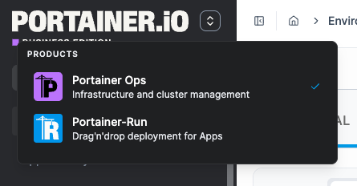

# Add-ons


Add-ons are only available to admin users in [Portainer Business Edition](https://www.portainer.io/business-upsell?from=ca-file) and require a local Kubernetes environment.&#x20;



In some Portainer Server Kubernetes installs, removing the local Kubernetes environment can prevent add-ons from being detected or managed correctly. For more information and a workaround, see [this FAQ](../../faqs/known-issues/add-ons-are-unavailable-because-the-local-kubernetes-environment-is-missing.md).


Portainer Add-ons are applications that extend Portainer. From this view, you can install and manage any available add-on applications. Add-ons are deployed as Helm releases into your local Kubernetes cluster and appear as separate tools in the sidebar switcher.

### Add-ons catalog

The catalog lists every add-on available and is updated dynamically from the catalog URL. Each card shows the add-on's name, description, installed version, and current status, along with the actions available for that state.

These are the current add-ons listed in the default add-on catalog:

<table data-card-size="large" data-view="cards"><thead><tr><th></th><th></th><th data-type="content-ref"></th><th data-hidden data-card-cover data-type="image">Cover image</th></tr></thead><tbody><tr><td><h4>Portainer-Run</h4></td><td>Portainer-Run is a governed self-service layer that lets non-developer business teams deploy the apps they build with AI tools onto your organization's own Kubernetes, without ever needing to know anything about Kubernetes, containers, or infrastructure.</td><td><a href="https://docs.portainer.ai/">https://docs.portainer.ai/</a></td><td data-object-fit="contain"><a href="../../.gitbook/assets/portainer-run-svg.svg">portainer-run-svg.svg</a></td></tr></tbody></table>


[installing-an-add-on.md](installing-an-add-on.md)



[managing-an-installed-add-on.md](managing-an-installed-add-on.md)


### Add-on switcher


Add-ons that are not healthy appear in the switcher but are shown as disabled - they cannot be launched until restored.&#x20;


Click the product switcher icon in the sidebar to see all enabled add-ons as external links.

<figure><figcaption></figcaption></figure>
