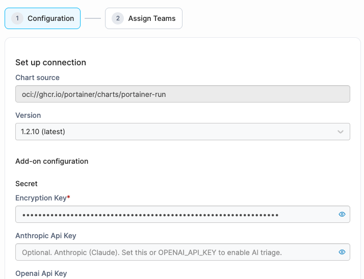
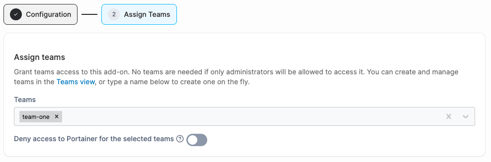

# Installing an add-on

To install an add-on, navigate to **Add-ons** under Administration in the menu and click **Install** on the application you would like to install.&#x20;

Add-on configuration varies by application. Refer to that application's documentation, linked in the [add-ons catalog](./#add-ons-catalog), for help with installation.

#### Configuration

| Field/Option         | Overview                                                                                                                                                                                                                                                                                                                                                                                               |
| -------------------- | ------------------------------------------------------------------------------------------------------------------------------------------------------------------------------------------------------------------------------------------------------------------------------------------------------------------------------------------------------------------------------------------------------ |
| Chart source         | A read-only field that shows the OCI Helm chart reference used to install this add-on.                                                                                                                                                                                                                                                                                                                 |
| Version              | Select which chart version to install. The most recent version is marked "(latest)" and selected by default.                                                                                                                                                                                                                                                                                           |
| Add-on configuration | 
Appears once a version is selected. Contains the connection and configuration fields defined by the chart's values. The fields vary between add-ons - each one is generated from the chart's own schema.

Fields whose name includes <code>key</code>, <code>token</code>, <code>secret</code>, or <code>password</code> are masked by default - click the eye icon to reveal them.
 |

<figure><figcaption></figcaption></figure>

Click **Next** when you have completed the initial configuration.

#### Assign teams

| Field/Option                                    | Overview                                                                                                                                                                    |
| ----------------------------------------------- | --------------------------------------------------------------------------------------------------------------------------------------------------------------------------- |
| Teams                                           | Optionally select which Portainer teams can access this add-on. You can also type a new team name here to create one.                                                       |
| Deny access to Portainer for the selected teams | When enabled, members of the selected teams are redirected directly into the add-on and cannot access the main Portainer UI. This makes the add-on their primary interface. |

<figure><figcaption></figcaption></figure>

Once you have complete both steps and click **Finish** to deploy the Helm release.
