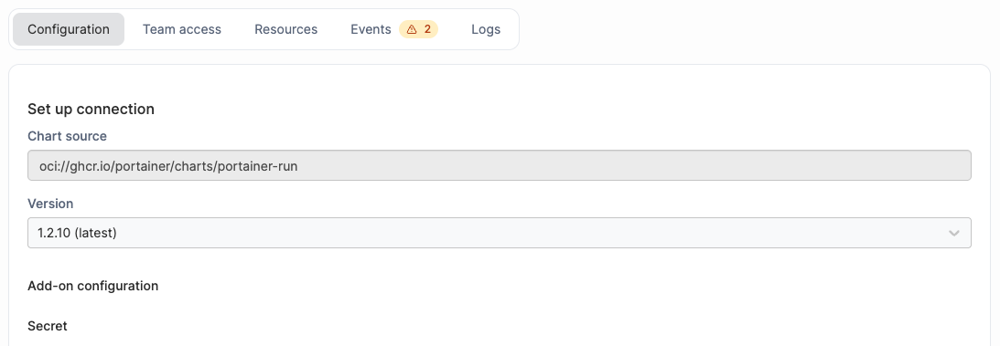
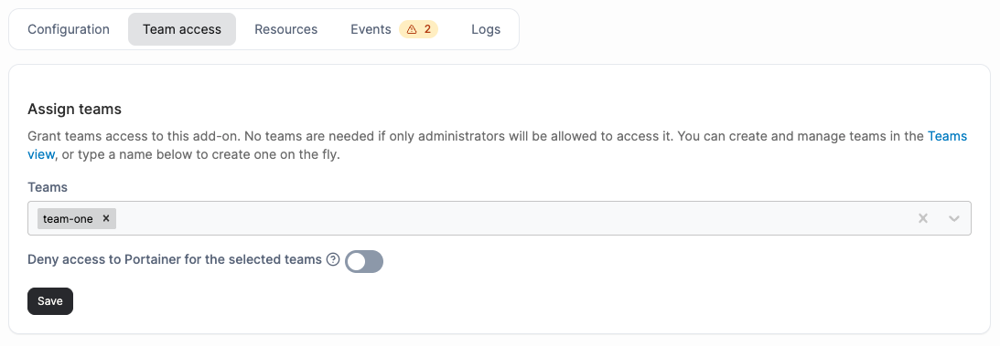
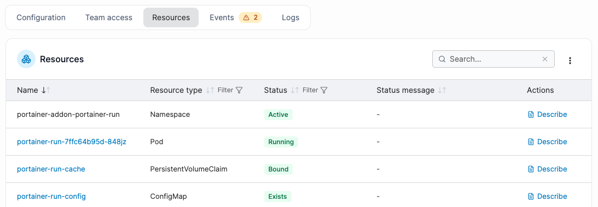
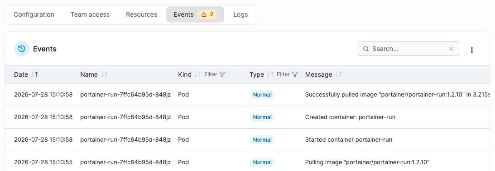
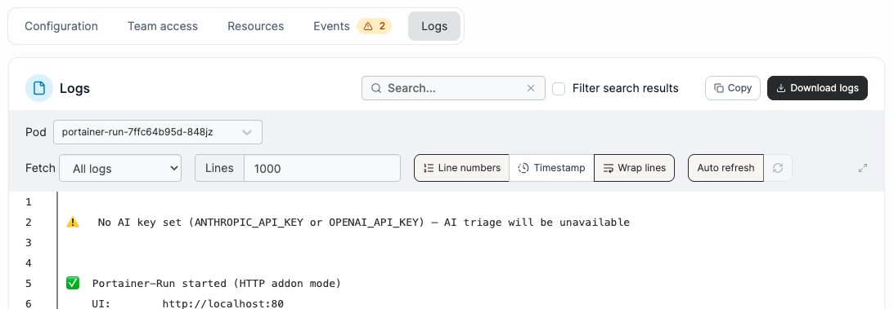

# Managing an installed add-on


Non-admin users cannot access the catalog, install wizard, or detail view for add-ons.


To manage an installed add-on, navigate to **Add-ons** under Administration in the menu and click an add-on card to open its detail view. The header shows the current status and provides the available actions. Five tabs give full visibility into the add-on's state.


If an installed add-on can't authenticate back to Portainer - for example after a database restore - a **Repair credential** button will show under the listed add-on, giving you a one-click way to fix it without reinstalling.


### Configuration

Edit the version and add-on configuration values, identical to the install wizard's first step. Click **Apply changes** to upgrade in place. If the change requires a restart, a confirmation dialog will note this before proceeding.

<figure><figcaption></figcaption></figure>

### Team access

Modify the teams that have access to this add-on and toggle the **Deny access to Portainer for the selected teams** setting. Changes are saved independently of the Configuration tab.

<figure><figcaption></figcaption></figure>

### Resources

Lists all Kubernetes resources belonging to the add-on's Helm release. If the release cannot be loaded, all resources in the add-on's namespace are shown instead.

<figure><figcaption></figcaption></figure>

### Events

Shows Kubernetes events scoped to the Helm release's resources. A warning badge on the tab label indicates unresolved warning events. Useful for diagnosing a stuck install or unhealthy pod.

<figure><figcaption></figcaption></figure>

### Logs

A live log viewer. Select a **Pod** from the dropdown (only pods with running containers are listed), then select a **Container** if the pod has more than one. Supports timestamps and tail configuration. **Copy** or **Download logs** using the buttons in the top right corner of the logs.&#x20;

<figure><figcaption></figcaption></figure>
