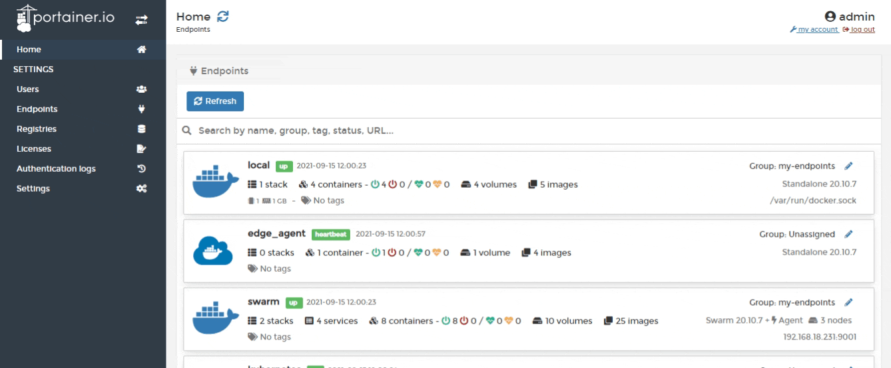
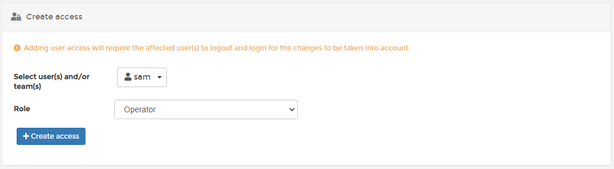

# Manage access to endpoint groups


Endpoints can be [grouped](groups.md) for organizational purposes. If an endpoint and an individual user are in the same group, users will be tagged with `inherited` on the **Manage access** page. This means that the user is inheriting their access from the group, not the endpoint.

If you manually assign a user to an endpoint, and they are already assigned to it via a group, they will be tagged with `override` on the **Manage access** page, indicating that their individual access will override that of the group for this one endpoint. You can then modify their access in this special case.


From the menu select **Endpoints** then select **Groups**. Locate the endpoint group you want to give users access to then select **Manage access** at the end of the row.

Next, select users or teams you want to add using the dropdown. Then use the **Role** dropdown to select the role you want this user to have.

Once you have made your selection, click **Create access**.

