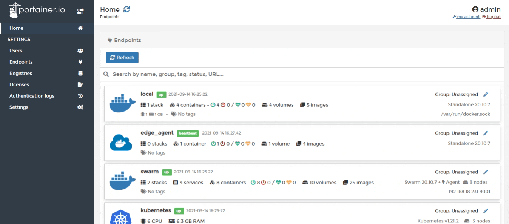
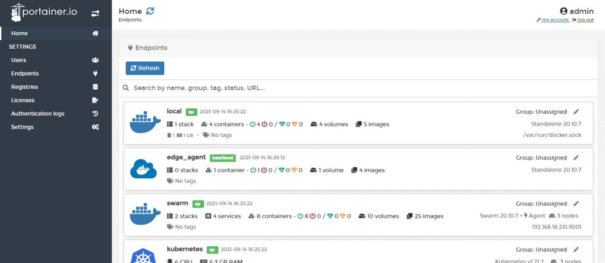

# Tags

Tags can be applied to endpoints and are useful for defining node or resource metadata. For example, you could use tags to define the physical location of nodes, departments or owners of resources, and much more.

## Creating a tag

From the menu select **Endpoints** then select **Tags**. 

Enter a name for the tag then click **Create tag**. The tag appears in the list and can be assigned to endpoints.

## Tagging an endpoint

From the menu select **Endpoints** then select the endpoint you want to tag.

From the **Tags** lookup select the tag then click **Update endpoint**.


Endpoint tags will be visible on the Portainer home page. You can also search for endpoints based on their tags.


