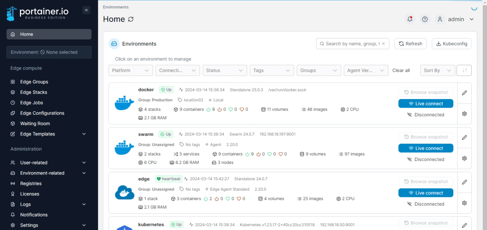
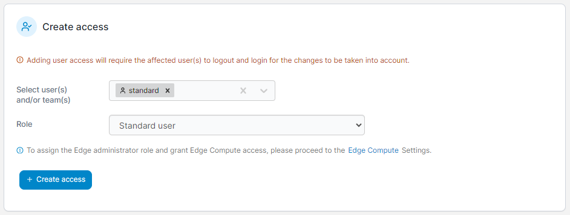

# Manage access to environments


Environments can be [grouped](groups.md) for organizational purposes. If an environment and an individual user are in the same group, users will be tagged with `inherited` on the **Manage access** page. This means that the user is inheriting their access from the group, not the environment.

If you manually assign a user to an environment, and they are already assigned to it via a group, they will be tagged with `override` on the **Manage access** page, indicating that their individual access will override that of the group for this one environment. You can then modify their access in this special case.


From the menu expand **Environment-related** and select **Environments**. Locate the environment you want to give users access to then select **Manage access** at the end of the row.

<figure><figcaption></figcaption></figure>

Next, select the users or teams you want to add using the dropdown. Then use the **Role** dropdown to select the role you want this user or team to have.

<figure><figcaption></figcaption></figure>

Once all have been selected, click **Create access**.
