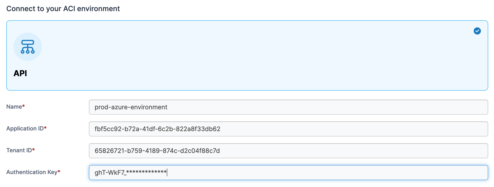
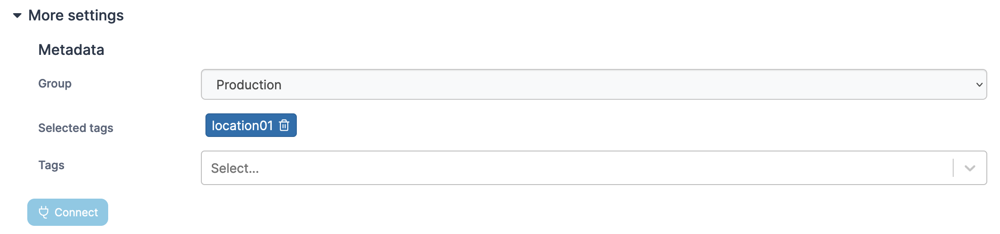

# Add an ACI environment

Before connecting to your Azure subscription, you need to create an Azure AD application. For more information on this please refer to the [official Microsoft documentation](https://docs.microsoft.com/en-us/azure/active-directory/develop/howto-create-service-principal-portal).


The following ACI features are not currently supported:

* ACI Persistent Storage
* Private networks


To add an ACI environment, from the menu expand **Environment-related**, click **Environments**, then click **Add environment**.

<figure><figcaption></figcaption></figure>

Select **ACI** as your environment type and click **Start Wizard**. Enter the **environment details** using the table below as a guide.

| Field              | Overview                                                                                                                                                |
| ------------------ | ------------------------------------------------------------------------------------------------------------------------------------------------------- |
| Name               | Enter a name for your environment.                                                                                                                      |
| Application ID     | Enter the application ID for the app you created in your Azure account. This can be found on the **Overview** page of your app within the Azure Portal. |
| Tenant ID          | Enter the tenant ID for your app. This can be found on the **Overview** page of your app within the Azure Portal.                                       |
| Authentication Key | Enter the client secret for your app. This can be created under **Certificates & secrets** within your application in the Azure Portal.                 |

<figure><figcaption></figcaption></figure>

As an optional step you can expand the **More settings** section and categorize the environment by adding it to a [group](../groups.md) or [tagging](../tags.md) it for better searchability.

<figure><figcaption></figcaption></figure>

When you're ready, click **Connect**. If you have other environments to configure click **Next** to proceed, otherwise click **Close** to return to the list of environments.
