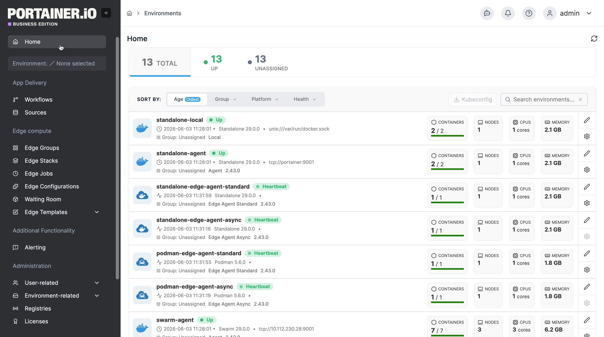
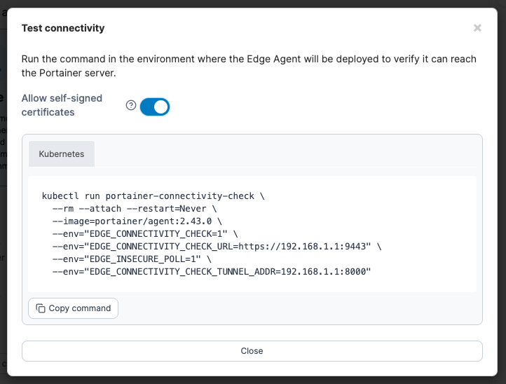
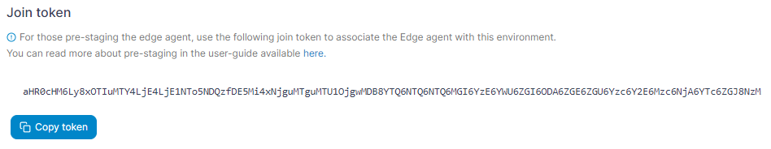
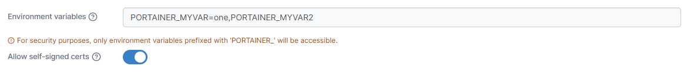
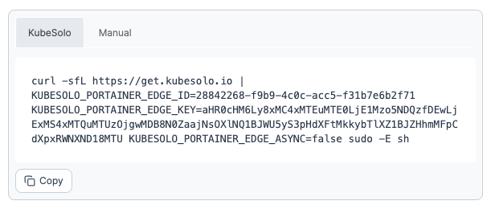

# Install Edge Agent Standard on KubeSolo


For a technical summary of how the Edge Agent works, refer to our [advanced documentation](../../../../advanced/edge-agent.md).


From the menu expand **Environment-related**, click **Environments**, then click **Add environment**.

<figure><figcaption></figcaption></figure>

Select **KubeSolo (Edge)** then click **Start Wizard**. Then select the **Edge Agent Standard** option. Enter the environment details using the table below as a guide.

| Field                           | Overview                                                                                              |
| ------------------------------- | ----------------------------------------------------------------------------------------------------- |
| Name                            | Enter a name for your environment.                                                                    |
| Portainer API server URL        | The URL of the Portainer instance that the agent will use to initiate the communications.             |
| Portainer tunnel server address | The address of the Portainer instance that will be used by Edge agents to establish a reverse tunnel. |

To test your input details, select **Test connectivity** to generate a verification command. Run this in the environment where the Edge Agent will be deployed to confirm it can reach the Portainer server. If your Portainer instance uses a self-signed or untrusted certificate, ensure you have **Allow self-signed certificates** selected, this will add `EDGE_INSECURE_POLL=1` to the script.

<figure><figcaption></figcaption></figure>

As an optional step you can expand the **More settings** section and adjust the Poll frequency for the environment - this defines how often this Edge Agent will check the Portainer Server for new jobs. The default is every 5 seconds. You can also categorize the environment by adding it to a [group](../../groups.md) or [tagging](../../tags.md) it for better searchability.

When you're ready, click **Create**. If you are pre-staging your Edge Agent deployment, you can now retrieve the join token for use in your deployment.

<figure><figcaption></figcaption></figure>

Otherwise, complete the new fields that have appeared using the table below as a guide.

| Field/Option            | Overview                                                                                                                                                                                                                                                              |
| ----------------------- | --------------------------------------------------------------------------------------------------------------------------------------------------------------------------------------------------------------------------------------------------------------------- |
| Environment variables   | 
Enter a comma separated list of environment variables that will be sourced from the host where the agent is deployed and provided to the agent. For security, the agent will only pass through environment variables with a <code>PORTAINER_</code> prefix.
 |
| Allow self-signed certs | Toggle this on to allow self-signed certificates when the agent is connecting to Portainer via HTTPS.                                                                                                                                                                 |

<figure><figcaption></figcaption></figure>

Copy the generated command and run it on your Edge environment to complete the installation. If you already have KubeSolo installed and just need to deploy the agent, use the command under the **Manual** tab. Otherwise, use the command under the **KubeSolo** tab to install KubeSolo and the agent together.&#x20;


If you have set a custom `AGENT_SECRET` on your Portainer Server instance (by specifying an AGENT\_SECRET environment variable when starting the Portainer Server container) you **must** remember to explicitly provide the same secret to your Edge Agent in the same way (as an environment variable) when deploying your Edge Agent, within the agent deployment definition:

`env:`\
`- name: AGENT_SECRET`\
`value: yoursecret`


<figure><figcaption></figcaption></figure>

If you have another Edge standard environment of the same type to deploy you can click **Add another environment** to do so. Otherwise if you have any other environments to configure click **Continue** to proceed, or click **Close** to return to the list of environments.
