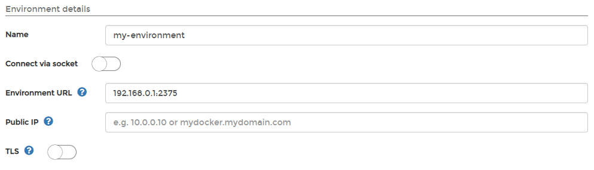
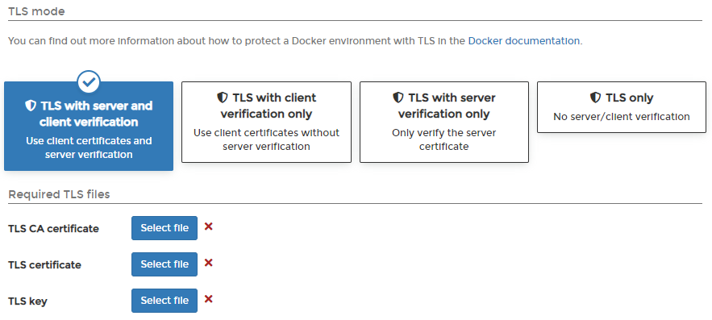
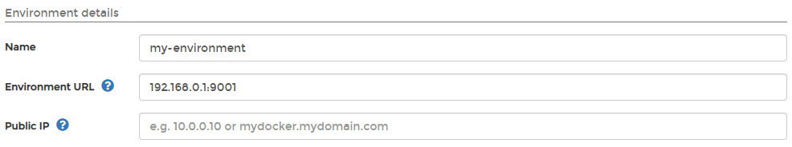

# Add a Docker Standalone environment

When connecting a Docker Standalone host to Portainer, there are two methods you can use. You can either connect directly to the Docker API via TCP, or you can install the Portainer Agent on the Docker Standalone host and connect via the agent.

## Method 1: Connecting via the Docker API

Before you begin, you will need to ensure that your Docker instance is configured to admit remote connections. To learn how to do this, refer to Docker's own documentation. Once Docker is configured, you will be able to connect either with or without TLS.

### Option 1: Connecting without TLS

From the menu select **Environments** then click **Add environment**.

Next, select **Docker** as the **environment type** then enter the environment details using the table below as a guide:

| Field/Option       | Overview                                                                                                                                     |
| ------------------ | -------------------------------------------------------------------------------------------------------------------------------------------- |
| Name               | Give the environment a descriptive name.                                                                                                     |
| Connect via socket | Leave this option toggled off.                                                                                                               |
| Environment URL    | Enter the DNS name or IP address to connect to the Docker host along with the port. When connecting without TLS, the default port is `2375`. |
| Public IP          | Enter the URL or IP address where exposed containers will be reachable. This is an optional field (defaults to the environment URL).         |
| TLS                | Leave this option toggled off.                                                                                                               |

In the **Metadata** section, as an optional step you can categorize the environment by adding it to a [group](../groups.md) or [tagging](../tags.md) it for better searchability.

When you're ready, click **Add environment**.

### Option 2: Connecting with TLS

Portainer can connect to the Docker host API using TLS. To use this option, the Docker environment you are connecting to must be configured to use TLS. Find out how to protect a Docker environment with TLS in [Docker's own documentation](https://docs.docker.com/engine/security/https/).

From the menu select **Environments** then click **Add environment**.

From the **Environment type** section select **Docker**, then enter the environment details using the table below as a guide:

| Field/Option       | Overview                                                                                                                                  |
| ------------------ | ----------------------------------------------------------------------------------------------------------------------------------------- |
| Name               | Give the environment a descriptive name.                                                                                                  |
| Connect via socket | Leave this option toggled off.                                                                                                            |
| Environment URL    | Enter the DNS name or IP address to connect to the Docker host along with the port. When connecting with TLS, the default port is `2376`. |
| Public IP          | Enter the URL or IP address where exposed containers will be reachable. This is an optional field (defaults to the environment URL).      |
| TLS                | Toggle this option on then select the TLS mode.                                                                                           |

| Field/Option       | Overview                                                                                                                                                                                                   |
| ------------------ | ---------------------------------------------------------------------------------------------------------------------------------------------------------------------------------------------------------- |
| TLS mode           | Select the mode that best fits your configuration. In most cases, this will be the default **TLS with server and client verification** option. The next options change, depending on what you select here. |
| TLS CA certificate | Select your CA certificate.                                                                                                                                                                                |
| TLS certificate    | Select your certificate.                                                                                                                                                                                   |
| TLS key            | Select the key that matches the certificate.                                                                                                                                                               |


Portainer expects TLS certificates and keys to be in PEM format.


In the **Metadata** section, as an optional step you can categorize the environment by adding it to a [group](../groups.md) or [tagging](../tags.md) it for better searchability.

When you're ready click **Add environment**.

## Method 2: Connecting via the Portainer Agent

First, install the Portainer Agent on your Docker Standalone instance using our [platform-specific instructions](https://github.com/portainer/portainer-docs/blob/ce-2.9/admin/environments/add/broken-reference/README.md). When this is done, you will be able to add the environment to Portainer.

From the menu select **Environments** then click **Add environment**.

From the **Environment type** section, select **Agent**. Since we have already installed the agent you can ignore the sample commands in the **Information** section. Enter the environment details, using the table below as a guide:

| Field/Option | Overview                                                                                                                             |
| ------------ | ------------------------------------------------------------------------------------------------------------------------------------ |
| Name         | Give the environment a descriptive name.                                                                                             |
| Endpoint URL | Enter the DNS name or IP address to connect to the Portainer Agent along with the port (the default port is `9001`).                 |
| Public IP    | Enter the URL or IP address where exposed containers will be reachable. This is an optional field (defaults to the environment URL). |

In the **Metadata** section, as an optional step you can categorize the environment by adding it to a [group](../groups.md) or [tagging](../tags.md) it for better searchability.

When you're ready, click **Add environment**.
