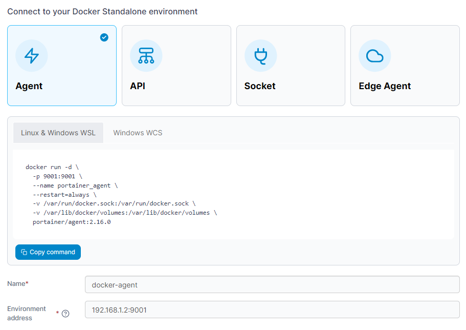

# Install Portainer Agent on Docker Standalone

Portainer uses the _Portainer Agent_ container to communicate with the _Portainer Server_ instance and provide access to the node's resources. This document will outline how to install the Portainer Agent on your node and how to connect to it from your Portainer Server instance. If you do not have a working Portainer Server instance yet, please refer to the [Portainer Server installation guide](../../../../start/install/server/docker/linux.md) first.

In addition to the generic requirements for Docker Standalone environments, you will need:

* Port `9001` accessible on this machine from the Portainer Server instance. If this is not available, we recommend using the [Edge Agent](edge.md) instead.
* If you are running Windows on your node, either:
  * Windows Subsystem for Linux (WSL) installed and a Linux distribution selected. For a new installation we recommend WSL2.
  * Windows Container Services (WCS) configured and running.

The Portainer Agent installation instructions also make the following additional assumptions about your environment:

* You are accessing Docker via Unix sockets (or a named pipe when using WCS). The Portainer Agent does not support connecting to the Docker engine via TCP.
* If running Linux, SELinux is disabled on the machine running Docker. If you require SELinux, you will need to pass the `--privileged` flag to Docker when deploying Portainer.
*   You have not set a custom `AGENT_SECRET` on your Portainer Server instance. If you have (by specifying an `AGENT_SECRET` environment variable when starting the Portainer Server container), you will need to provide that same secret to your agent in the same way (as an environment variable) when deploying, for example by adding the following to your `docker run` command:

    `-e AGENT_SECRET=yoursecret`

From the menu expand **Environment-related**, click **Environments**, then click **Add environment**.

<figure><figcaption></figcaption></figure>

Next, select **Docker Standalone** as the environment type then click **Start Wizard**. Select the **Agent** option, then your environment type. Copy the command for your environment type and run it on your Docker Standalone instance. For example, if you are deploying on a Linux machine or a Windows machine with WSL installed, use the **Linux & Windows WSL** command. If you are deploying on a Windows machine with WCS, use the **Windows WCS** command.


If you want to use the [host management features](../../../../user/docker/host/setup.md#enable-host-management-features) of the Portainer Agent, you should add the necessary volume mount to the command that Portainer provides:

```
-v /:/host
```



If Docker on the environment you're deploying the Agent to has the Docker volume path at a non-standard location (instead of `/var/lib/docker/volumes`) you will need to adjust the volume mount in the deployment command to suit.&#x20;

For example, if your volume path was `/srv/data/docker`, you would change the line in the command to:

```
- v /srv/data/docker:/var/lib/docker/volumes \
```

The right side of the mount should remain as `/var/lib/docker/volumes`, as that is what the Agent expects.


Once the Agent has been deployed, enter the environment details using the table below as a guide:

| Field/Option        | Overview                                                                                                             |
| ------------------- | -------------------------------------------------------------------------------------------------------------------- |
| Name                | Give the environment a descriptive name.                                                                             |
| Environment address | Enter the DNS name or IP address to connect to the Portainer Agent along with the port (the default port is `9001`). |

<figure><figcaption></figcaption></figure>

As an optional step you can expand the **More settings** section to categorize the environment by adding it to a [group](../../groups.md) or [tagging](../../tags.md) it for better searchability.


GPU configuration has been moved to [Host Setup](../../../../user/docker/host/setup.md#other) and can be configured once the environment has been set up.


<figure><figcaption></figcaption></figure>

When you're ready, click **Connect**. If you have other environments to configure click **Next** to proceed, otherwise click **Close** to return to the list of environments.
