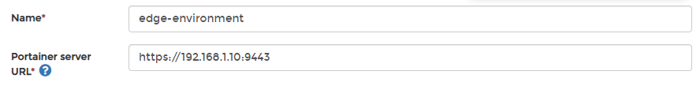
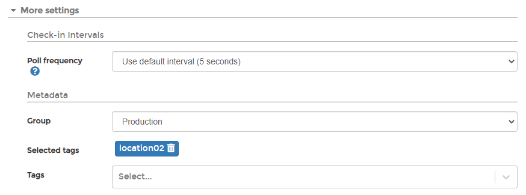
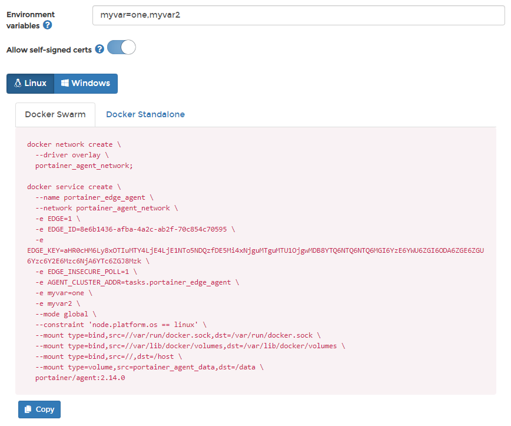

# Add an Edge environment

The Edge Agent was created as a way to manage an Edge Compute environment where devices typically lack the networking capability to run the traditional Portainer Agent. For more information about the Edge Agent and how it works, take a look at our [advanced documentation](../../../advanced/edge-agent.md).

## Preparation

### Exposing the tunnel port

The Edge Agent communicates with the Portainer Server instance over port `8000` (or `30776` if using Kubernetes with NodePort). Through this port, the Edge Agent can poll the Portainer instance, connect to Portainer, see when it is required, then initiate a tunnel or receive configuration updates. Without the tunnel port exposed on the Portainer Server instance, you cannot access the Edge endpoint. If you already deployed Portainer without this port open, you will need to redeploy with the tunnel port exposed alongside the port used to access Portainer. Using the CLI flag `--tunnel-port` you can set a different port if the port is already in use. For more information see [CLI options](../../../advanced/cli.md).

### Deployment methods available

| Method                           | Overview                                                                                                                                                                                                                                         |
| -------------------------------- | ------------------------------------------------------------------------------------------------------------------------------------------------------------------------------------------------------------------------------------------------ |
| Portainer with TLS               | If your Portainer instance is deployed with TLS, the agent will use HTTPS for the connection it makes back to Portainer. This is the recommended approach.                                                                                       |
| Portainer with Self-Signed Certs | If you are using self-signed TLS certificates with your Portainer instance, the Edge Agent must be deployed with the flag `-e EDGE_INSECURE_POLL=1`. If you do not deploy Portainer with this flag, the agent cannot communicate with Portainer. |
| Portainer Fallback to HTTP       | If Portainer is not configured with either of the above options, it will use HTTP for agent polling as a fallback. We do not recommend this option because it is not secure.                                                                     |

## Adding an Edge environment to Portainer

To add an Edge Agent, click on **Environments** then **Add environment**.&#x20;

Select either Docker or Kubernetes depending on your environment type, then click **Start Wizard**. Then select the **Edge Agent** option. Enter the environment details **** using the table below as a guide.

| Field                | Overview                                                                                                                                                                         |
| -------------------- | -------------------------------------------------------------------------------------------------------------------------------------------------------------------------------- |
| Name                 | Enter a name for your environment.                                                                                                                                               |
| Portainer server URL | Enter the URL and port of your Portainer Server instance as it will be seen from your Edge environment. If using a FQDN, ensure that DNS is properly configured to provide this. |

As an optional step you can expand the **More settings** section and adjust the Poll frequency for the environment - this defines how often this Edge Agent will check the Portainer Server for new jobs. The default is every 5 seconds. You can also categorize the environment by adding it to a [group](../groups.md) or [tagging](../tags.md) it for better searchability.

When you're ready, click **Create**. Then complete the new fields that have appeared using the table below as a guide.

| Field/Option            | Overview                                                                                                                                        |
| ----------------------- | ----------------------------------------------------------------------------------------------------------------------------------------------- |
| Environment variables   | Enter a comma separated list of environment variables that will be sourced from the host where the agent is deployed and provided to the agent. |
| Allow self-signed certs | Toggle this on to allow self-signed certificates when the agent is connecting to Portainer via HTTPS.                                           |

Choose your platform and environment where applicable, copy the generated command and run the command on your Edge environment to complete the installation. Alternatively if you are prestaging your Edge Agent, you can retrieve the join token here. You can also adjust the environment configuration from this page.&#x20;


If you have set a custom `AGENT_SECRET` on your Portainer Server instance you **must** remember to explicitly provide this when deploying your Edge Agent.


If you have another Edge environment of the same type to deploy you can click **Add another environment** to do so. Otherwise if you have any other environments to configure click **Next** to proceed, or click **Close** to return to the list of environments.
