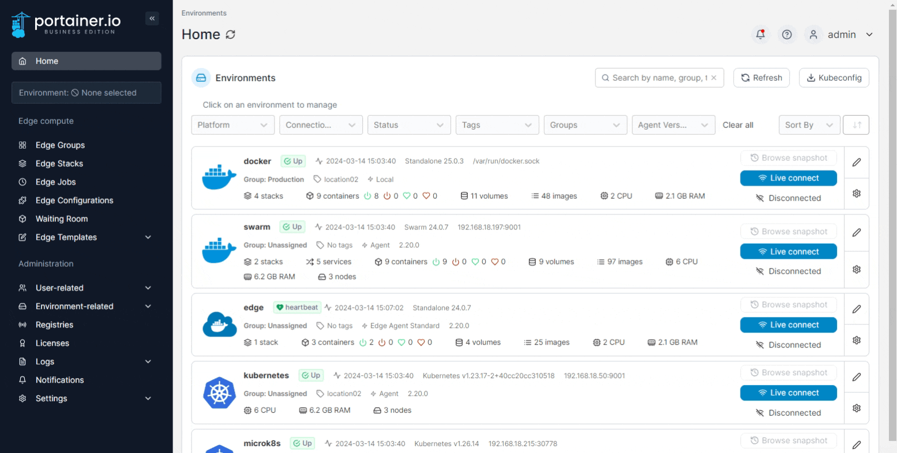

# Provision KaaS Cluster

Portainer supports the provisioning of new Kubernetes environments on select cloud providers directly from within the interface, allowing you to spin up a new cloud Kubernetes environment and deploy the Portainer Agent with a few clicks.


This feature is only available in [Portainer Business Edition](https://www.portainer.io/business-upsell?from=kaas-provisioning).


To get started, from the menu expand **Environment-related**, click **Environments**, then click **Add environment**.

<figure><figcaption></figcaption></figure>

From the wizard select the **Provision KaaS Cluster** option and click **Start Wizard**. Then, select your provider. We currently support the following providers:

<table data-view="cards"><thead><tr><th></th><th></th><th></th><th data-hidden data-card-cover data-type="files"></th><th data-hidden data-card-target data-type="content-ref"></th></tr></thead><tbody><tr><td><strong>Civo</strong></td><td>Civo Kubernetes</td><td></td><td><a href="../../../../.gitbook/assets/card-civo-large.png">card-civo-large.png</a></td><td><a href="civo.md">civo.md</a></td></tr><tr><td><strong>Linode</strong></td><td>Linode Kubernetes Engine (LKE)</td><td></td><td><a href="../../../../.gitbook/assets/card-linode-large.png">card-linode-large.png</a></td><td><a href="linode.md">linode.md</a></td></tr><tr><td><strong>DigitalOcean</strong></td><td>DigitalOcean Kubernetes (DOKS)</td><td></td><td><a href="../../../../.gitbook/assets/card-digitalocean-large.png">card-digitalocean-large.png</a></td><td><a href="digitalocean.md">digitalocean.md</a></td></tr><tr><td><strong>Google Cloud</strong></td><td>Google Kubernetes Engine (GKE)</td><td></td><td><a href="../../../../.gitbook/assets/card-googlecloud-large.png">card-googlecloud-large.png</a></td><td><a href="gke.md">gke.md</a></td></tr><tr><td><strong>Amazon Web Services (AWS)</strong></td><td>Elastic Kubernetes Service (EKS)</td><td></td><td><a href="../../../../.gitbook/assets/card-aws-large.png">card-aws-large.png</a></td><td><a href="eks.md">eks.md</a></td></tr><tr><td><strong>Microsoft Azure</strong></td><td>Azure Kubernetes Service (AKS)</td><td></td><td><a href="../../../../.gitbook/assets/card-azure-large.png">card-azure-large.png</a></td><td><a href="aks.md">aks.md</a></td></tr></tbody></table>
