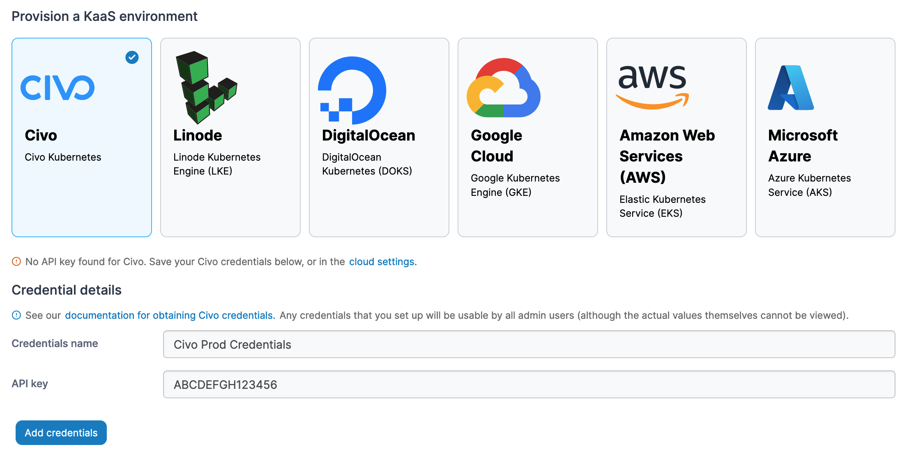
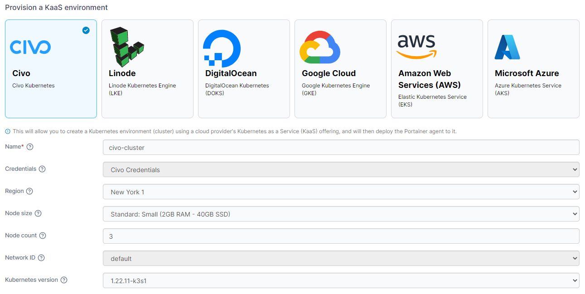

# Civo

Select the **Civo** option from the list of providers. If you haven't already provided your Civo API token you'll be asked to provide credential details. Provide a **name** for your credentials and paste your Civo API token into the **API key** field and click **Add credentials**.


You can find more details on [setting up access to your Civo account](../../../settings/credentials/civo.md) in the [shared credentials documentation](../../../settings/credentials/).


<figure><figcaption></figcaption></figure>

Once you have added your credentials (or if you already had them set up) select your cluster options from the fields below.

| Field/Option       | Overview                                                             |
| ------------------ | -------------------------------------------------------------------- |
| Name               | Enter a name for your cluster.                                       |
| Credentials        | Select the set of credentials to use for the provision.              |
| Region             | Select the region to deploy your cluster in.                         |
| Node size          | Select the size of the individual nodes in your cluster.             |
| Node count         | Enter the number of nodes to provision in your cluster.              |
| Network ID         | Select the network to add your cluster to.                           |
| Kubernetes version | Select the version of Kubernetes you want to deploy on your cluster. |


You can manually refresh the options available from Civo by clicking **Reload cluster details** in the **Actions** section.


### A note about Civo versions

Civo clusters using Kubernetes version 1.27 or above on a node size of Extra Small may fail to complete provisioning as the compute resources are too limited for required workloads. Versions prior to 1.27 do not have this resource requirement, so can be used with the Extra Small node size.

<figure><figcaption></figcaption></figure>

You can also expand the **More settings** section and set groups and tags for your environment now or you can do this later.

<figure><figcaption></figcaption></figure>

Once you have made your selections, click **Provision environment** to begin the provision. If you have other environments to configure click **Next** to proceed, otherwise click **Close** to return to the list of environments where you will see the progress of your provision.
