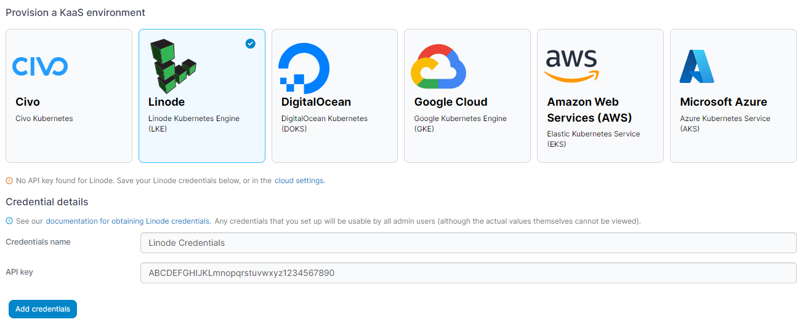
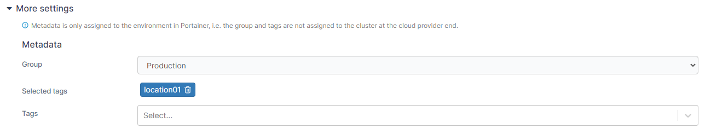

# Linode

Select the **Linode** option from the list of providers. If you haven't already provided your Linode API token you'll be asked to provide credentials. Provide a **name** for your credentials and paste your Linode API token into the **API key** field and click **Add credentials**.


You can find more details on [setting up access to your Linode account](../../../settings/credentials/linode.md) in the [shared credentials documentation](../../../settings/credentials/).


<figure><figcaption></figcaption></figure>

Once you have added your credentials (or if you already had them set up) select your cluster options from the fields below.

| Field/Option       | Overview                                                             |
| ------------------ | -------------------------------------------------------------------- |
| Name               | Enter a name for your cluster.                                       |
| Credentials        | Select the set of credentials to use for the provision.              |
| Region             | Select the region to deploy your cluster in.                         |
| Node size          | Select the size of the individual nodes in your cluster.             |
| Node count         | Enter the number of nodes to provision in your cluster.              |
| Kubernetes version | Select the version of Kubernetes you want to deploy on your cluster. |


You can manually refresh the options available from Linode by clicking **Reload cluster details** under the **Actions** section.


<figure><figcaption></figcaption></figure>

You can also expand the **More settings** section and set groups and tags for your environment now or you can do this later.

<figure><figcaption></figcaption></figure>

Once you have made your selections, click **Provision environment** to begin the provision. If you have other environments to configure click **Next** to proceed, otherwise click **Close** to return to the list of environments where you will see the progress of your provision.
