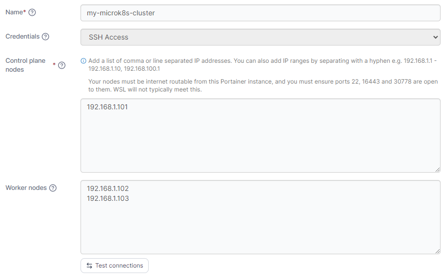
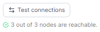
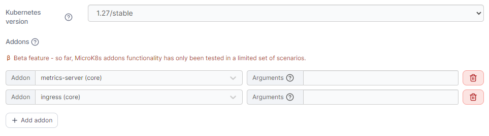
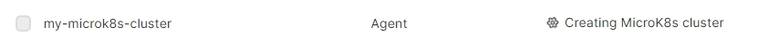

# MicroK8s

## Introduction

Portainer consists of two elements, the _Portainer Server_ and the _Portainer Agent_. Both elements run as lightweight containers on Kubernetes. This document will outline how to connect Portainer to your existing infrastructure to deploy MicroK8s and install the Portainer Agent. If you do not have a working Portainer Server instance yet, please refer to the [Portainer Server installation guide](../../../../start/install/server/kubernetes/baremetal.md) first.

## Prerequisites

In order to connect to and deploy MicroK8s and the Portainer Agent on your existing infrastructure, you will need:

* One or more Linux-based machines on which MicroK8s will be deployed. We have primarily tested on Ubuntu 20.04 LTS but most comparable Linux distributions should work. These machines can be bare metal servers or virtual machines.
* Root or sudo SSH access to the above machines on port `22`. This is needed in order to install MicroK8s. Portainer supports both password-based and key-based authentication.
* The `snap` tool installed on the above machines. You can find installation instructions for most Linux distributions [at the Snapcraft website](https://snapcraft.io/docs/installing-snapd). The `snap` tool is used to install MicroK8s and any selected addons.
* Communication between the Portainer Server and the above machines, as well as communication between the individual machines in the cluster. This is to ensure the Portainer Server can reach the machines both for the initial installation and for communication with the Portainer Agent once the cluster is up and running, and so that the cluster nodes can communicate with each other.
* For the installation, internet access (specifically to Docker Hub and registry.k8s.io) from the machines where MicroK8s will be deployed. This is a requirement at present in order for the setup to complete successfully. Once setup is complete, internet access can be disabled. However, this may affect enabling of some addons.

## What to expect

By necessity, our MicroK8s deployment makes some configuration decisions for you.

* The Portainer Agent is deployed using NodePort, on port `30778`.&#x20;
* There may be some configuration differences between versions of MicroK8s deployed. One notable difference is from version 1.25, if the `ingress` addon is installed an additional ingress named `nginx` is configured. This does not occur on version 1.24. We recommend referring to the [MicroK8s release notes](https://microk8s.io/docs/release-notes) for further detail.
* The deployment does not configure any storage classes on your cluster (unless the `hostpath-storage` addon is installed, though this is not recommended for multiple node clusters). Due to the vast amount of potential storage class configurations, this is not something we currently provide automatically. We recommend configuring a storage class once provision completes.

## Deployment

To create and deploy MicroK8s and the Portainer Agent to your machines, from the menu select **Environments** then click **Add Environment**.

<figure><figcaption></figcaption></figure>

Select **Create a Kubernetes cluster** and click **Start wizard**.

If you have not yet [configured a set of SSH credentials](../../../settings/credentials/ssh.md), you will be asked to provide them now. If you already have a credential set configured, you can skip to [cluster configuration](microk8s.md#configure-your-cluster).

### Add SSH credentials

Fill in the fields based on the table below:

| Field/Option               | Overview                                                                                                             |
| -------------------------- | -------------------------------------------------------------------------------------------------------------------- |
| Credentials name           | Enter a name for this credential set. This is how it will be listed in Portainer.                                    |
| SSH username               | Enter the username for your SSH account.                                                                             |
| SSH password               | Enter the password for your SSH account. You can leave this field blank if you intend to use SSH key authentication. |
| Use SSH key authentication | Enable this toggle to use SSH key authentication instead of password authentication.                                 |
| SSH private key passphrase | If your SSH private key is encrypted, provide the passphrase here.                                                   |
| SSH private key            | Paste your SSH private key in this field.                                                                            |


You can also choose to generate a new SSH key pair by clicking the **Generate new RSA SSH key pair** button, or upload an existing private key by clicking the **Upload SSH private key** button. You can find more detailed instructions for generating a new SSH key in our [SSH credentials documentation](../../../settings/credentials/ssh.md#generate-a-new-key-pair).


<figure><figcaption></figcaption></figure>

Once you have entered your credentials click **Add credentials**. The credential set will be saved under the name you entered, and you will be taken to the [cluster configuration](microk8s.md#configure-your-cluster).

### Configure your cluster

Once you have a set of credentials configured, you can proceed to configuring your cluster. Fill out the fields based on the table below:

| Field/Option        | Overview                                                                                                                                                                                                   |
| ------------------- | ---------------------------------------------------------------------------------------------------------------------------------------------------------------------------------------------------------- |
| Name                | Enter a name for your environment. This is how the environment will appear in Portainer.                                                                                                                   |
| Credentials         | Select the set of SSH credentials to use from the dropdown.                                                                                                                                                |
| Control plane nodes | Enter a comma-separated or line-separated list of the IP addresses for the machines that will be the **control plane nodes** for your cluster. You can also specify a range of IP addresses with a hyphen. |
| Worker nodes        | Enter a comma-separated or line-separated list of the IP addresses for the machines that will be the **worker nodes** for your cluster. You can also specify a range of IP addresses with a hyphen.        |

<figure><figcaption></figcaption></figure>

Once you have selected a credential set and entered the node IPs, you can click **Test connections** to ensure the credentials work for all the IP addresses and that they are reachable from the Portainer Server instance. If there are any issues connecting to the nodes they will be displayed.

<figure><figcaption></figcaption></figure>

You can now proceed to configuring MicroK8s itself. Fill out the fields based on the table below:

| Field/Option       | Overview                                                                                                                                                                                                                                                                                                         |
| ------------------ | ---------------------------------------------------------------------------------------------------------------------------------------------------------------------------------------------------------------------------------------------------------------------------------------------------------------- |
| Kubernetes version | Select the version of MicroK8s to deploy on your cluster.                                                                                                                                                                                                                                                        |
| Addons             | Optionally click the **Add addon** button to select one or more addons to deploy alongside the MicroK8s installation. You can also specify any arguments needed for each addon.                                                                                                                                  |
| Custom template    | Optionally select a custom template to deploy on your cluster once the MicroK8s and Portainer Agent installations are complete. This is handy for pre-loading a new environment with your applications. The template will be deployed in the default namespace unless the template specifies a namespace to use. |

<figure><figcaption></figcaption></figure>

As an optional step you can expand the **More settings** section to customize the deployment further.

| Field/Option    | Overview                                                                                                                                                                                                                                                                                                                                                    |
| --------------- | ----------------------------------------------------------------------------------------------------------------------------------------------------------------------------------------------------------------------------------------------------------------------------------------------------------------------------------------------------------- |
| Custom Template | Select a custom template to deploy on your cluster once the MicroK8s and Portainer Agent installations are complete. This is handy for pre-loading a new environment with your applications. The template will be deployed in the default namespace unless the template specifies a namespace to use. You can also set any variables the template requires. |
| Group           | Select a [group](../../groups.md) to add the new environment to once provisioning completes.                                                                                                                                                                                                                                                                |
| Tags            | Select any [tags](../../tags.md) to add to the environment.                                                                                                                                                                                                                                                                                                 |

<figure><figcaption></figcaption></figure>

Once you have entered your cluster configuration details, click **Provision environment** to begin the provision. Portainer will start provisioning your cluster with the options you selected. If you have other environments to configure click **Next** to proceed, otherwise click **Close** to return to the list of environments.

### Provision progress

From the Environments page you will be able to see the progress of any running Kubernetes environment provisions. The status will be updated as the provision completes, and if the provision runs into problems an error will be displayed here. You can hover over the status or error for additional detail.

<figure><figcaption></figcaption></figure>

Once the provision completes, you will be able to access the environment as you would any other Portainer-configured environment.
