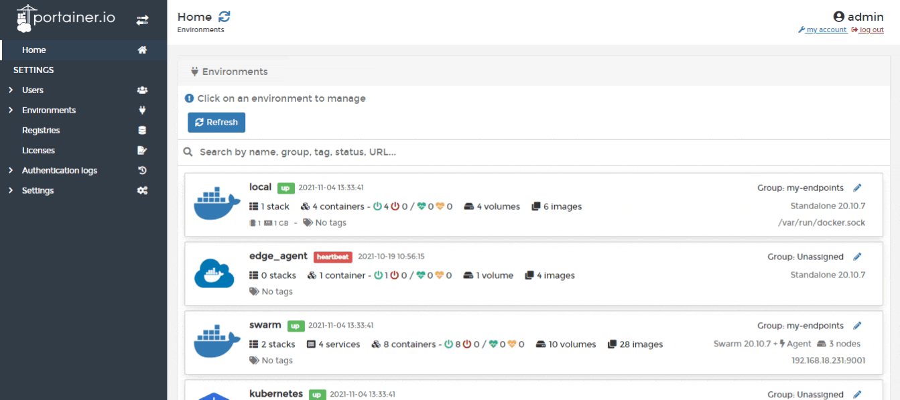
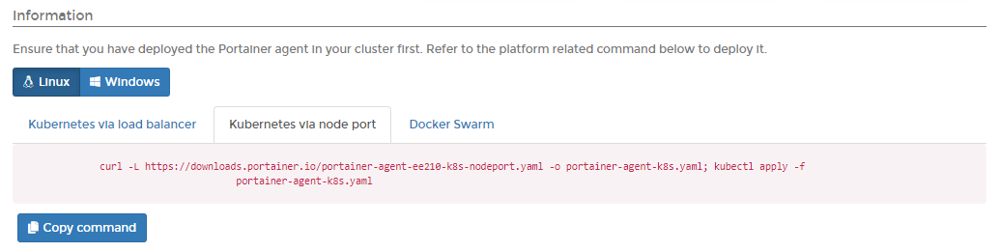
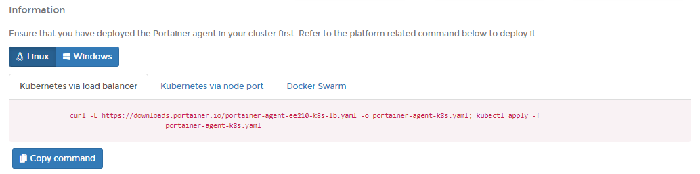
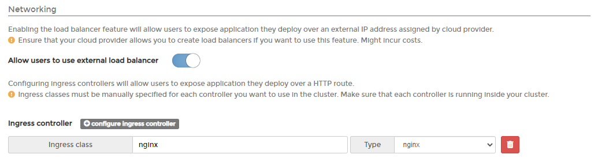
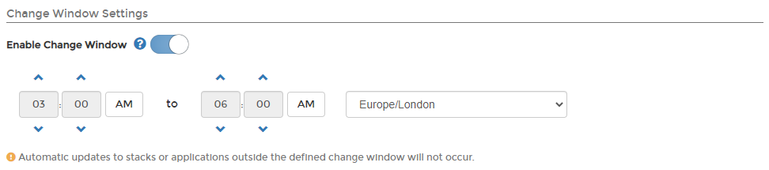
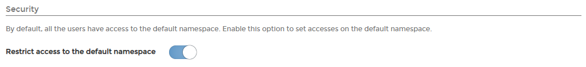
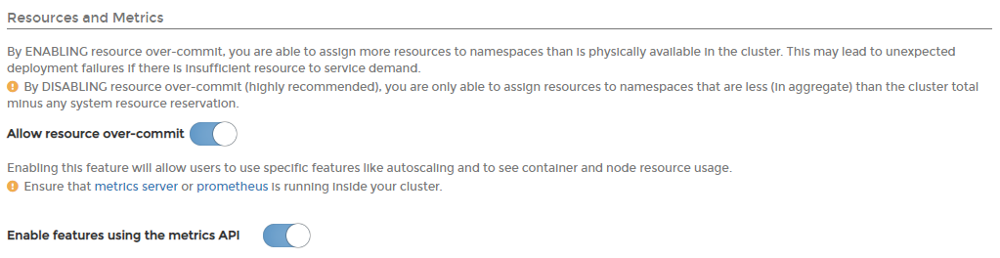

# Add a Kubernetes environment

Adding Kubernetes environments to Portainer is straightforward. Before you begin, you will need to decide if you will deploy the agents for Kubernetes via NodePort or Load Balancer. Here, we explain both methods.


This article assumes you are running a [validated Kubernetes configuration](../../../start/requirements-and-prerequisites.md#validated-configurations).


## Deployment

To deploy Portainer Agent within a Kubernetes cluster you can use the YAML manifests we provide.


Helm charts for agent-only deployments will be available soon.


### Method 1: Deploying using NodePort

From the menu select **Environments** then click **Add environment**. Ensure **Agent** is selected in **Environment type**.



In the **Information** section select the correct operating system for the new environment then select the **Kubernetes via node port** tab. Copy the command, then run it on the control node of your Kubernetes cluster.&#x20;


Make sure you run this command on your Kubernetes node before continuing.




The deployment command will return something similar to this:

```
namespace/portainer created
serviceaccount/portainer-sa-clusteradmin created
clusterrolebinding.rbac.authorization.k8s.io/portainer-crb-clusteradmin created
service/portainer-agent created
service/portainer-agent-headless created
deployment.apps/portainer-agent created
```

To validate that the agent is running, use this command:

```
 kubectl get pods --namespace=portainer
```

The result should look something like this:

```
NAME                               READY   STATUS    RESTARTS   AGE
portainer-agent-5988b5d966-bvm9m   1/1     Running   0          15m
```

### Method 2: Deploying using Load Balancer

From the menu select **Environments** then click **Add environment**. Ensure **Agent** is selected in **Environment type**.


In the **Information** section select the correct operating system for the new environment then select the **Kubernetes via load balancer** tab. Copy the command, then run it on the control node of your Kubernetes cluster.&#x20;


Make sure you run this command on your Kubernetes node before continuing.




The deployment command will return something similar to this:

```
serviceaccount/portainer-sa-clusteradmin created
clusterrolebinding.rbac.authorization.k8s.io/portainer-crb-clusteradmin created
service/portainer-agent created
service/portainer-agent-headless created
deployment.apps/portainer-agent created
```

To validate that the agent is running, use this command:

```
 kubectl get pods --namespace=portainer
```

The result should look something like this:

```
NAME                               READY   STATUS    RESTARTS   AGE
svclb-portainer-agent-52xrp        1/1     Running   0          2m26s
```

## Completing the configuration

Regardless of the method used, once the agent is running on the Kubernetes host, you must complete the appropriate environmental details.


Only do this **once** for your environment, regardless of how many nodes are in the cluster. You do **not** need to add each node as an individual environment in Portainer. Adding just one node will allow Portainer to manage the entire cluster.


| Field/Option | Overview                                                                                                                                                                                                          |
| ------------ | ----------------------------------------------------------------------------------------------------------------------------------------------------------------------------------------------------------------- |
| Name         | Give the environment a descriptive name. This is a required field.                                                                                                                                                |
| Endpoint URL | Define the IP address or name used to connect to the environment (the Kubernetes host) and specify the port if required (`30778` when using NodePort; `9001` when using Load Balancer). This is a required field. |
| Public IP    | Enter the URL or IP address where exposed containers will be reachable. This field is optional and will default to the environment URL.                                                                           |


In the **Metadata** section, as an optional step you can categorize the environment by adding it to a [group](../groups.md) or  [tagging](../tags.md) it for better searchability.


When you're ready, click **Add environment**. You will then be taken to the Kubernetes features configuration where you can set the following options:

| Field/Option                              | Overview                                                                                                       |
| ----------------------------------------- | -------------------------------------------------------------------------------------------------------------- |
| Allow users to use external load balancer | If enabled, users can expose an application deployed over an external IP address assigned by a cloud provider. |
| Ingress controller                        | Adding ingress controllers lets users expose an application deployed over an HTTP route.                       |



| Field/Option         | Overview                                                                                                                                                                               |
| -------------------- | -------------------------------------------------------------------------------------------------------------------------------------------------------------------------------------- |
| Enable Change Window | This setting allows you to specify a window within which [automatic updates](../../../user/kubernetes/applications/manifest.md#automatic-updates) to your applications can be applied. |


If this setting is enabled and an update is made to an application outside of this window, it will not be applied.




| Field/Option                             | Overview                                                                                                |
| ---------------------------------------- | ------------------------------------------------------------------------------------------------------- |
| Restrict access to the default namespace | This feature lets you enable the ability to restrict access to the default namespace by users or teams. |



| Field/Option                         | Overview                                                                                                                                                                                                                                                                                                                                                                                                                                                                                                             |
| ------------------------------------ | -------------------------------------------------------------------------------------------------------------------------------------------------------------------------------------------------------------------------------------------------------------------------------------------------------------------------------------------------------------------------------------------------------------------------------------------------------------------------------------------------------------------- |
| Allow resource over-commit           | This allows you to toggle the over-commit feature, letting you assign more resources to namespaces than are physically available within your cluster.                                                                                                                                                                                                                                                                                                                                                                |
| Enable features using metrics server | If enabled, users can use specific features that leverage the metrics server component or Prometheus adapter. The [metrics server component](https://kubernetes.io/docs/tasks/debug-application-cluster/resource-metrics-pipeline/#metrics-server) or [Prometheus adapter](https://github.com/kubernetes-sigs/prometheus-adapter) must be installed on your Kubernetes cluster to use this.                                                                                                                          |
| Available storage options            | <p>Select which options will be available to users when they deploy applications. First, take a look at your storage driver documentation to figure out which access policy to configure, and if volume expansion capability is supported. Options are:</p><p></p><ul><li><strong>Local-path:</strong> Applications will be stored in the node.</li><li><strong>Shared Access Policy:</strong> RWO or RWX.</li><li><strong>Volume Expansion:</strong> Enable to expand the persistent storage of the pods.</li></ul> |




Find more information about access modes in [Kubernetes' own documentation](https://kubernetes.io/docs/concepts/storage/persistent-volumes/#access-modes).


When the setup is complete, click **Save configuration**.&#x20;
