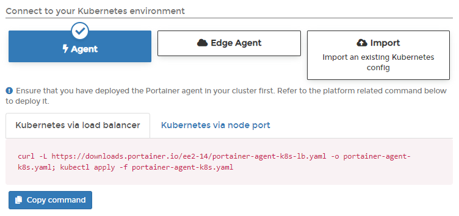
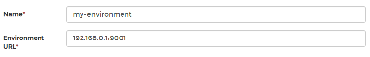
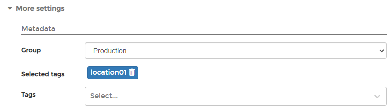

# Add a Kubernetes environment

Adding Kubernetes environments to Portainer is straightforward. Before you begin, you will need to decide if you will deploy the agents for Kubernetes via NodePort or Load Balancer. Here, we explain both methods.


This article assumes you are running a [validated Kubernetes configuration](../../../start/requirements-and-prerequisites.md#validated-configurations).


## Deployment

To deploy Portainer Agent within a Kubernetes cluster you can use the YAML manifests we provide.


Helm charts for agent-only deployments will be available soon.


From the menu select **Environments** then click **Add environment**.


Select the **Kubernetes** option and click **Start Wizard**. Select the **Agent** option and choose the tab that matches your configuration (**Kubernetes via load balancer** or **Kubernetes via node port**). Copy the command, then run it on the control node of your Kubernetes cluster.


Make sure you run this command on your Kubernetes node before continuing.




The deployment command will return something similar to this:

```
namespace/portainer created
serviceaccount/portainer-sa-clusteradmin created
clusterrolebinding.rbac.authorization.k8s.io/portainer-crb-clusteradmin created
service/portainer-agent created
service/portainer-agent-headless created
deployment.apps/portainer-agent created
```

To validate that the agent is running, use this command:

```
 kubectl get pods --namespace=portainer
```

The result should look something like this:

```
NAME                               READY   STATUS    RESTARTS   AGE
portainer-agent-5988b5d966-bvm9m   1/1     Running   0          15m
```

Once the Portainer Agent has been successfully deployed on the cluster, you can complete the rest of the environment configuration.

## Completing the configuration

Regardless of the method used, once the agent is running on the Kubernetes host, you must complete the appropriate environmental details.


Only do this **once** for your environment, regardless of how many nodes are in the cluster. You do **not** need to add each node as an individual environment in Portainer. Adding just one node will allow Portainer to manage the entire cluster.


| Field/Option    | Overview                                                                                                                                                                                |
| --------------- | --------------------------------------------------------------------------------------------------------------------------------------------------------------------------------------- |
| Name            | Give the environment a descriptive name.                                                                                                                                                |
| Environment URL | Define the IP address or name used to connect to the environment (the Kubernetes host) and specify the port if required (`30778` when using NodePort; `9001` when using Load Balancer). |



As an optional step you can expand the **More settings** section and categorize the environment by adding it to a [group](../groups.md) or [tagging](../tags.md) it for better searchability.



When you're ready, click **Connect**. If you have other environments to configure click **Next** to proceed, otherwise click **Close** to return to the list of environments.
