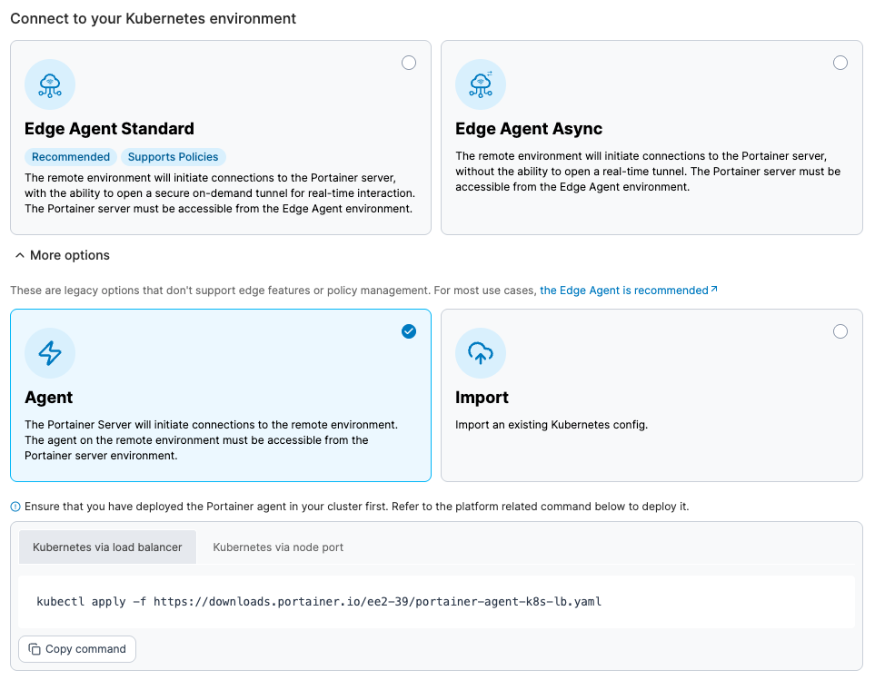
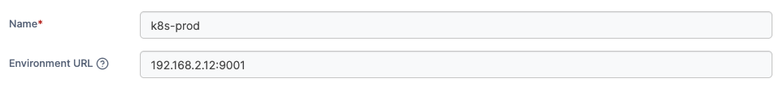

---
metaLinks:
  alternates:
    - >-
      https://app.gitbook.com/s/Dalese9Lv4CX6YKS1s45/admin/environments/add/kubernetes/agent
---

# Install Portainer Agent on your Kubernetes environment


Installing Portainer Agent on your Kubernetes environment is a legacy option that does not support edge features or policy management. For most use cases, [the Edge Agent is recommended](../../../../faqs/getting-started/why-do-we-recommend-using-the-edge-agent-instead-of-the-traditional-agent.md).


Portainer consists of two elements, the _Portainer Server_ and the _Portainer Agent_. Both elements run as lightweight containers on Kubernetes. This document will outline how to install the Portainer Agent on your cluster and how to connect to it from your Portainer Server instance. If you do not have a working Portainer Server instance yet, please refer to the [Portainer Server installation guide](../../../../start/install/server/kubernetes/baremetal.md) first.

In addition to the generic requirements for Kubernetes environments, you will need:

* Access to run `kubectl` commands on your cluster.
* Cluster Admin rights on your Kubernetes cluster. This is so Portainer can create the necessary `ServiceAccount` and `ClusterRoleBinding` for it to access the Kubernetes cluster.

The installation instructions also make the following additional assumption about your environment:

*   If you have (by specifying an `AGENT_SECRET` environment variable when starting the Portainer Server container), you will need to provide that same secret to your agent in the same way (as an environment variable) by adding it to the YAML file within the agent deployment definition:

    `env:`

    `- name: AGENT_SECRET`

    `value: yoursecret`

To deploy Portainer Agent within a Kubernetes cluster you can use our provided YAML manifests.


Helm charts for agent-only deployments will be available soon.


From the menu expand **Environment-related**, click **Environments**, then click **Add environment**.

<figure><figcaption></figcaption></figure>

Select the **Kubernetes** option and click **Start Wizard**. Under **More options**, select the **Agent** option and choose the tab that matches your configuration (**Kubernetes via load balancer** or **Kubernetes via node port**). Copy the command, then run it on the control node of your Kubernetes cluster.


Make sure you run this command on your Kubernetes node before continuing.


<figure><figcaption></figcaption></figure>

The deployment command will return something similar to this:

```
namespace/portainer created
serviceaccount/portainer-sa-clusteradmin created
clusterrolebinding.rbac.authorization.k8s.io/portainer-crb-clusteradmin created
service/portainer-agent created
service/portainer-agent-headless created
deployment.apps/portainer-agent created
```

To validate that the agent is running, use this command:

```
 kubectl get pods --namespace=portainer
```

The result should look something like this:

```
NAME                               READY   STATUS    RESTARTS   AGE
portainer-agent-5988b5d966-bvm9m   1/1     Running   0          15m
```

Regardless of the method used, once the agent is running on the Kubernetes host, you must complete the appropriate environmental details.


Only do this **once** for your environment, regardless of how many nodes are in the cluster. You do **not** need to add each node as an individual environment in Portainer. Adding just one node will allow Portainer to manage the entire cluster.


| Field/Option    | Overview                                                                                                                                                                                                                                                                                                                                         |
| --------------- | ------------------------------------------------------------------------------------------------------------------------------------------------------------------------------------------------------------------------------------------------------------------------------------------------------------------------------------------------ |
| Name            | Give the environment a descriptive name.                                                                                                                                                                                                                                                                                                         |
| Environment URL | Define the IP address or name used to connect to the environment (the Kubernetes host) and specify the port if required (`30778` when using NodePort; `9001` when using Load Balancer). Do not provide a protocol - communication with the Agent by the Server is performed over HTTPS with certificates generated by the Agent on installation. |

<figure><figcaption></figcaption></figure>

As an optional step you can expand the **More settings** section to customize the deployment further.

| Field/Option    | Overview                                                                                                                                                                                                                                                                                                                                                                                     |
| --------------- | -------------------------------------------------------------------------------------------------------------------------------------------------------------------------------------------------------------------------------------------------------------------------------------------------------------------------------------------------------------------------------------------- |
| Stack           | <p>You can specify a stack name to group related resources such as Deployments, DaemonSets, and Pods. This helps organize and manage resources created as part of the same stack.</p><p>If required, you can leave this field empty. Kubernetes functionality can also be disabled entirely from the <a href="../../../settings/general.md#kubernetes-settings">Kubernetes Settings</a>.</p> |
| Custom Template | Select a custom template to deploy on your cluster. This is handy for pre-loading a new environment with your applications. The template will be deployed in the default namespace unless the template specifies a namespace to use. You can also set any variables the template requires.                                                                                                   |
| Group           | Select a [group](../../groups.md) to add the new environment to once provisioning completes.                                                                                                                                                                                                                                                                                                 |
| Tags            | Select any [tags](../../tags.md) to add to the environment.                                                                                                                                                                                                                                                                                                                                  |

<figure><figcaption></figcaption></figure>

When you're ready, click **Connect**. If you have other environments to configure click **Continue** to proceed, otherwise click **Close** to return to the list of environments.
