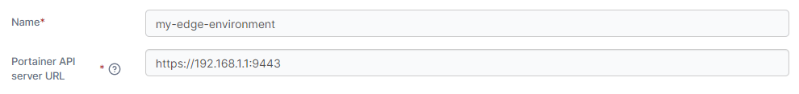
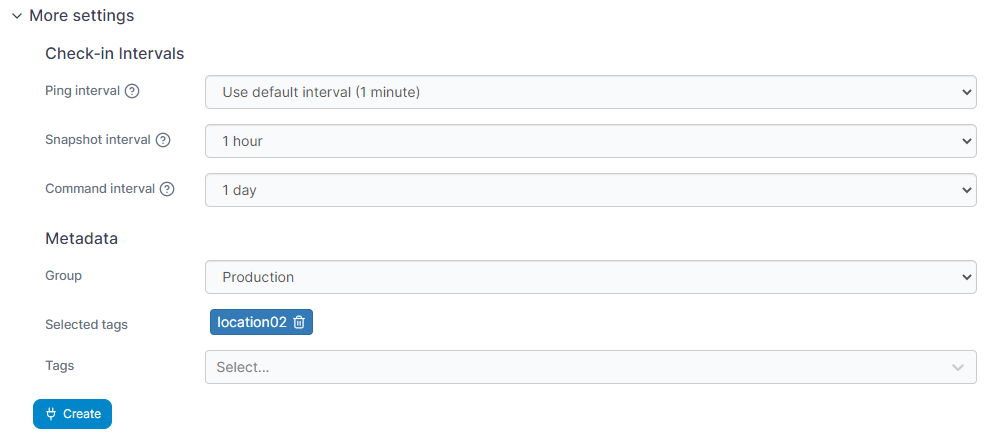
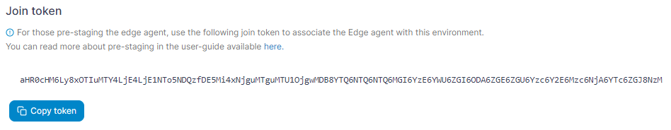
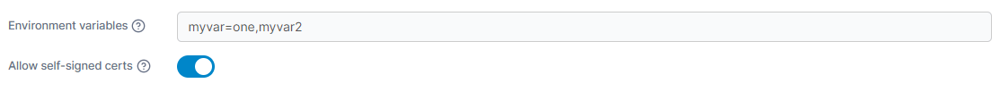
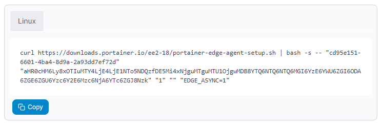

# Install Edge Agent Async on Kubernetes

When a remote environment is not directly accessible from the Portainer Server instance, we recommend deploying the Portainer _Edge Agent_ to the remote environment. This allows you to manage the remote environment from your Portainer Server instance without having to open any ports on the environment. Rather than the traditional approach of the server connecting to Agents, the Edge Agent instead polls the Portainer Server periodically to see if there are any pending jobs to perform, and acts appropriately.


For a technical summary of how the Edge Agent works, refer to our [advanced documentation](../../../../advanced/edge-agent.md).


## Async mode vs Standard mode

The Portainer Edge Agent can be deployed in two different modes - standard mode and async mode. In standard mode, we provide the ability to connect to the remote Edge Agent through a tunnel that is established on-demand from the Edge Agent to the Portainer Server, letting you interact directly with the environment in real time.&#x20;

In async mode, this tunnel connectivity is not available. Instead, we provide the ability to browse snapshots of the remote environment, allowing you to see the state of the Edge Agent's environment based on a recent state capture sent through to the Portainer Server, as well as use this snapshot to perform actions on the remote environment.&#x20;

Async mode has been developed to use very small amounts of data and as such is suitable for environments that have limited or intermittent connectivity as well as connections with limited data caps, for example mobile networks.&#x20;


Edge Agent Async mode is only available in Portainer Business Edition.


## Preparation

In async mode, the Edge Agent requires only the UI port (usually `9443` or `30779` on Kubernetes with NodePort) to be open on the Portainer server instance. The tunnel port is not required for async mode. Our installation instructions configure Portainer Server to listen on both ports by default, and you will need to ensure your firewalling provides external access to the UI port in order to proceed.


If your Portainer Server instance is deployed with TLS, the agent will use HTTPS for the connection it makes back to Portainer. However if your Portainer instance uses a self-signed certificate, the Edge Agent must be deployed with the `-e EDGE_INSECURE_POLL=1` flag. If you do not deploy the Edge Agent with this flag, then the agent will not be able to communicate with the Portainer Server instance.


In addition, our instructions assume your environment meets [our requirements](../../../../start/requirements-and-prerequisites.md). While Portainer may work with other configurations, it may require configuration changes or have limited functionality.

## Deploying

To add an async Edge Agent to a Kubernetes environment, from the menu expand **Environment-related**, click **Environments**, then click **Add environment**.

<figure><figcaption></figcaption></figure>

Select **Kubernetes** then click **Start Wizard**. Then select the **Edge Agent Async** option. Enter the environment details using the table below as a guide.

| Field                    | Overview                                                                                                                                                                         |
| ------------------------ | -------------------------------------------------------------------------------------------------------------------------------------------------------------------------------- |
| Name                     | Enter a name for your environment.                                                                                                                                               |
| Portainer API server URL | Enter the URL and port of your Portainer Server instance as it will be seen from your Edge environment. If using a FQDN, ensure that DNS is properly configured to provide this. |

<figure><figcaption></figcaption></figure>

As an optional step you can expand the **More settings** section and adjust the **Ping**, **Snapshot** and **Command** intervals for the environment - this defines how often this Edge Agent will check in with the Portainer Server for status updates, snapshot updates and to see if there are new pending commands to run, respectively. The default for each is once a minute, but the defaults can be adjusted in the [Edge Compute settings](../../../settings/edge.md#async-check-in-intervals).&#x20;

You can also categorize the environment by adding it to a [group](../../groups.md) or [tagging](../../tags.md) it for better searchability.

<figure><figcaption></figcaption></figure>

When you're ready, click **Create**. If you are pre-staging your Edge Agent deployment, you can now retrieve the join token for use in your deployment.&#x20;

<figure><figcaption></figcaption></figure>

Otherwise, complete the new fields that have appeared using the table below as a guide.

| Field/Option            | Overview                                                                                                                                        |
| ----------------------- | ----------------------------------------------------------------------------------------------------------------------------------------------- |
| Environment variables   | Enter a comma separated list of environment variables that will be sourced from the host where the agent is deployed and provided to the agent. |
| Allow self-signed certs | Toggle this on to allow self-signed certificates when the agent is connecting to Portainer via HTTPS.                                           |

<figure><figcaption></figcaption></figure>

Copy the generated command and run the command on your Edge environment to complete the installation.


If you have set a custom `AGENT_SECRET` on your Portainer Server instance (by specifying an AGENT\_SECRET environment variable when starting the Portainer Server container) you **must** remember to explicitly provide the same secret to your Edge Agent in the same way (as an environment variable) when deploying your Edge Agent, within the agent deployment definition:

`env:`\
&#x20; `- name: AGENT_SECRET`\
&#x20;   `value: yoursecret`


<figure><figcaption></figcaption></figure>

If you have another Edge async environment of the same type to deploy you can click **Add another environment** to do so. Otherwise if you have any other environments to configure click **Next** to proceed, or click **Close** to return to the list of environments.
