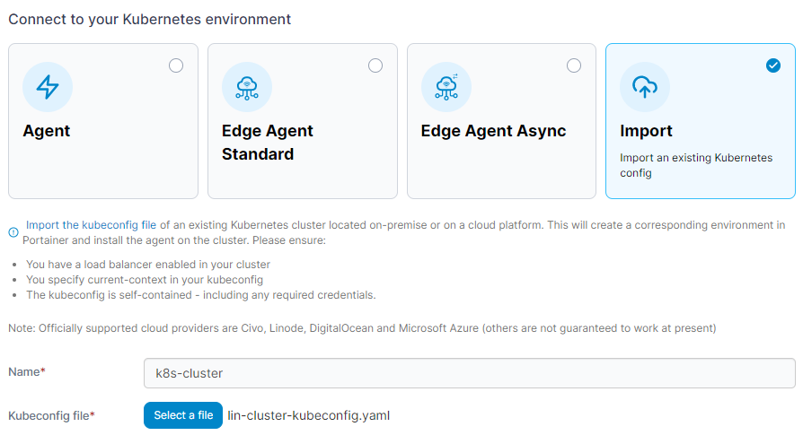
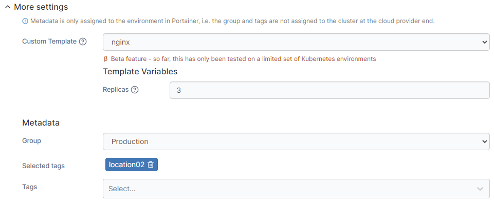

# Import an existing Kubernetes environment

With Portainer you can import your existing Kubernetes environment through the use of a [kubeconfig](https://kubernetes.io/docs/concepts/configuration/organize-cluster-access-kubeconfig/) file. Portainer will use the information in the kubeconfig file to connect to your environment then deploy and configure the Portainer Agent for you.


This feature is only available in [Portainer Business Edition](https://www.portainer.io/business-upsell?from=k8s-create-from-kubeconfig).


## Requirements

While we have tried to support as many configurations as possible, there are a few requirements in order to fully support the import process:

* Your cluster must have a load balancer configured and enabled.
* Your kubeconfig file must specify `current-context`.
* Your kubeconfig file must be self-contained (i.e., consist of only the one file with no external references).
* Your kubeconfig file must provide cluster admin level credentials, in order for Portainer to deploy the agent on your cluster.

## Generating a kubeconfig file for import

Depending on your environment, there may be different methods for creating a supported kubeconfig file. The following environment types are currently supported:

### On-premise clusters

For an on-premise cluster, you can use the following kubectl command to generate a supported kubeconfig file:

```
kubectl config view --flatten=true --minify=true > kubeconfig.yml
```

### Civo

To create a kubeconfig file from a Civo cluster, log into the Civo dashboard and go to **Kubernetes**. Select the cluster to import and click on **Click to Download** next to the **Kubeconfig** label.

### Linode

To create a kubeconfig file from a Linode cluster, log into the Linode dashboard and click on **Kubernetes** in the left hand menu. Select the cluster to import, and in the top right of the page select **Actions** then **Download Config**.

### DigitalOcean

To create a kubeconfig file from a DigitalOcean cluster, log into the DigitalOcean dashboard and in the left hand menu select **Manage** then **Kubernetes**. Alternatively, go to **Projects**, select the project containing your cluster, then look in the **Clusters** panel. Select the cluster to import, then click the **Kubeconfig** option to download the kubeconfig file.

### Microsoft Azure

To create a kubeconfig file from an Azure cluster, download and install the [Azure CLI](https://docs.microsoft.com/en-us/cli/azure/install-azure-cli) from Microsoft. Start a shell session on Linux or an administrator PowerShell session on Windows, and run the following:

```
az login
```

This command can take a couple of minutes to complete the first time it is used, and involves a browser window opening in order to authenticate you with Azure.

Once this completes and you are authenticated, run the following command:

```
az aks get-credentials --resource-group [resource-group-name] --name [cluster-name] --file ./kubeconfig-azure.yml
```

Replace `[resource-group-name]` with the resource group containing your cluster. Replace `[cluster-name]` with your cluster.

## Importing your kubeconfig

Once you have your kubeconfig file created, from the menu expand **Environment-related**, click **Environments**, then click **Add environment**.

<figure><figcaption></figcaption></figure>

&#x20;Select the **Kubernetes** option and click **Start Wizard**. Then select the **Import** option.


The import option is only available in [Portainer Business Edition](https://www.portainer.io/business-upsell?from=k8s-create-from-kubeconfig).


Enter a **name** for cluster then click **Select a file** to browse for your kubeconfig file.&#x20;

<figure><figcaption></figcaption></figure>

As an optional step you can expand the **More settings** section to customize the deployment further.

| Field/Option    | Overview                                                                                                                                                                                                                                                                                   |
| --------------- | ------------------------------------------------------------------------------------------------------------------------------------------------------------------------------------------------------------------------------------------------------------------------------------------ |
| Custom Template | Select a custom template to deploy on your cluster. This is handy for pre-loading a new environment with your applications. The template will be deployed in the default namespace unless the template specifies a namespace to use. You can also set any variables the template requires. |
| Group           | Select a [group](../../groups.md) to add the new environment to once provisioning completes.                                                                                                                                                                                               |
| Tags            | Select any [tags](../../tags.md) to add to the environment.                                                                                                                                                                                                                                |

<figure><figcaption></figcaption></figure>

When you're ready, click the **Connect** button. If you have other environments to configure click **Next** to proceed, otherwise click **Close** to return to the list of environments where you will see the progress of your provision.
