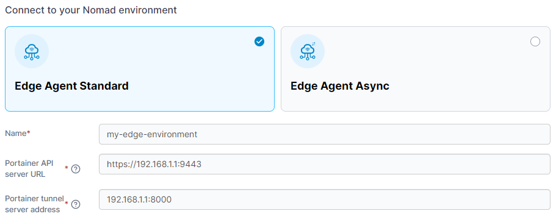
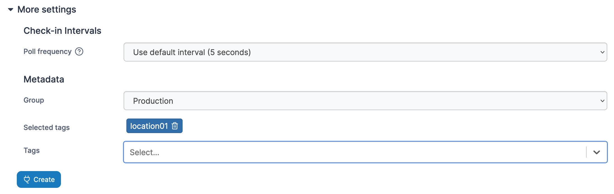

# Add a Nomad environment

Nomad support in Portainer is provided through the use of the [Portainer Edge Agent](../../../advanced/edge-agent.md).&#x20;

To add a Nomad environment, click on **Environments** then click the **Add environment** button.

<figure><figcaption></figcaption></figure>

Select **Nomad** as your environment type and click **Start Wizard**. Select the type of Edge Agent you want to deploy: **Edge Agent Standard** or **Edge Agent Async**.


The Portainer Edge Agent can be deployed in two different modes - **standard mode** and **async mode**. In standard mode, we provide the ability to connect to the remote Edge Agent through a tunnel that is established on-demand from the Edge Agent to the Portainer Server, letting you interact directly with the environment in real time.&#x20;

In async mode, this tunnel connectivity is not available. Instead, we provide the ability to browse snapshots of the remote environment, allowing you to see the state of the Edge Agent's environment based on a recent state capture sent through to the Portainer Server, as well as use this snapshot to perform actions on the remote environment.&#x20;

Async mode has been developed to use very small amounts of data and as such is suitable for environments that have limited or intermittent connectivity as well as connections with limited data caps, for example mobile networks.&#x20;


Enter the **environment details** using the table below as a guide.

| Field                           | Overview                                                                                                                                                                                                                                                                                                                                                                                                                                                                  |
| ------------------------------- | ------------------------------------------------------------------------------------------------------------------------------------------------------------------------------------------------------------------------------------------------------------------------------------------------------------------------------------------------------------------------------------------------------------------------------------------------------------------------- |
| Name                            | Enter a name for your environment.                                                                                                                                                                                                                                                                                                                                                                                                                                        |
| Portainer server URL            | Enter the URL and port of your Portainer Server instance as it will be seen from your Nomad environment. If using a FQDN, ensure that DNS is properly configured to provide this.                                                                                                                                                                                                                                                                                         |
| Portainer tunnel server address | 
Enter the address and port of your Portainer Server instance's tunnel server as it will be seen from your Edge environment. If using a FQDN, ensure that DNS is properly configured to provide this. In most cases, this will be the same address as the Portainer API server URL, but without the protocol and on port <code>8000</code>. This field is only available in Portainer Business Edition, and is not required for Edge Agent Async deployments.
 |

<figure><figcaption></figcaption></figure>

As an optional step you can expand the **More settings** section and adjust the **Poll frequency** for the environment (for Edge Agent Standard deployments) - this defines how often this Edge Agent will check the Portainer Server for new jobs. For Edge Agent Async deployments, you can adjust the **Ping**, **Snapshot** and **Command** intervals for the environment - this defines how often this Edge Agent will check in with the Portainer Server for status updates, snapshot updates and to see if there are new pending commands to run, respectively. The default values can be adjusted in the [Edge Compute settings](../../settings/edge.md#deployment-sync-options).

You can also categorize the environment by adding it to a [group](../groups.md) or [tagging](../tags.md) it for better searchability.

<figure><figcaption></figcaption></figure>

When you're ready, click **Create**. Then complete the new fields that have appeared using the table below as a guide.

| Field/Option                 | Overview                                                                                                                                        |
| ---------------------------- | ----------------------------------------------------------------------------------------------------------------------------------------------- |
| Nomad Authentication Enabled | Toggle this on if your Nomad installation has ACL enabled (recommended).                                                                        |
| Nomad Token                  | If the above toggle is on, this field is displayed. Enter the Secret ID from your Nomad installation.                                           |
| TLS                          | Toggle this on if your Nomad installation uses TLS.                                                                                             |
| Environment variables        | Enter a comma separated list of environment variables that will be sourced from the host where the agent is deployed and provided to the agent. |
| Allow self-signed certs      | Toggle this on to allow self-signed certificates when the agent is connecting to Portainer via HTTPS.                                           |

<figure><figcaption></figcaption></figure>

Copy the generated command based on your settings and run it on your Nomad environment to deploy the Edge Agent.


If you have set a custom `AGENT_SECRET` on your Portainer Server instance you **must** remember to explicitly provide this when deploying your Edge Agent.


If you have another Nomad environment to deploy you can click **Add another environment** to do so. If you have any other non-Nomad environments to configure click **Next** to proceed, otherwise click **Close** to return to the list of environments.
