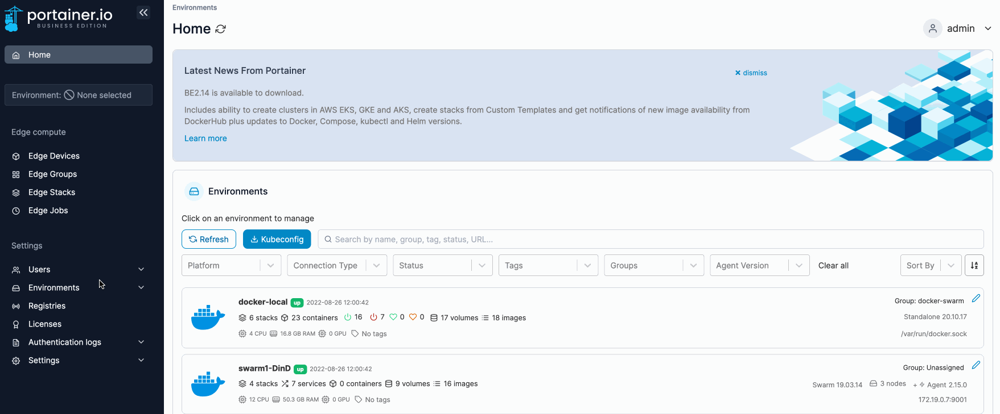
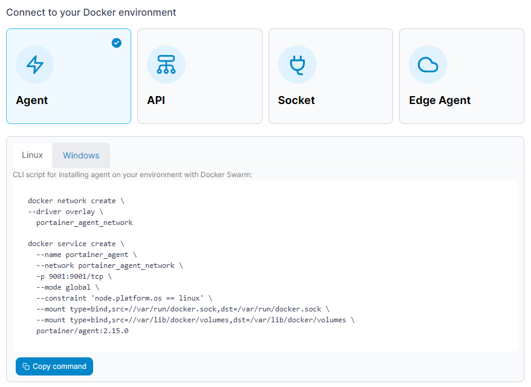

# Add a Docker Swarm environment

## Deploying the agent

From the menu select **Environments** then click **Add environment**.

<figure><figcaption></figcaption></figure>

Next, select **Docker** as the environment type then click **Start Wizard**. Select the **Agent** option and your platform. Copy the command, then run it on the manager node of your Docker Swarm cluster.


You must run the command on the Docker Swarm cluster before entering the environment details.


<figure><figcaption></figcaption></figure>

The deployment command will return something similar to this:

```
Creating network portainer-agent_portainer_agent
Creating service portainer-agent_agent
```

To validate the agent is running,  run the following command:

```
 docker service ls
```

The result of which should look something like this:

```
ID                  NAME                    MODE                REPLICAS            IMAGE                    PORTS
tshb6ee2710s        portainer-agent_agent   global              1/1                 portainer/agent:latest
```

Once the Portainer Agent has been successfully deployed on the cluster, you can complete the rest of the environment configuration.

## Finishing the configuration

Once the agent is running on the Docker Swarm cluster, enter the environment details, using the table below as a guide.


Only do this **once** for your environment, regardless of how many nodes are in the cluster. You do **not** need to add each node as an individual environment in Portainer. Adding just one node (we recommend the manager node) will allow Portainer to manage the entire cluster.


| Field               | Overview                                                                                                                |
| ------------------- | ----------------------------------------------------------------------------------------------------------------------- |
| Name                | Give the environment a descriptive name.                                                                                |
| Environment address | Enter the IP or DNS name at which the Portainer Server instance can reach the environment along with the port (`9001`). |

<figure><figcaption></figcaption></figure>

As an optional step you can expand the **More settings** section and categorize the environment by adding it to a [group](../groups.md) or [tagging](../tags.md) it for better searchability.

<figure><figcaption></figcaption></figure>

When you're ready, click **Connect**. If you have other environments to configure click **Next** to proceed, otherwise click **Close** to return to the list of environments.\
