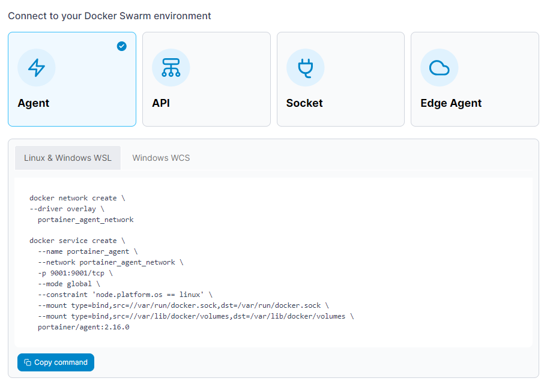

# Install Portainer Agent on Docker Swarm

Portainer uses the _Portainer Agent_ container to communicate with the _Portainer Server_ instance and provide access to the node's resources. This document will outline how to install the Portainer Agent on your environment and how to connect to it from your Portainer Server instance. If you do not have a working Portainer Server instance yet, please refer to the [Portainer Server installation guide](../../../../start/install/server/swarm/linux.md) first.

In addition to the generic requirements for Docker Swarm environments, you will need:

* The manager and worker nodes must be able to communicate with each other over port `9001`. In addition, the Portainer Server installation must be able to reach the nodes on port `9001`. If this is not possible, we advise looking at the [Edge Agent](edge.md) instead.
* If you are running Windows on your node, either:
  * Windows Subsystem for Linux (WSL) installed and a Linux distribution selected. For a new installation we recommend WSL2.
  * Windows Container Services (WCS) configured and running.

The Portainer Agent installation instructions also make the following additional assumptions about your environment:

* SELinux is disabled on the machines running Docker.
* You are accessing Docker via Unix sockets (or a named pipe when using WCS).
*   You have not set a custom `AGENT_SECRET` on your Portainer Server instance. If you have (by specifying an `AGENT_SECRET` environment variable when starting the Portainer Server container), you will need to provide that same secret to your agent in the same way (as an environment variable) when deploying by adding it to the stack file:

    `environment:`

    &#x20; `- AGENT_SECRET: yoursecret`

From the menu expand **Environment-related**, click **Environments**, then click **Add environment**.


Only do this **once** for your environment, regardless of how many nodes are in the cluster. You do **not** need to add each node as an individual environment in Portainer. Adding just one node (we recommend the manager node) will allow Portainer to manage the entire cluster.


<figure><figcaption></figcaption></figure>

Next, select **Docker Swarm** as the environment type then click **Start Wizard**. Select the **Agent** option and your platform. Copy the command, then run it on the manager node of your Docker Swarm cluster. For example, if you are deploying on a Linux machine or a Windows machine with WSL installed, use the **Linux & Windows WSL** command. If you are deploying on a Windows machine with WCS, use the **Windows WCS** command.


You must run the command on the Docker Swarm cluster before entering the environment details.



If you want to use the [host management features](../../../../user/docker/swarm/setup.md#host-and-filesystem) of the Portainer Agent, you should add the necessary volume mount to the command that Portainer provides:

```
--mount type=bind,src=//,dst=/host
```



If Docker on the environment you're deploying the Agent to has the Docker volume path at a non-standard location (instead of `/var/lib/docker/volumes`) you will need to adjust the volume mount in the deployment command to suit.&#x20;

For example, if your volume path was `/srv/data/docker`, you would change the line in the command to:

```
--mount type=bind,src=//srv/data/docker,dst=/var/lib/docker/volumes \
```

The `dst` value of the mount should remain as `/var/lib/docker/volumes`, as that is what the Agent expects.


<figure><figcaption></figcaption></figure>

The deployment command will return something similar to this:

```
Creating network portainer-agent_portainer_agent
Creating service portainer-agent_agent
```

To validate the agent is running,  run the following command:

```
 docker service ls
```

The result of which should look something like this:

```
ID                  NAME                    MODE                REPLICAS            IMAGE                    PORTS
tshb6ee2710s        portainer-agent_agent   global              1/1                 portainer/agent:latest
```

Once the agent is running on the Docker Swarm cluster, enter the environment details, using the table below as a guide.


Only do this **once** for your environment, regardless of how many nodes are in the cluster. You do **not** need to add each node as an individual environment in Portainer. Adding just one node (we recommend the manager node) will allow Portainer to manage the entire cluster.


<table><thead><tr><th width="238">Field</th><th>Overview</th></tr></thead><tbody><tr><td>Name</td><td>Give the environment a descriptive name.</td></tr><tr><td>Environment address</td><td>Enter the IP or DNS name at which the Portainer Server instance can reach the environment along with the port (<code>9001</code>).</td></tr></tbody></table>

<figure><figcaption></figcaption></figure>

As an optional step you can expand the **More settings** section and categorize the environment by adding it to a [group](../../groups.md) or [tagging](../../tags.md) it for better searchability.

<figure><figcaption></figcaption></figure>

When you're ready, click **Connect**. If you have other environments to configure click **Next** to proceed, otherwise click **Close** to return to the list of environments.
