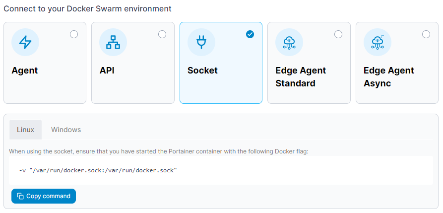
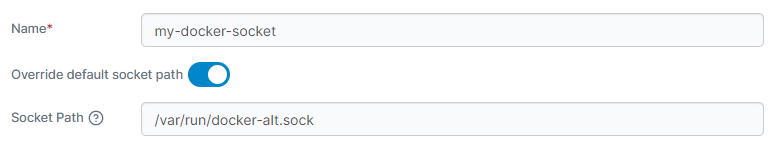

# Connect to the Docker Socket


Connecting to the Docker socket on a Swarm environment is a legacy option and not recommended for new installs. We highly recommend using the [Portainer Agent](agent.md) instead.


Connecting to the Docker socket directly can only be done from the local environment. Before you begin, ensure the user running the Portainer Server container has permissions to access the Docker socket.

From the menu expand **Environment-related**, click **Environments**, then click **Add environment**.

<figure><figcaption></figcaption></figure>

Next, select **Docker Swarm** as the environment type then click **Start Wizard**. Select the **Socket** option and your platform. You will be shown the required parameter to pass to the Portainer container as part of your Portainer Server deployment.

<figure><figcaption></figcaption></figure>

Fill out the fields based on the table below.

<table><thead><tr><th width="280">Field/Option</th><th>Overview</th></tr></thead><tbody><tr><td>Name</td><td>Give the environment a descriptive name.</td></tr><tr><td>Override default socket path</td><td>Toggle this option on to override the default <code>/var/run/docker.sock</code> socket path.</td></tr><tr><td>Socket Path</td><td>If <strong>Override default socket path</strong> is enabled, enter the path to the Docker socket.</td></tr></tbody></table>


Ensure that if you change the Socket Path, that you update the required bind mount parameter above to suit.


<figure><figcaption></figcaption></figure>

As an optional step you can expand the **More settings** section to categorize the environment by adding it to a [group](../../groups.md) or [tagging](../../tags.md) it for better searchability.

<figure><figcaption></figcaption></figure>

When you're ready, click **Connect**. If you have other environments to configure click **Next** to proceed, otherwise click **Close** to return to the list of environments.
