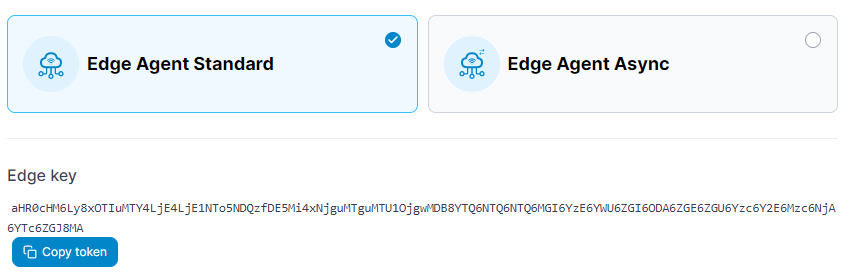
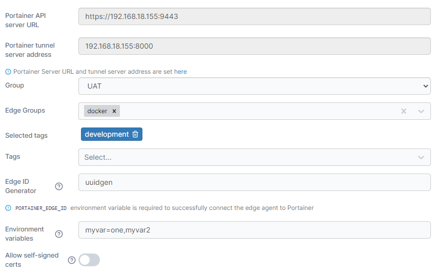
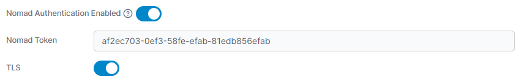
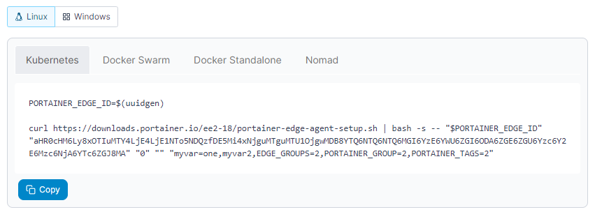

# Auto onboarding

This section allows you to create customized scripts to quickly onboard a number of Edge Agents automatically. Your selections will update the script provided at the bottom of the page which you can then run on your remote environments.

First, select the type of Edge Agent deployment: **Edge Agent Standard** or **Edge Agent Async**.


The Portainer Edge Agent can be deployed in two different modes - **standard mode** and **async mode**. In standard mode, we provide the ability to connect to the remote Edge Agent through a tunnel that is established on-demand from the Edge Agent to the Portainer Server, letting you interact directly with the environment in real time.&#x20;

In async mode, this tunnel connectivity is not available. Instead, we provide the ability to browse snapshots of the remote environment, allowing you to see the state of the Edge Agent's environment based on a recent state capture sent through to the Portainer Server, as well as use this snapshot to perform actions on the remote environment.&#x20;

Async mode has been developed to use very small amounts of data and as such is suitable for environments that have limited or intermittent connectivity as well as connections with limited data caps, for example mobile networks.&#x20;


Your **Edge key** will also be shown here if you need to access it directly.

<figure><figcaption></figcaption></figure>

Once you have made your type selection, configure the options and select the platform (Linux or Windows) to generate your Edge agent deployment scripts.

| Field/Option                    | Overview                                                                                                                                                       |
| ------------------------------- | -------------------------------------------------------------------------------------------------------------------------------------------------------------- |
| Portainer API server URL        | This field displays your Portainer API server URL. This can be adjusted in the Edge Compute settings.                                                          |
| Portainer tunnel server address | This field displays your Portainer tunnel server address. This can be adjusted in the Edge Compute settings, and is not used for Edge Agent Async deployments. |
| Group                           | Select a [group](groups.md) for your Edge Agent deployments.                                                                                                   |
| Edge Groups                     | Select one or more [Edge Groups](../../user/edge/groups.md) for your Edge Agent deployments.                                                                   |
| Tags                            | Select one or more [tags](tags.md) for your Edge Agent deployments.                                                                                            |
| Edge ID Generator               | Provide a one-line script that will be used to generate a unique ID for your Edge devices. For Linux, an example would be using the `uuidgen` command.         |
| Environment variables           | Define a comma separated list of environment variables that will be sourced from the Edge devices for use in Portainer.                                        |
| Allow self-signed certs         | Toggle this to permit the use of self-signed certificates for the communication between the Edge Agent and the Portainer server.                               |

<figure><figcaption></figcaption></figure>

The following options only appear if the **Nomad** option has been selected in the command section below.

| Field/Option                 | Overview                                                           |
| ---------------------------- | ------------------------------------------------------------------ |
| Nomad Authentication Enabled | Toggle this on if your Nomad environments require authentication.  |
| Nomad Token                  | If Nomad authentication is enabled, define the Nomad token to use. |
| TLS                          | Toggle this on if your Nomad installation uses TLS.                |

<figure><figcaption></figcaption></figure>

Select the environment of your deployment and click **Copy** to copy the script to your clipboard.

<figure><figcaption></figcaption></figure>
