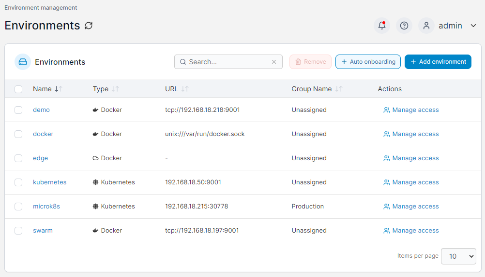
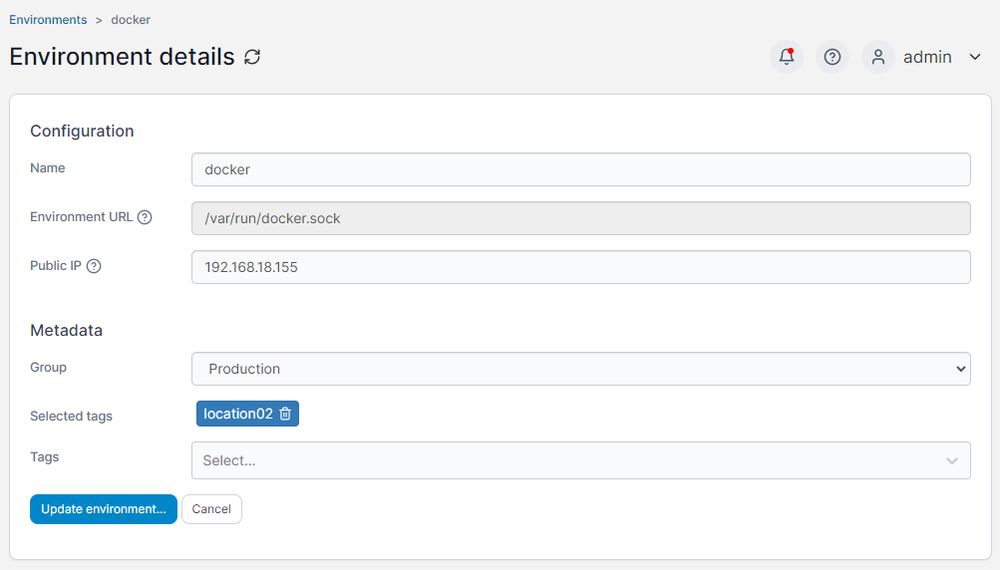

# Environments

The Environments page lists the environments that can be managed with your Portainer installation. Here you can add new environments either [manually](add/) or through [auto onboarding](aeec.md), as well as manage which users and groups have [access](access.md) to individual environments.

<figure><figcaption></figcaption></figure>

To see the details of an existing environment, click on the environment's name in the list. The below options are generic to all environment types, but some environment types will have additional information displayed as well.

| Field/Option              | Overview                                                                                                                                                                                                                                     |
| ------------------------- | -------------------------------------------------------------------------------------------------------------------------------------------------------------------------------------------------------------------------------------------- |
| Name                      | The name of the environment, and how it appears in the list of environments on the dashboard.                                                                                                                                                |
| Environment URL / Address | The URL or address of the environment that is used by Portainer to connect and manage the environment. This could be a Docker socket or API, or the address and port of a Portainer Agent. Edge Agent environments will not have this field. |
| Public IP                 | The URL or address where exposed containers will be reachable. This is an optional field and will default to the environment URL if not set.                                                                                                 |
| Group                     | Select a group to add the environment to. This field is optional.                                                                                                                                                                            |
| Tags                      | Select one or more tags to associate with this environment. This field is optional.                                                                                                                                                          |

<figure><figcaption></figcaption></figure>

To remove an environment, check the box next to the environment to remove and click the **Remove** button. You will be asked to confirm your action.


This action cannot be reversed, so proceed with caution!

