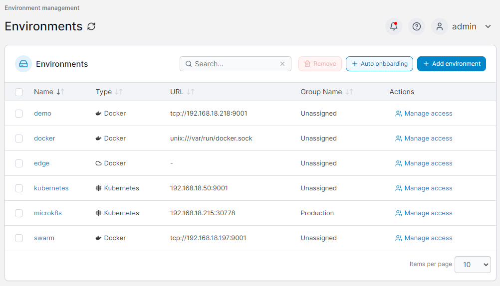
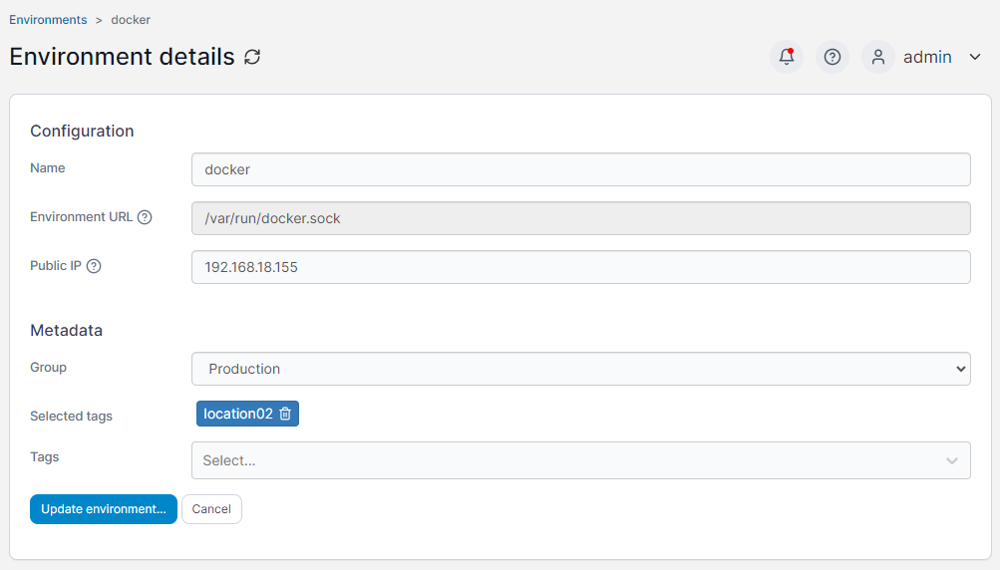
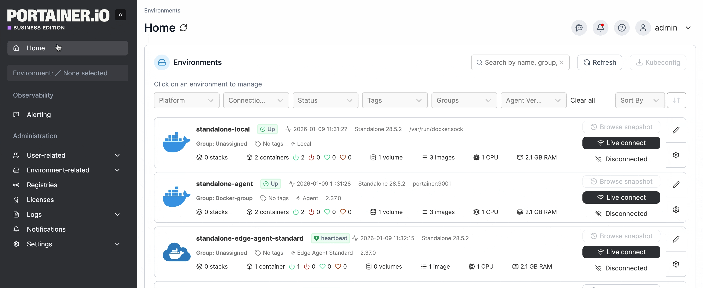
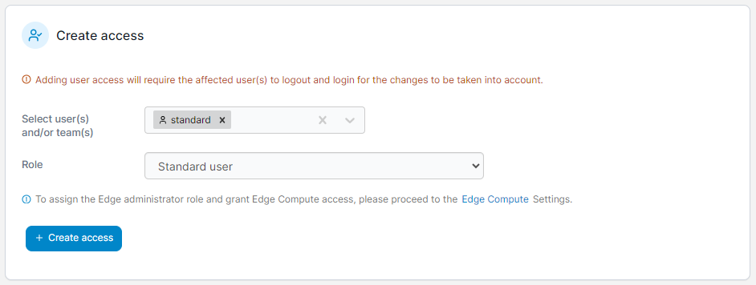

---
metaLinks:
  alternates:
    - >-
      https://app.gitbook.com/s/xdTQRpMuktD2l0URtOJO/admin/environments/environments
---

# Environments

The Environments page lists the environments that can be managed with your Portainer installation. Here you can add new environments either [manually](add/) or through [auto onboarding](aeec.md), as well as manage which users and groups have access to individual environments.

<figure><figcaption></figcaption></figure>

To see the details of an existing environment, click on the environment's name in the list. The below options are generic to all environment types, but some environment types will have additional information displayed as well.

| Field/Option              | Overview                                                                                                                                                                                                                                     |
| ------------------------- | -------------------------------------------------------------------------------------------------------------------------------------------------------------------------------------------------------------------------------------------- |
| Name                      | The name of the environment, and how it appears in the list of environments on the dashboard.                                                                                                                                                |
| Environment URL / Address | The URL or address of the environment that is used by Portainer to connect and manage the environment. This could be a Docker socket or API, or the address and port of a Portainer Agent. Edge Agent environments will not have this field. |
| Public IP                 | The URL or address where exposed containers will be reachable. This is an optional field and will default to the environment URL if not set.                                                                                                 |
| Group                     | Select a group to add the environment to. This field is optional.                                                                                                                                                                            |
| Tags                      | Select one or more tags to associate with this environment. This field is optional.                                                                                                                                                          |

<figure><figcaption></figcaption></figure>

To remove an environment, check the box next to the environment to remove and click the **Remove** button. You will be asked to confirm your action.


This action cannot be reversed, so proceed with caution!


## Manage access to environments  


If an environment's access is controlled by a [policy](policies/), you cannot add access at this level because the policy access takes precedence.



Environments can be [grouped](groups.md) for organizational purposes. If an environment and an individual user are in the same group, users will be tagged with `inherited` on the **Manage access** page. This means that the user is inheriting their access from the group, not the environment.

If you manually assign a user to an environment, and they are already assigned to it via a group, they will be tagged with `override` on the **Manage access** page, indicating that their individual access will override that of the group for this one environment. You can then modify their access in this special case.


From the menu expand **Environment-related** and select **Environments**. Locate the environment you want to give users access to then select **Manage access** at the end of the row.

<figure><figcaption></figcaption></figure>

Next, select the users or teams you want to add using the dropdown. Then use the **Role** dropdown to select the role you want this user or team to have.

<figure><figcaption></figcaption></figure>

Once all have been selected, click **Create access**.
