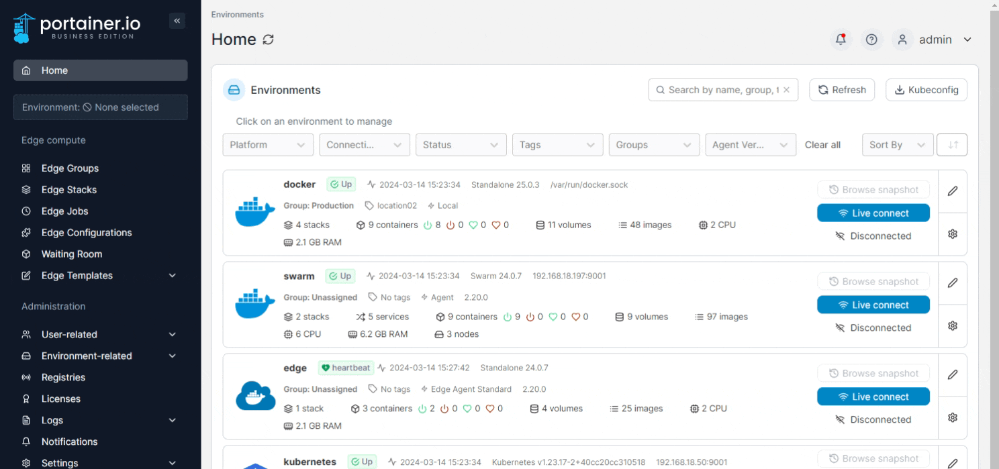
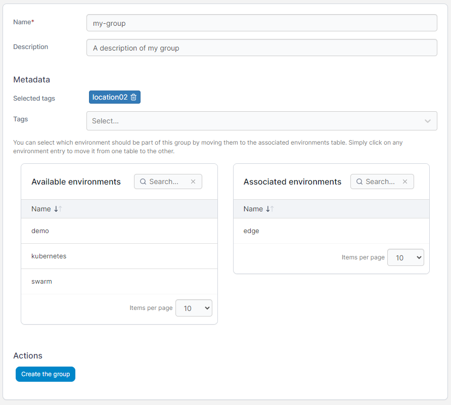

# Groups

Groups organize your environments in Portainer. As an example, you can create groups for development, staging and production to differentiate between environment roles. You can also use groups to define which environments are available to which users.


Portainer Community Edition supports basic user and group assignments. For more complex user roles within groups, use Portainer Business Edition.


## Adding a group

From the menu expand **Environment-related**, select **Groups**, then click **Add group**.&#x20;

<figure><figcaption></figcaption></figure>

Define the properties of the group, using the table below as a guide.

| Field/Option            | Overview                                                |
| ----------------------- | ------------------------------------------------------- |
| Name                    | Give the group a descriptive name.                      |
| Description             | Optionally describe the group in more detail.           |
| Tags                    | Apply any tags to the group.                            |
| Associated environments | Select the environments to be categorized in the group. |

<figure><figcaption></figcaption></figure>

When you're finished, click **Create the group**.

## Removing a group

When you no longer need a group, you can remove it by ticking the box next to the group then clicking **Remove**.


Removing a group will not delete environments and users in that group. However, it may change the environments accessible to users who have their access assigned via a group.

