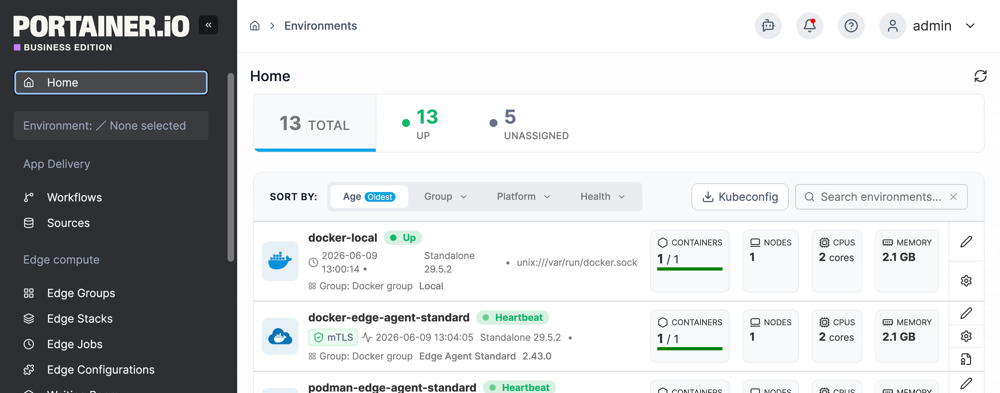
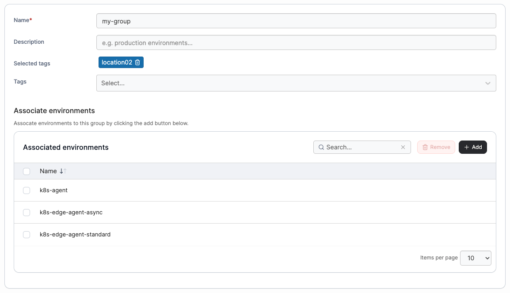
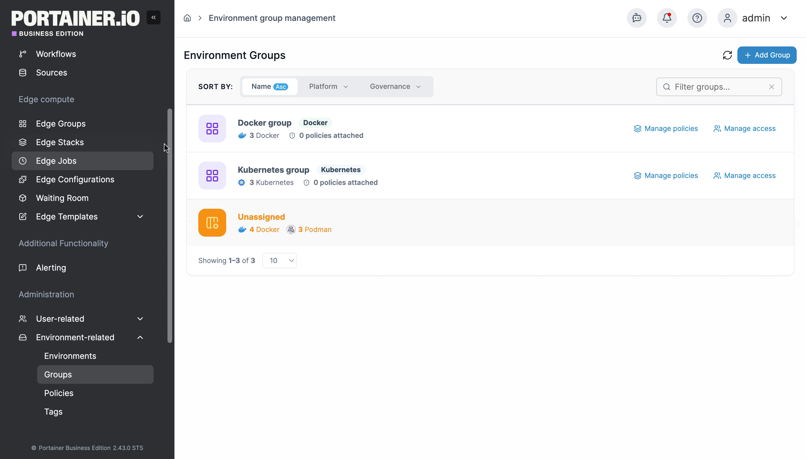
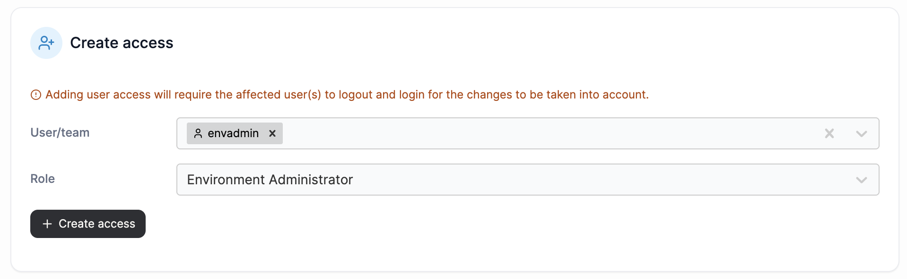
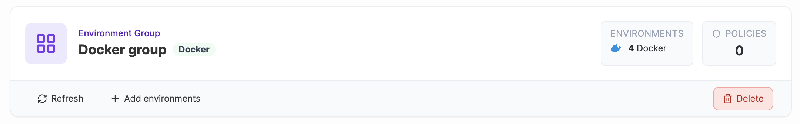
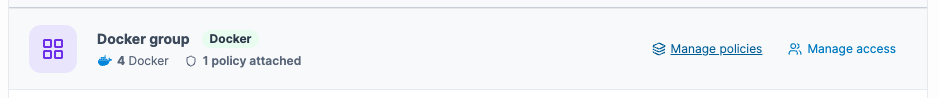

# Groups

Groups organize your environments in Portainer. As an example, you can create groups for development, staging and production to differentiate between environment roles. You can also use groups to define which environments are available to which users.


Portainer Community Edition supports basic user and group assignments. For more complex user roles within groups, use Portainer Business Edition.


## Creating a group

From the menu expand **Environment-related**, select **Groups**, then click **Add group**.

<figure><figcaption></figcaption></figure>

Define the properties of the group, using the table below as a guide.

| Field/Option            | Overview                                                                                                                                                                                                                                                                                                           |
| ----------------------- | ------------------------------------------------------------------------------------------------------------------------------------------------------------------------------------------------------------------------------------------------------------------------------------------------------------------ |
| Name                    | Give the group a descriptive name.                                                                                                                                                                                                                                                                                 |
| Description             | Optionally describe the group in more detail.                                                                                                                                                                                                                                                                      |
| Tags                    | Apply any [tags](tags.md) to the group.                                                                                                                                                                                                                                                                            |
| Associated environments | This section lists the [environments](environments.md) to be added to the group. Use the **Add** button in the top right corner of the table to select your environments. To remove an environment from the list, select the checkbox next to the entry and click **Remove** in the top right corner of the table. |

<figure><figcaption></figcaption></figure>

When you're finished, click **Create**.

## Managing or deleting a group

#### Manage the environments in a group

To add [environments](environments.md) to a group, find the group in the **Environment groups** list and select it to open the edit view. Click **Add environments**, select the environments you want to add, then click **Confirm**.&#x20;

To remove any environments from the group, select the checkbox next to the environments name in the **Associated environments** table, then select **Remove.**

<figure><figcaption></figcaption></figure>

#### Manage access to a group


If a group's access is controlled by a [policy](policies/), you cannot add access at this level because the policy access takes precedence.



If an environment and an individual user are in the same group, users will be tagged with `inherited` on the **Manage access** page. This means that the user is inheriting their access from the group, not the environment.

If you manually assign a user to an environment, and they are already assigned to it via a group, they will be tagged with `override` on the **Manage access** page, indicating that their individual access will override that of the group for this one environment. You can then modify their access in this special case.


To add or view access, locate the environment group you want to give users access to then select **Manage access**.

To add access, select the users or teams you want to add using the dropdown. Then use the **Role** dropdown to select the role you want this user or team to have.

<figure><figcaption></figcaption></figure>

Once all have been selected, click **Create access**.

#### Delete a group

When you no longer need a group, locate the group you want to delete from the **Environment groups** list and select it to open the edit view, remove it by selecting **Delete** in the panel under the environments name.&#x20;


Removing a group will not delete environments and users in that group. However, it may change the environments accessible to users who have their access assigned via a group.


<figure><figcaption></figcaption></figure>

## Manage policies of a group

[Policies](policies/) allow you to apply configuration, security rules, and cluster settings to groups of environments, rather than configuring each environment individually.

To manage the policies of a group, in the menu expand **Environment-related** then select **Groups**. Locate the environment group you want to manage the policies for, then select **Manage policies.** This will direct you to the [Policies](policies/) page where you can manage existing polices or create new policies.

<figure><figcaption></figcaption></figure>
