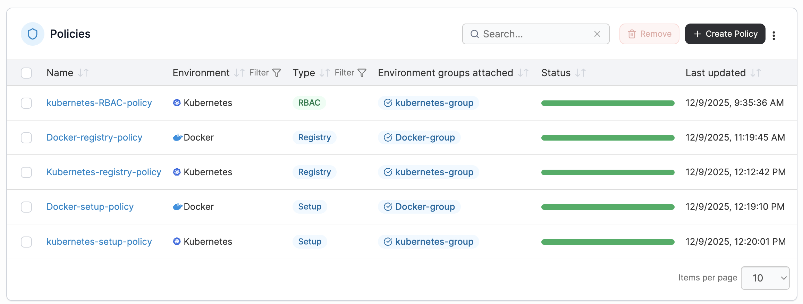
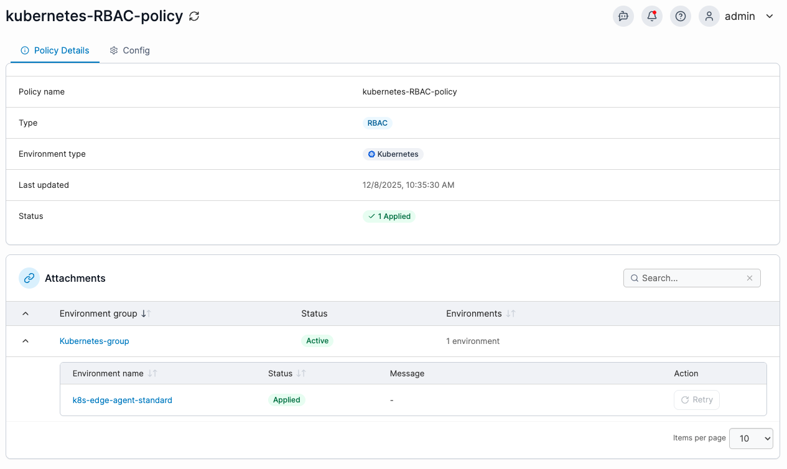

# Policies


Policies is part of the new Fleet Management feature and is currently experimental:\
\- To access this feature, enable **Fleet Management** in the [experimental features](../../settings/general.md#experimental-features) section within the settings.\
\- Use this feature with caution and expect changes or additions as development continues.\
\- While this feature is still developing, policies may not act as intended when there is an existing environment level access in place. We recommend creating policies only for new environment setups.&#x20;



Policies can only be applied to Edge (Standard) Agent environments that are of version 2.37.0 or greater.



Policies can only be created in Portainer Business Edition.


Policies introduces a centralized configuration and policy inheritance as part of the Fleet Management feature set. This allows you to apply configuration, security rules, and cluster settings to groups of environments, rather than configuring each environment individually. By defining settings once at the group level, all child environments inherit those values, helping you keep your fleet consistent and reducing configuration drift. Any created policies will override existing environment level access.

<figure><figcaption></figcaption></figure>

The policies page lists all existing policies. To see the details of an existing policy, click on the policy name. View details of the policy under the **Policy Details** tab, and configure the policy under the **Config** tab at the top of the page.&#x20;

<figure><figcaption></figcaption></figure>

## Create a new policy

From the menu, expand **Environment-related**, select **Policies**, then click **Create policy**.&#x20;

<figure><figcaption></figcaption></figure>

There are eight policy types available, depending on the environment type you are managing and the kind of access you want to enforce. You can use the search function or filter by environment type to narrow down the list.

After selecting a policy type, select **Continue** to open the configuration form. The fields shown will vary depending on the policy you are creating, and each form guides you through the required settings for that specific policy. Select a policy type below for more details on creating the policy.&#x20;

<table data-column-title-hidden data-view="cards"><thead><tr><th></th><th data-hidden data-card-target data-type="content-ref"></th><th data-hidden data-card-cover data-type="image">Cover image</th></tr></thead><tbody><tr><td><h4>Kubernetes RBAC</h4></td><td><a href="kubernetes-rbac-policy.md">kubernetes-rbac-policy.md</a></td><td data-object-fit="fill"><a href="../../../.gitbook/assets/2.37.0-Kube-rbac-1.png">2.37.0-Kube-rbac-1.png</a></td></tr><tr><td><h4>Kubernetes Security</h4></td><td><a href="kubernetes-security-policy.md">kubernetes-security-policy.md</a></td><td data-object-fit="contain"><a href="../../../.gitbook/assets/2.37.0-Kube-security.png">2.37.0-Kube-security.png</a></td></tr><tr><td><h4>Kubernetes Setup</h4></td><td><a href="kubernetes-setup-policy.md">kubernetes-setup-policy.md</a></td><td data-object-fit="contain"><a href="../../../.gitbook/assets/2.37.0-Kube-setup-policy.png">2.37.0-Kube-setup-policy.png</a></td></tr><tr><td><h4>Kubernetes Registry</h4></td><td><a href="kubernetes-registry-policy.md">kubernetes-registry-policy.md</a></td><td data-object-fit="contain"><a href="../../../.gitbook/assets/2.37.0-Kube-Reg-policy.png">2.37.0-Kube-Reg-policy.png</a></td></tr><tr><td><h4>Docker / Swarm / Podman RBAC</h4></td><td><a href="rbac-policy.md">rbac-policy.md</a></td><td data-object-fit="contain"><a href="../../../.gitbook/assets/2.37.0-RBAC-policy.png">2.37.0-RBAC-policy.png</a></td></tr><tr><td><h4>Docker / Swarm / Podman Security</h4></td><td><a href="security-policy.md">security-policy.md</a></td><td data-object-fit="contain"><a href="../../../.gitbook/assets/2.37.0-Security-policy.png">2.37.0-Security-policy.png</a></td></tr><tr><td><h4>Docker / Swarm / Podman Setup</h4></td><td><a href="setup-policy.md">setup-policy.md</a></td><td data-object-fit="contain"><a href="../../../.gitbook/assets/2.37.0-Setup-policy.png">2.37.0-Setup-policy.png</a></td></tr><tr><td><h4>Docker / Swarm / Podman Registry</h4></td><td><a href="registry-policy.md">registry-policy.md</a></td><td data-object-fit="contain"><a href="../../../.gitbook/assets/Screenshot 2025-12-05 at 10.23.28 AM.png">Screenshot 2025-12-05 at 10.23.28 AM.png</a></td></tr></tbody></table>
