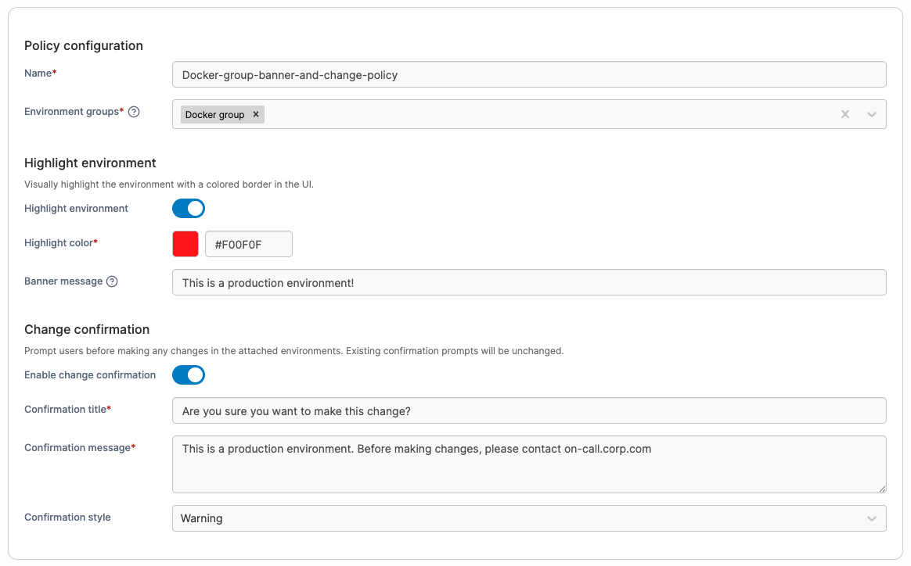
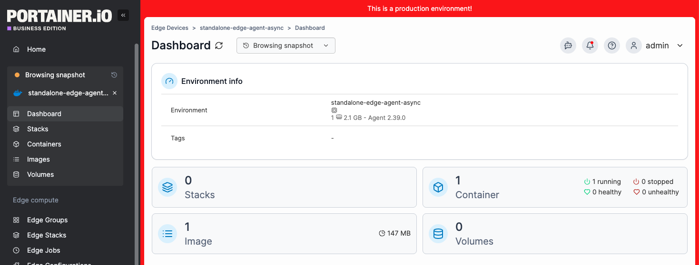

---
metaLinks:
  alternates:
    - >-
      https://app.gitbook.com/s/Dalese9Lv4CX6YKS1s45/admin/environments/policies/any-environment-type-policies/create-a-banner-and-change-confirmation-policy
---

# Create a banner and change confirmation policy

Define a policy that allows you to display a custom banner with your chosen text and color across a specified group of environments, helping users clearly distinguish between them.

This policy also lets you configure a confirmation prompt that appears whenever a user applies a change to those environments, adding an extra layer of protection for sensitive workloads.

To create a banner and change confirmation policy, in the menu, under **Environment-related**, select **Policies** then select **Create policy**. From the policy type list, navigate to the **All (Kubernetes, Docker, Podman and Swarm)** > **Banner and change confirmation** section, select either a predefined template or the **Custom** policy, then select **Continue** to begin configuring the policy.

| Field/Option               | Overview                                                                                                                                                                                                                  |
| -------------------------- | ------------------------------------------------------------------------------------------------------------------------------------------------------------------------------------------------------------------------- |
| Name                       | Define a name for this policy.                                                                                                                                                                                            |
| Environment groups         | 
Select one or more environment <a href="../../groups.md">groups</a> from the dropdown menu. If the selected group is already included in an existing policy, a warning icon will appear next to the group name.
 |
| Highlight environment      | Enable this option to display a colored border around all pages for environments within the selected environment groups.                                                                                                  |
| Highlight color            | Specify the color of the border. You can select a color using the color picker or enter a hex code directly.                                                                                                              |
| Banner message             | Optionally specify a message to display within the border.                                                                                                                                                                |
| Enable change confirmation | Enable this option to display a confirmation dialog whenever changes are made in environments within the selected environment groups.                                                                                     |
| Confirmation title         | Specify the title displayed in the confirmation dialog.                                                                                                                                                                   |
| Confirmation message       | Specify the message displayed within the confirmation dialog.                                                                                                                                                             |
| Confirmation style         | Select the style of the confirmation dialog. See below for examples of each style.                                                                                                                                        |

<figure><figcaption></figcaption></figure>

<figure><figcaption></figcaption></figure>

### Example banner styles

<table data-header-hidden><thead><tr><th></th><th data-type="image"></th></tr></thead><tbody><tr><td>Default</td><td><a href="../../../../.gitbook/assets/2.40.0-Default-confirm-box.png">2.40.0-Default-confirm-box.png</a></td></tr><tr><td>Warning</td><td><a href="../../../../.gitbook/assets/2.40-warning-confirmation-box.png">2.40-warning-confirmation-box.png</a></td></tr><tr><td>Error</td><td><a href="../../../../.gitbook/assets/2.40.0-error-confirmation-box.png">2.40.0-error-confirmation-box.png</a></td></tr></tbody></table>
