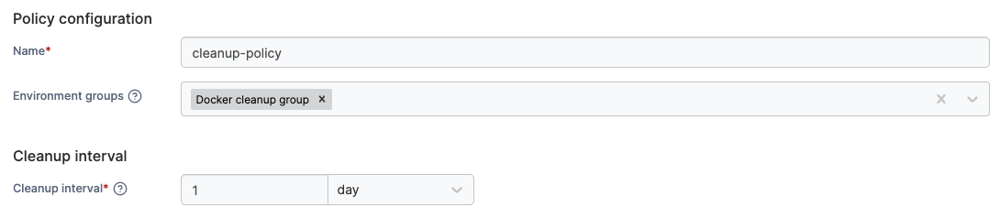
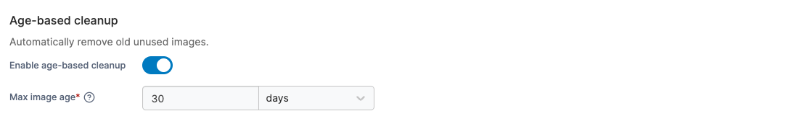
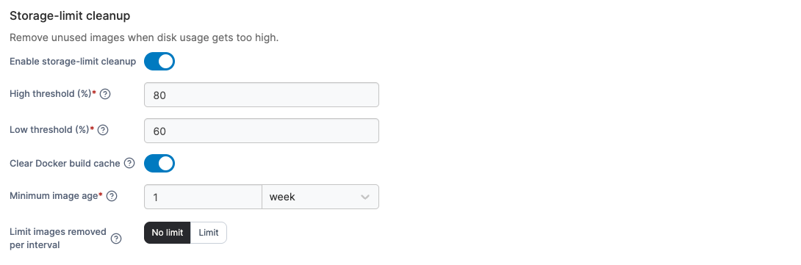
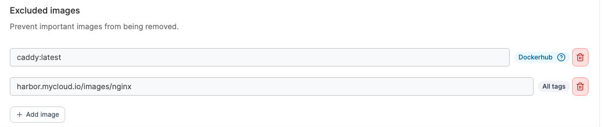

# Create a Docker, Swarm or Podman image cleanup policy

Define a policy that automatically reclaims disk space by removing old and unused Docker images on a defined schedule.

To create a image cleanup policy, in the menu, under **Environment-related**, select **Policies** then select **Create policy**. From the policy type list, navigate to the **Docker, Podman and Swarm** > **Image cleanup** section, select either a [predefined template](cleanup-policy.md#policy-templates) or the **Custom** policy, then select **Continue** to start configuring the policy.

|                    |                                                                                                                                                                                                                           |
| ------------------ | ------------------------------------------------------------------------------------------------------------------------------------------------------------------------------------------------------------------------- |
| Name               | Define a name for this policy.                                                                                                                                                                                            |
| Environment groups | 
Select one or more environment <a href="../../groups.md">groups</a> from the dropdown menu. If the selected group is already included in an existing policy, a warning icon will appear next to the group name.
 |
| Cleanup interval   | Define how often the cleanup runs. This value must be greater than 5 minutes.                                                                                                                                             |

<figure><figcaption></figcaption></figure>

Once the initial policy setup is complete, select how you would like automatic image cleanup to be triggered. At least one cleanup mode must be selected to save your policy.

|                          |                                                                      |
| ------------------------ | -------------------------------------------------------------------- |
| Enable age-based cleanup | Toggle on to automatically remove images older than a specified age. |
| Max image age            | Specify the age at which images are automatically removed.           |

<figure><figcaption></figcaption></figure>

|                                   |                                                                                                                                 |
| --------------------------------- | ------------------------------------------------------------------------------------------------------------------------------- |
| Enable storage-limit cleanup      | Toggle on to automatically remove images once disk usage exceeds a specified threshold.                                         |
| High threshold                    | Specify the disk usage percentage that must be reached before the policy begins removing images.                                |
| Low threshold                     | Specify the disk usage percentage at which the policy stops removing images.                                                    |
| Clear Docker build cache          | Toggle on to prune the Docker build cache when disk usage exceeds the high threshold.                                           |
| Minimum image age                 | Specify a minimum age below which images are never removed by storage-limit cleanup.                                            |
| Limit images removed per interval | Specify the maximum number of images that can be removed per cleanup cycle. Select **No limit** to remove images without a cap. |

<figure><figcaption></figcaption></figure>

Finally, specify any images that should never be removed. To exclude images from custom repositories, ensure you use the full repository path.

<figure><figcaption></figcaption></figure>

When you have completed the form, click **Create policy.** A confirmation screen displays the changes being made and any existing policy that will be replaced. Click **Confirm** to acknowledge the changes and create the policy.

### Policy templates

Policy templates come with a pre-configured setup that you can adjust before creating the policy. The following Docker, Swarm or Podman image cleanup templates are currently available:

| Policy template    | Default setup description                                                                                                                                                                                                                                     |
| ------------------ | ------------------------------------------------------------------------------------------------------------------------------------------------------------------------------------------------------------------------------------------------------------- |
| Disk space cleanup | Cleans up images at a sensible threshold with the following behavior: removes images older than 30 days; when disk usage exceeds 80%, clears the Docker build cache and removes images older than 1 week with no removal limit until disk usage drops to 60%. |
