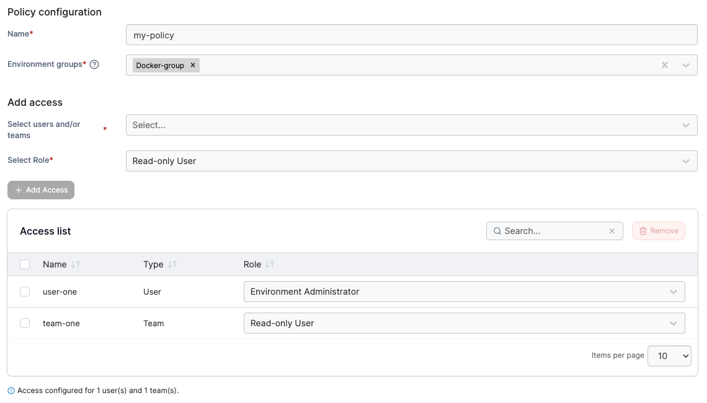

---
metaLinks:
  alternates:
    - >-
      https://app.gitbook.com/s/j6QEqM3Sd94bdPsX4HaN/admin/environments/policies/docker-policies/rbac-policy
---

# Create a Docker, Swarm or Podman RBAC policy

Define a policy based on access permissions and role-based access control for Docker, Swarm or Podman environments.

To create a RBAC policy, in the menu, under **Environment-related**, select **Policies** then select **Create policy**. From the policy type list, navigate to the **Docker** > **RBAC** section, select **Custom** then select **Continue** to begin configuring the policy.


Currently, only custom RBAC policies can be created. Future improvements to the policies feature will introduce policy templates.


| Field/Option       | Overview                                                                                                                                                                                                                  |
| ------------------ | ------------------------------------------------------------------------------------------------------------------------------------------------------------------------------------------------------------------------- |
| Name               | Define a name for this policy.                                                                                                                                                                                            |
| Environment groups | 
Select one or more environment <a href="../../groups.md">groups</a> from the dropdown menu. If the selected group is already included in an existing policy, a warning icon will appear next to the group name.
 |
| Users/teams        | Select one or more [users](../../../user/users.md) or [teams](../../../user/teams/) from the dropdown menu.                                                                                                               |
| Role               | Select the role you want to assign to the users or teams.                                                                                                                                                                 |

<figure><figcaption></figcaption></figure>

Click **Add Access** to add the user/team to the policy, multiple users or teams can be added. Each access added will show in the **Access list**. When you have finished adding access, click **Create policy**. A confirmation screen displays the changes being made and any existing policy that will be replaced. Click **Confirm** to acknowledge the changes and create the policy.
