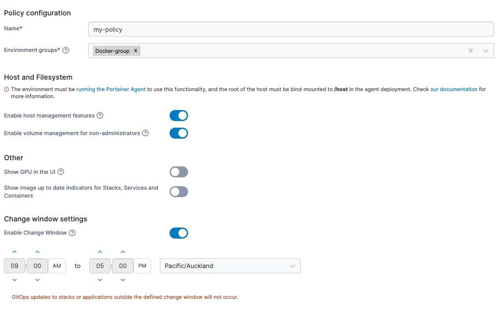

---
metaLinks:
  alternates:
    - >-
      https://app.gitbook.com/s/xdTQRpMuktD2l0URtOJO/admin/environments/policies/docker-policies/setup-policy
---

# Create a Docker, Swarm or Podman setup policy

Define a policy by configuring cluster settings, resources, and deployment options for Docker, Swarm or Podman environments.

To create a setup policy, in the menu, under **Environment-related**, select **Policies** then select **Create policy**. From the policy type list, navigate to the **Docker** > **Setup** section, select **Custom** then select **Continue** to begin configuring the policy.


Currently, only custom setup policies can be created. Future improvements to the policies feature will introduce policy templates.


| Field/Option                                                         | Overview                                                                                                                                                                                                                                                          |
| -------------------------------------------------------------------- | ----------------------------------------------------------------------------------------------------------------------------------------------------------------------------------------------------------------------------------------------------------------- |
| Name                                                                 | Define a name for this policy.                                                                                                                                                                                                                                    |
| Environment groups                                                   | 
Select one or more environment <a href="../../groups.md">groups</a> from the dropdown menu. If the selected group is already included in an existing policy, a warning icon will appear next to the group name.
                                         |
| Enable host management features                                      | Enabling host management features allows you to see the available devices and storage on the physical node as well as browse the node's filesystem. Further details of this can be seen in the [host setup documentation](../../../../user/docker/host/setup.md). |
| Enable volume management for non-administrators                      | Enabling this feature allows non-administrator users to manage volumes on an environment. If this is disabled, users below administrator level have read-only access to volumes.                                                                                  |
| Show GPU in the UI                                                   | Toggle on to enable GPU assignments in the Portainer UI. This adds additional processing to the container and stack listing pages, so if you are not using GPUs on your environment we recommend toggling this off.                                               |
| Add GPU                                                              | When **Show GPU in the UI** is toggled on, click Add GPU to add GPUs to your environment for use by your containers. To add a GPU, provide a name for the GPU and an index or UUID to reference the GPU.                                                          |
| Show image up to date indicators for Stacks, Services and Containers | Toggle on to enable the [new image indicator ](../../../../user/docker/containers/)feature for this environment.                                                                                                                                                  |
| Enable Change Window                                                 | This setting allows you to specify a window within which [GitOps updates](../../../../user/kubernetes/applications/manifest/create.md#gitops-updates) to your applications can be applied.                                                                        |

<figure><figcaption></figcaption></figure>

When you have completed the form, click **Create policy.** A confirmation screen displays the changes being made and any existing policy that will be replaced. Click **Confirm** to acknowledge the changes and create the policy.
