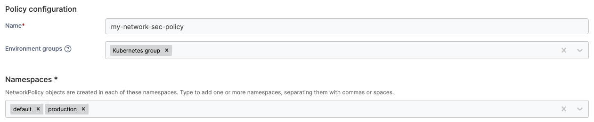
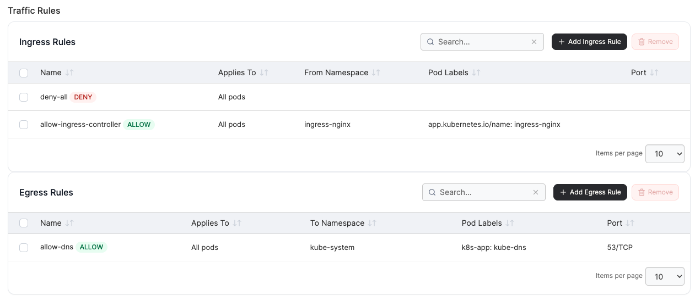

# Create a Kubernetes network security policy


This policy can only be applied to Edge (Standard) Agent environments that are of version 2.43.0 or greater.


Define a policy that sets ingress and egress traffic rules for pods across your Kubernetes environments. Portainer converts the policy into native Kubernetes `NetworkPolicy` objects and deploys them via Helm.

To create a Kubernetes network security policy, from the menu, under **Environment-related**, select **Policies** then select **Create policy**. From the policy type list, navigate to the **Kubernetes** > **Network Security** section, select **Custom** then select **Continue** to begin configuring the policy.

| Field/Option       | Overview                                                                                                                                                                                                                             |
| ------------------ | ------------------------------------------------------------------------------------------------------------------------------------------------------------------------------------------------------------------------------------ |
| Name               | Define a name for this policy.                                                                                                                                                                                                       |
| Environment groups | 
Select one or more Kubernetes environment <a href="../../groups.md">groups</a> from the dropdown menu. If the selected group is already included in an existing policy, a warning icon will appear next to the group name.
 |
| Namespaces         | 
The Kubernetes namespaces the rules in this policy apply to. At least one namespace must be selected. 

Namespace scope is shared across all ingress and egress rules in the policy - it cannot be set per rule.
         |

<figure><figcaption></figcaption></figure>

### Ingress rules

Control which traffic is allowed into pods. A new policy starts with a `deny-all` ingress rule pre-added - remove it only if you intend to leave inbound traffic unrestricted.

Each row in the table is one ingress rule. Rules are independent - each maps to its own Kubernetes `NetworkPolicy` object. Use **Add ingress rule** to open the rule modal.


Kubernetes evaluates `NetworkPolicies` as an allow-list: if any policy permits a connection, it is allowed. A deny-all rule only blocks traffic if no other NetworkPolicy simultaneously allows it.&#x20;


<table data-view="cards"><thead><tr><th></th><th></th><th data-hidden data-card-cover data-type="image">Cover image</th></tr></thead><tbody><tr><td><strong>Block all inbound</strong></td><td>Drops all incoming traffic. Also add allow rules to selectively open ports.</td><td data-object-fit="contain"><a href="../../../../.gitbook/assets/ban.svg">ban.svg</a></td></tr><tr><td><strong>Allow all inbound</strong></td><td>Permits all incoming traffic to pods. Use in dev environments or when auditing.</td><td data-object-fit="contain"><a href="../../../../.gitbook/assets/globe.svg">globe.svg</a></td></tr><tr><td><strong>Allow from ingress controller</strong></td><td>Lets nginx (or similar) forward HTTP/S traffic into your pods. Targets pods with ingress-nginx labels in the <code>ingress-nginx</code> namespace.</td><td data-object-fit="contain"><a href="../../../../.gitbook/assets/shuffle.svg">shuffle.svg</a></td></tr><tr><td><strong>Allow from namespace</strong></td><td>Permits traffic from all pods in a specific namespace. You supply the namespace name after selecting this preset.</td><td data-object-fit="contain"><a href="../../../../.gitbook/assets/layers.svg">layers.svg</a></td></tr><tr><td><strong>Allow Prometheus</strong></td><td>Opens port 9090 to Prometheus in the <code>monitoring</code> namespace - suitable for scraping metrics.</td><td data-object-fit="contain"><a href="../../../../.gitbook/assets/chart-column.svg">chart-column.svg</a></td></tr><tr><td><strong>Custom</strong></td><td>Build a rule from scratch with full control over all options.</td><td data-object-fit="contain"><a href="../../../../.gitbook/assets/pencil.svg">pencil.svg</a></td></tr></tbody></table>

### Egress rules

Control which traffic pods are allowed to send out. No egress rules are pre-added - if you leave this list empty, outbound traffic from the selected pods is unrestricted.

Each row is one egress rule. Use **Add egress rule** to open the rule modal.


If you add a **Block all outbound** rule, always also add an **Allow DNS** rule. Without DNS egress, pods cannot resolve hostnames and most application-level connectivity will silently fail.


<table data-view="cards"><thead><tr><th></th><th></th><th data-hidden data-card-cover data-type="image">Cover image</th></tr></thead><tbody><tr><td><strong>Block all outbound</strong></td><td>Drops all outgoing traffic. Also add allow rules to selectively open destinations.</td><td data-object-fit="contain"><a href="../../../../.gitbook/assets/ban.svg">ban.svg</a></td></tr><tr><td><strong>Allow all outbound</strong></td><td>Permits all outgoing traffic from pods. Use in dev environments or when auditing.</td><td data-object-fit="contain"><a href="../../../../.gitbook/assets/globe.svg">globe.svg</a></td></tr><tr><td><strong>Allow DNS</strong></td><td>Required for pods to resolve hostnames. Opens UDP port 53 to <code>kube-dns</code> in the <code>kube-system</code> namespace.</td><td data-object-fit="contain"><a href="../../../../.gitbook/assets/search (1).svg">search (1).svg</a></td></tr><tr><td><strong>Allow to namespace</strong></td><td>Permits outbound traffic to all pods in a specific namespace. You supply the namespace name after selecting this preset.</td><td data-object-fit="contain"><a href="../../../../.gitbook/assets/layers.svg">layers.svg</a></td></tr><tr><td><strong>Allow HTTPS outbound</strong></td><td>Opens TCP port 443 so pods can reach external APIs and services over HTTPS.</td><td data-object-fit="contain"><a href="../../../../.gitbook/assets/lock.svg">lock.svg</a></td></tr><tr><td><strong>Custom</strong></td><td>Build a rule from scratch with full control over all options.</td><td data-object-fit="contain"><a href="../../../../.gitbook/assets/pencil.svg">pencil.svg</a></td></tr></tbody></table>

### Rule configuration

| Field/Option  | Overview                                                                                                                                                                                                                                                                                                                                                                                                                                                                                                                                                                                                                                                                                                                                                                                                                                                                                            |
| ------------- | --------------------------------------------------------------------------------------------------------------------------------------------------------------------------------------------------------------------------------------------------------------------------------------------------------------------------------------------------------------------------------------------------------------------------------------------------------------------------------------------------------------------------------------------------------------------------------------------------------------------------------------------------------------------------------------------------------------------------------------------------------------------------------------------------------------------------------------------------------------------------------------------------- |
| Name          | A unique identifier for this rule within the policy. Must be a valid DNS label: lowercase letters, digits, and hyphens only, maximum 63 characters. Names must be unique within the ingress list and within the egress list respectively.                                                                                                                                                                                                                                                                                                                                                                                                                                                                                                                                                                                                                                                           |
| Pod selection | 
<strong>All pods in namespace</strong>: The rule applies to every pod in the target namespace(s). This is the default for most presets.  <strong>Pods matching labels:</strong> The rule applies only to pods whose labels match all of the specified key-value pairs (logical AND). Add one or more label pairs.

Example: <code>app=frontend, tier=web</code> - matches pods that have both labels.  <strong>pods matching expression:</strong>  Select pods using a label selector expression. Each expression has a key, an operator, and optionally a set of values:
<ul><li><strong>In</strong> - pod's label value is in the provided list</li><li><strong>NotIn</strong> - pod's label value is not in the list</li><li><strong>Exists</strong> - the label key exists (any value)</li><li><strong>DoesNotExist</strong> - the label key is absent</li></ul>      |
| Source Type   | 
<strong>Deny all:</strong> No traffic is permitted. Creates a <code>NetworkPolicy</code> with an empty peer list, blocking all connections to the selected pods.

<strong>Namespace:</strong> Traffic is allowed from (or to) all pods in a specific namespace.  <strong>Namespace pod label:</strong> Traffic is allowed from (or to) pods in a specific namespace that also carry a matching pod label.  <strong>Pod label only:</strong> Traffic is allowed from (or to) any pod cluster-wide that carries the specified label, regardless of namespace.  <strong>CIDR block:</strong> Traffic is allowed from (or to) an IP range. Commonly used for external services or for allowing traffic from specific node CIDRs.  <strong>Any:</strong> All traffic from (or to) any source is allowed for the selected pods on the specified port/protocol.
 |
| Port          | 
The port number this rule applies to. Leave blank to match traffic on any port. Most specific allow rules should set a port to avoid over-permitting. Select the protocol as  <strong>TCP</strong> (default) or <strong>UDP</strong>.
                                                                                                                                                                                                                                                                                                                                                                                                                                                                                                                                                                                                                                                     |

<figure><figcaption></figcaption></figure>

When you have completed the configuration, click **Create policy**. A confirmation screen displays the changes being made and any existing policy that will be replaced. Click **Confirm** to acknowledge the changes and create the policy.
