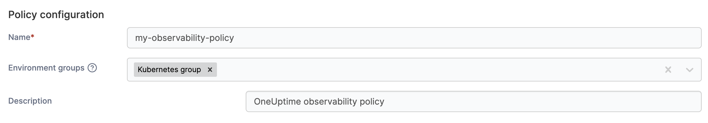
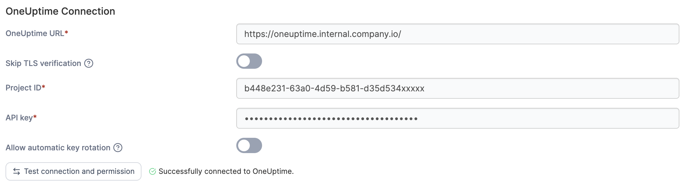
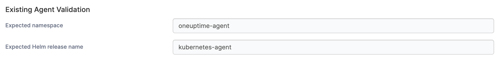

# Create a Kubernetes observability policy

Define a policy that connects to your [OneUptime](https://oneuptime.com/) instance to display logs and metrics directly in Portainer. Once configured, OneUptime logs and metrics can be viewed directly from the [namespace details view](../../../../user/kubernetes/namespaces/manage.md).

To create a Kubernetes observability policy, in the menu, under **Environment-related**, select **Policies** then select **Create policy**. From the policy type list, navigate to the **Kubernetes** > **Observability** section, select either a [predefined template](create-a-kubernetes-observability-policy.md#policy-templates) or the **Custom** policy, then select **Continue** to begin configuring the policy.

| Field / Option     | Overview                                                                                                                                                                                                                             |
| ------------------ | ------------------------------------------------------------------------------------------------------------------------------------------------------------------------------------------------------------------------------------ |
| Name               | Define a name for this policy.                                                                                                                                                                                                       |
| Environment groups | 
Select one or more Kubernetes environment <a href="../../groups.md">groups</a> from the dropdown menu. If the selected group is already included in an existing policy, a warning icon will appear next to the group name.
 |
| Description        | Set an optional description for your policy.                                                                                                                                                                                         |

<figure><figcaption></figcaption></figure>

### OneUptime Connection

Enter the following details to connect Portainer to your OneUptime project.

| Field / Option               | Overview                                                                                                                                                                                                                                                                                      |
| ---------------------------- | --------------------------------------------------------------------------------------------------------------------------------------------------------------------------------------------------------------------------------------------------------------------------------------------- |
| OneUptime URL                | The URL of your OneUptime instance - for example `https://oneuptime.internal.companycloud.io/`                                                                                                                                                                                                |
| Skip TLS verification        | Disable certificate verification for self-signed certificates. Only applicable for HTTPS URLs.                                                                                                                                                                                                |
| Project ID                   | The ID of the project you want to connect to. This can be found under **Project** > **Project settings** in OneUptime.                                                                                                                                                                        |
| API key                      | A OneUptime project API key. Create or find one under **Project > Settings > API Keys** in OneUptime. The key must have one of the following permissions: Project Owner, Project Admin, Project Member, Viewer, Settings Admin, Settings Member, Settings Viewer, or Read Kubernetes Cluster. |
| Allow automatic key rotation | When enabled, Portainer rotates the OneUptime API key automatically before it expires. The current key must have rotation permissions - verify this with the **Test connection and permission** button before saving.                                                                         |

<figure><figcaption></figcaption></figure>

### Mode

After connecting to your OneUptime instance, choose whether to connect to an existing OneUptime agent or deploy a new one.

#### Connect to existing agents&#x20;

| Field / Option             | Overview                                                                |
| -------------------------- | ----------------------------------------------------------------------- |
| Expected namespace         | The namespace that the OneUptime agent was deployed into.               |
| Expected Helm release name | The Helm release name that was used to deploy your OneUptime instance.  |

#### Deploy agents and connect

| Field / Option               | Overview                                                                                                                                                                                                                          |
| ---------------------------- | --------------------------------------------------------------------------------------------------------------------------------------------------------------------------------------------------------------------------------- |
| Auto-provision ingestion key | When enabled, Portainer obtains the ingestion key from OneUptime automatically on each save. The API key must have the `CreateTelemetryIngestionKey` permission - verify this with the **Test connection and permission** button. |
| Ingestion Key                | Required if you're not auto-provisioning the ingestion key. Retrieve this from OneUptime under **Settings > Ingestion Keys**. The agent uses this key to send telemetry data.                                                     |
| Target namespace             | The namespace where the OneUptime agent will be deployed.                                                                                                                                                                         |
| Helm release name            | The Helm release name used to deploy your OneUptime instance.                                                                                                                                                                     |
| Cluster Distribution         | Applies compatible defaults for your Kubernetes distribution.                                                                                                                                                                     |
| Log Collection mode          | Leave on **Preset default** to let the preset decide (**standard** → DaemonSet; **gke-autopilot** / **eks-fargate** → API). Override this if you know your cluster's requirements better than the preset does.                    |

<figure><figcaption></figcaption></figure>

When you have finished adding access, click **Create policy**. A confirmation screen displays the changes being made and any existing policy that will be replaced. Click **Confirm** to acknowledge the changes and create the policy.

### Policy templates

Policy templates come with a pre-configured setup that you can adjust before creating the policy. The following Kubernetes observability templates are currently available:

| Policy template                      | Default setup description                                                                                                                             |
| ------------------------------------ | ----------------------------------------------------------------------------------------------------------------------------------------------------- |
| Connect to Existing OneUptime Agents | Use existing OneUptime collector deployments already present in each environment. Portainer validates collectors and configures UI enrichment.        |
| Deploy OneUptime Agents and Connect  | Deploy OneUptime metrics and logs collectors into each environment via Helm, then configure UI enrichment against the central OneUptime installation. |

### View your OneUptime logs and metrics


The Portainer environment name must match the cluster name registered in OneUptime for data to be retrieved.&#x20;


If your Observability policy has been successfully deployed, you can view OneUptime log data and metrics for environments within the policy groups. Access these details from the [namespace details view](../../../../user/kubernetes/namespaces/manage.md).&#x20;

<figure><figcaption></figcaption></figure>

