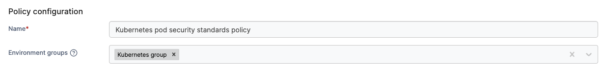
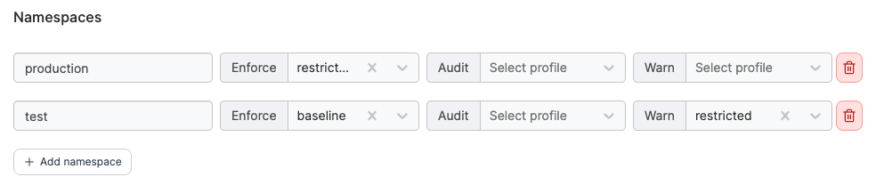

# Create a Kubernetes pod security standards policy

Define a policy that lets you apply Kubernetes' built-in security profiles to namespaces, controlling what pod configurations are allowed to run.

To create a Kubernetes pod security standards policy, in the menu, under **Environment-related**, select **Policies** then select **Create policy**. From the policy type list, navigate to the **Kubernetes** > **pod security standards** section, select **Custom** then select **Continue** to begin configuring the policy.


Currently, only custom registry policies can be created. Future improvements to the policies feature will introduce policy templates.


| Field/Option       | Overview                                                                                                                                                                                                                             |
| ------------------ | ------------------------------------------------------------------------------------------------------------------------------------------------------------------------------------------------------------------------------------ |
| Name               | Define a name for this policy.                                                                                                                                                                                                       |
| Environment groups | 
Select one or more Kubernetes environment <a href="../../groups.md">groups</a> from the dropdown menu. If the selected group is already included in an existing policy, a warning icon will appear next to the group name.
 |

<figure><figcaption></figcaption></figure>

### Namespaces&#x20;

Each namespace can have a pod security standard profile applied per mode. The mode determines how the cluster responds when a pod violates the profile:

| Mode    | Behavior                                                   |
| ------- | ---------------------------------------------------------- |
| Enforce | Blocks the pod from being admitted.                        |
| Audit   | Allows the pod but records the violation in the audit log. |
| Warn    | Allows the pod but returns a warning to the user.          |

You can set a different profile for each mode, or leave a mode unset to keep it unmanaged.&#x20;

#### Profile levels


The following namespaces must use the `privileged` profile and are unable to be reconfigured:

* kube-system
* kube-public
* kube-node-lease
* portainer
* portainer-agent

Applying a more restrictive profile to these namespaces can prevent core cluster or Portainer components from starting.


From least to most restrictive:

* **Privileged** - Unrestricted. Allows known privilege escalations.
* **Baseline** - Prevents known privilege escalations while allowing default pod configurations.
* **Restricted** - Heavily restricted, following current pod hardening best practices.

For the full definition of what each profile allows and blocks, see the [Kubernetes Pod Security Standards documentation](https://kubernetes.io/docs/concepts/security/pod-security-standards/).

To add a namespace, select **Add namespace**, then enter the namespace name and choose a profile for each mode you want to set.

<figure><figcaption></figcaption></figure>

When you have completed the entries, click **Create policy**. A confirmation screen displays the changes being made and any existing policy that will be replaced. Click **Confirm** to acknowledge the changes and create the policy.

#### Recommended configuration

| Namespace type                    | Recommended setting                          |
| --------------------------------- | -------------------------------------------- |
| Sensitive production namespaces   | `enforce: restricted`                        |
| Testing and legacy namespaces     | `enforce: baseline`, `warn: restricted`      |
| Trusted infrastructure namespaces | `enforce: privileged` or `enforce: baseline` |
