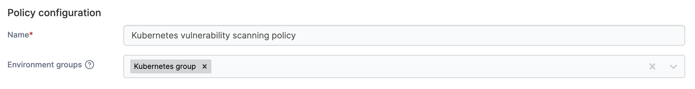
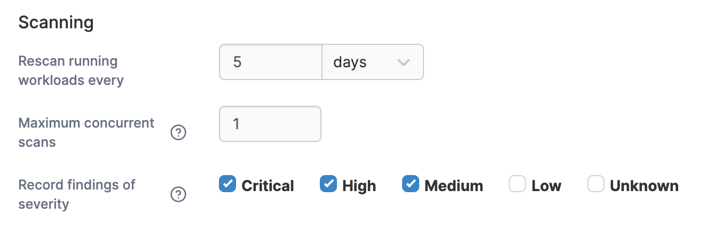
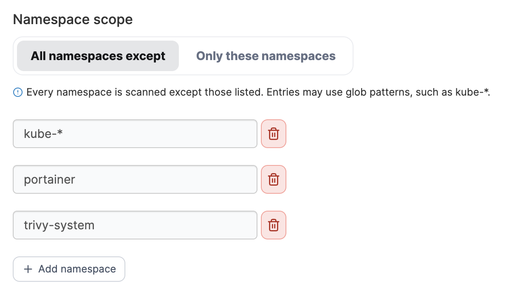
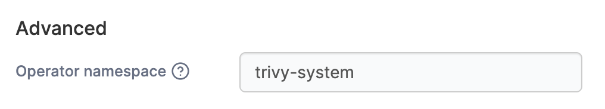

# Create a Kubernetes vulnerability scanning policy

Define a vulnerability scanning policy that deploys [trivy-operator](https://aquasecurity.github.io/trivy-operator/latest/) to every Kubernetes environment in the environment groups the policy is attached to. Trivy-operator scans the images backing running workloads on a schedule and records what it finds as `VulnerabilityReport` resources in the cluster.&#x20;

Once the policy is applied, an [**Image Vulnerabilities**](../../../../user/kubernetes/more-resources/image-vulnerabilities.md) item appears under **More resources** in the sidebar of each environment it covers, providing a list of vulnerabilities and severity.&#x20;


Scanning is real work on a busy cluster. Keep the interval long and the concurrency low unless you have headroom to spare.


To create a Kubernetes vulnerability scanning policy, in the menu, under **Environment-related**, select **Policies** then select **Create policy**. From the policy type list, navigate to the **Kubernetes** > **Vulnerability Scanning** section, select **Custom** then select **Continue** to begin configuring the policy.


Currently, only custom vulnerability scanning policies can be created. Future improvements to the policies feature will introduce policy templates.


| Field/Option       | Overview                                                                                                                                                                                                                                            |
| ------------------ | --------------------------------------------------------------------------------------------------------------------------------------------------------------------------------------------------------------------------------------------------- |
| Name               | Define a name for this policy.                                                                                                                                                                                                                      |
| Environment groups | Select one or more Kubernetes environment [groups](https://docs.portainer.io/admin/environments/groups) from the dropdown menu. If the selected group is already included in an existing policy, a warning icon will appear next to the group name. |

<figure><figcaption></figcaption></figure>

### Scanning&#x20;

| Field/Option                   | Overview                                                                                                                                            |
| ------------------------------ | --------------------------------------------------------------------------------------------------------------------------------------------------- |
| Rescan running workloads every | How often trivy-operator rescans running workloads, in hours, days or weeks. Minimum 1 hour. Default is 7 days.                                     |
| Maximum concurrent scans       | How many scan jobs may run at once, from 1 to 10. A higher limit finishes a sweep sooner but takes more of the cluster while it runs. Default is 2. |
| Record findings of severity    | Select which of the five severities (Critical, High, Medium, Low, Unknown) the scanner records.                                                     |

<figure><figcaption></figcaption></figure>

### Namespace scope

Choose which namespaces trivy-operator scans:

| Field/Option          | Overview                                                                                                                                                                                                                                                                                                                                                                                                                                 |
| --------------------- | ---------------------------------------------------------------------------------------------------------------------------------------------------------------------------------------------------------------------------------------------------------------------------------------------------------------------------------------------------------------------------------------------------------------------------------------- |
| All namespaces except | 
Click <strong>Add namespace</strong> to add namespaces you want to exclude from scanning.

Every namespace is scanned except those listed. Entries may use glob patterns, such as <code>kube-*</code>. 

<code>kube-system</code>, <code>kube-public</code>, <code>kube-node-lease</code>, <code>portainer</code> and the operator namespace are excluded by default. Any entry can be removed using the trashcan icon.
 |
| Only these namespaces | 
Click <strong>Add namespace</strong> to add namespaces you want to be included in scanning.

Only the namespaces listed are scanned. Entries must be exact namespace names - patterns aren't supported in this mode. Namespaces created later aren't covered until you add them here.
                                                                                                                                        |

<figure><figcaption></figcaption></figure>

### Advanced&#x20;

| Field/Option       | Overview                                                                                                 |
| ------------------ | -------------------------------------------------------------------------------------------------------- |
| Operator namespace | The namespace trivy-operator itself runs in - not the namespace(s) it scans. Defaults to `trivy-system`. |

<figure><figcaption></figcaption></figure>

When you have completed the entries, click **Create policy**. A confirmation screen displays the changes being made and any existing policy that will be replaced. Click **Confirm** to acknowledge the changes and create the policy.
