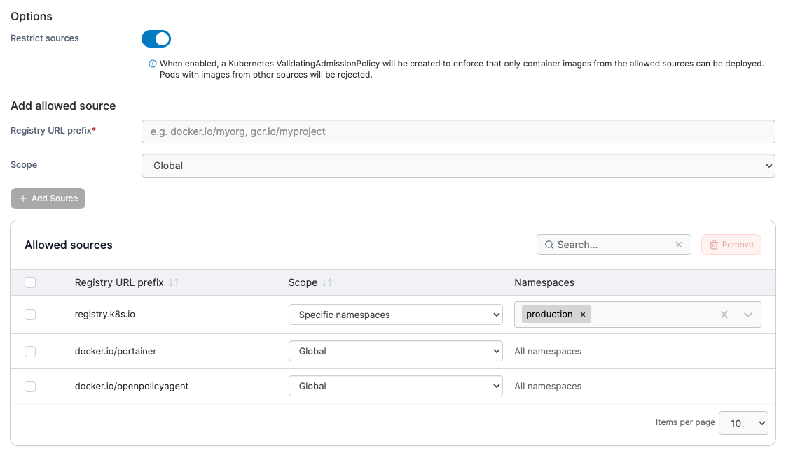

---
metaLinks:
  alternates:
    - >-
      https://app.gitbook.com/s/j6QEqM3Sd94bdPsX4HaN/admin/environments/policies/kubernetes-policies/kubernetes-registry-policy
---

# Create a Kubernetes registry policy

Define a policy by managing registry access and configuration for Kubernetes clusters.

To create a Kubernetes registry policy, in the menu, under **Environment-related**, select **Policies** then select **Create policy**. From the policy type list, navigate to the **Kubernetes** > **Registry** section, select **Custom** then select **Continue** to begin configuring the policy.


Currently, only custom registry policies can be created. Future improvements to the policies feature will introduce policy templates.


| Field/Option       | Overview                                                                                                                                                                                                                             |
| ------------------ | ------------------------------------------------------------------------------------------------------------------------------------------------------------------------------------------------------------------------------------ |
| Name               | Define a name for this policy.                                                                                                                                                                                                       |
| Environment groups | 
Select one or more Kubernetes environment <a href="../../groups.md">groups</a> from the dropdown menu. If the selected group is already included in an existing policy, a warning icon will appear next to the group name.
 |
| Select registry    | ​Select a [registry](../../../../user/kubernetes/cluster/registries.md) from the dropdown menu. ​                                                                                                                                    |
| Namespaces         | Select one or more [namespaces](../../../../user/kubernetes/namespaces/) that you want to have access to the selected registry.                                                                                                      |

<figure><figcaption></figcaption></figure>

Click **Add Access** to add the registry to the access list. You can add multiple entries, and each will appear in the **Registry access list** table. To remove a registry, select the checkbox next to the entry and click **Remove** in the top right corner of the table.

To restrict deployment to approved container images only, enable **Restrict sources** and define the allowed images. You can set the scope to apply cluster-wide or limit it to specific namespaces.

The **Allowed sources** list is pre-populated with common images, including those required for Portainer to operate.&#x20;

| Field/Option        | Overview                                                                                                                                                                                                                                                                  |
| ------------------- | ------------------------------------------------------------------------------------------------------------------------------------------------------------------------------------------------------------------------------------------------------------------------- |
| Restrict sources    | When enabled, Portainer creates a Kubernetes `ValidatingAdmissionPolicy` to ensure only container images from approved registries can be deployed. Any Pod that references an image from an unapproved source will be rejected at admission time and will not be created. |
| Registry URL prefix | The container image or registry that is permitted for deployment.                                                                                                                                                                                                         |
| Scope               | Specify whether the allowed access should apply cluster-wide (Global) or be restricted to selected [namespaces](../../../../user/kubernetes/namespaces/) only.                                                                                                            |

<figure><figcaption></figcaption></figure>

Click **Add source** to add an image to the allowed sources list. You can add multiple entries, and each will appear in the **Allowed sources** table. To remove a source, select the checkbox next to the entry and click **Remove** in the top right corner of the table.

When you have finished adding access, click **Create policy**. A confirmation screen displays the changes being made and any existing policy that will be replaced. Click **Confirm** to acknowledge the changes and create the policy.
