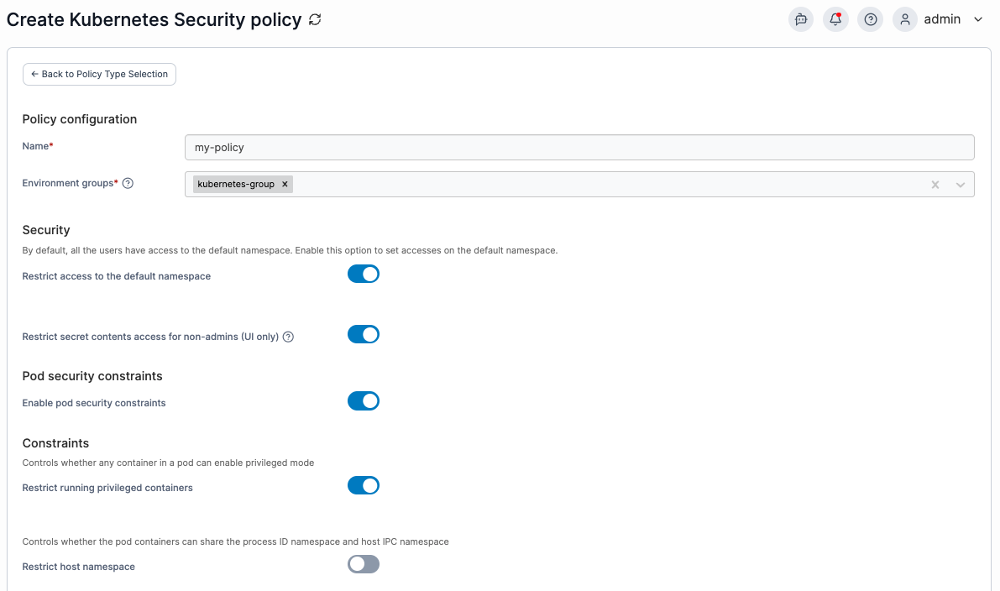

---
metaLinks:
  alternates:
    - >-
      https://app.gitbook.com/s/Dalese9Lv4CX6YKS1s45/admin/environments/policies/kubernetes-policies/kubernetes-security-policy
---

# Create a Kubernetes security policy

Define a policy by specifying security constraints for Kubernetes clusters.

To create a Kubernetes security policy, in the menu, under **Environment-related**, select **Policies** then select **Create policy**. From the policy type list, go to **Kubernetes** > **Security**, select either a [predefined template](kubernetes-security-policy.md#policy-templates) or the **Custom** policy, then select **Continue** to start configuring the policy.

| Field/Option                                             | Overview                                                                                                                                                                                                                                                                                                                                                                                        |
| -------------------------------------------------------- | ----------------------------------------------------------------------------------------------------------------------------------------------------------------------------------------------------------------------------------------------------------------------------------------------------------------------------------------------------------------------------------------------- |
| Name                                                     | Define a name for this policy.                                                                                                                                                                                                                                                                                                                                                                  |
| Environment groups                                       | 
Select one or more Kubernetes environment <a href="../../groups.md">groups</a> from the dropdown menu. If the selected group is already included in an existing policy, a warning icon will appear next to the group name.
                                                                                                                                                            |
| Restrict access to the default namespace                 | When this option is enabled, the default namespace behaves like any other standard namespace. Access is restricted to admin users and to users who have been explicitly granted permission.                                                                                                                                                                                                     |
| Restrict secret contents access for non-admins (UI only) | By default, users are able to view and edit Kubernetes secrets within the Portainer UI. Enabling this option disallows all non-admin users from doing so. Note that due to limitations within Kubernetes itself this only applies to the Portainer UI and does not prevent users from doing so through the command line or API.                                                                 |
| Enable pod security constraints                          | 
Pod security constraints can be used to define under what conditions workloads can run. To set these constraints, toggle this option on, then toggle and configure the features you require. More information on each pod security constraint option can be found in the Kubernetes <a href="../../../../user/kubernetes/cluster/security.md">security constraints</a> documentation.
 |

<figure><figcaption></figcaption></figure>

When you have completed the form, click **Create policy.** A confirmation screen displays the changes being made and any existing policy that will be replaced. Click **Confirm** to acknowledge the changes and create the policy.

### Policy templates

Policy templates come with a pre-configured setup that you can adjust before creating the policy. The following Kubernetes security templates are currently available:

| Policy template | Default setup description                                                                                             |
| --------------- | --------------------------------------------------------------------------------------------------------------------- |
| Production      | A policy suitable for production Kubernetes clusters, prioritizing safety with a high number of restrictions applied. |
| Development     | A policy for development Kubernetes clusters, prioritizing low friction while still enforcing sensible restrictions.  |
