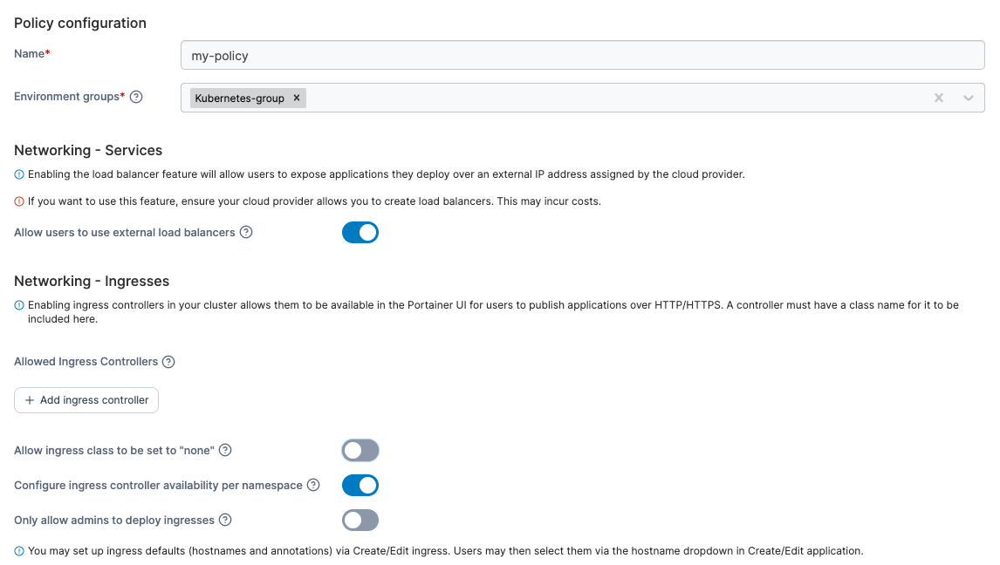

---
metaLinks:
  alternates:
    - >-
      https://app.gitbook.com/s/Dalese9Lv4CX6YKS1s45/admin/environments/policies/kubernetes-policies/kubernetes-setup-policy
---

# Create a Kubernetes setup policy

Define a policy by configuring cluster settings, resources, and deployment options for Kubernetes clusters.

To create a Kubernetes setup policy, in the menu, under **Environment-related**, select **Policies** then select **Create policy**. From the policy type list, navigate to the **Kubernetes** > **Setup** section, select either a predefined template or the **Custom** policy, then select **Continue** to begin configuring the policy.

| Field/Option                                            | Overview                                                                                                                                                                                                                                                                                                                                     |
| ------------------------------------------------------- | -------------------------------------------------------------------------------------------------------------------------------------------------------------------------------------------------------------------------------------------------------------------------------------------------------------------------------------------- |
| Name                                                    | Define a name for this policy.                                                                                                                                                                                                                                                                                                               |
| Environment groups                                      | 
Select one or more Kubernetes environment <a href="../../groups.md">groups</a> from the dropdown menu. If the selected group is already included in an existing policy, a warning icon will appear next to the group name.
                                                                                                         |
| Allow users to use external load balancers              | 
​Enabling this feature will allow users to expose applications they deploy over an external IP address assigned by their cloud provider. <strong>Note:</strong> To use this feature, you need to ensure that your cloud provider allows you to create load balancers. Using this feature may incur costs from your cloud provider.
 |
| Allowed Ingress Controllers                             | Define the list of allowed ingress controllers by adding them by name into the text box. The list of ingress controllers defined must be pre-installed in the cluster.                                                                                                                                                                       |
| Allow ingress class to be set to "none"                 | Enabling this allows users to create ingress objects without specifying any Ingress Class. This is useful for Kubernetes implementations where there is no `IngressClass` defined in the cluster.                                                                                                                                            |
| Configure ingress controller availability per namespace | Enabling this allows users to be able to control Ingress Class availability further at the namespace level.                                                                                                                                                                                                                                  |
| Only allow admins to deploy ingresses                   | Enabling this restricts the deployment of ingresses to cluster administrators only, preventing standard users from creating new ingresses.                                                                                                                                                                                                   |
| Enable Change Window                                    | This setting allows you to specify a window within which [GitOps updates](../../../../user/kubernetes/applications/manifest/create.md#gitops-updates) to your applications can be applied.                                                                                                                                                   |
| Allow resource over-commit                              | 
Enabling this feature lets you allocate more resources to namespaces than are physically available in the cluster. <strong>Note</strong> This may lead to unexpected deployment failures if there are insufficient resources to meet the demand.
                                                                                   |
| Enable features using the metrics API                   | Enabling this feature will allow users to use specific features that leverage the metrics API component, such as the memory and CPU usage graphs at the cluster and node level.                                                                                                                                                              |
| Storage Classes                                         | Select which storage options will be available for use when deploying applications. Take a look at your storage driver documentation to figure out which access policy to configure, and whether or not the volume-expansion capability is supported.                                                                                        |

<figure><figcaption></figcaption></figure>

When you have completed the form, click **Create policy.** A confirmation screen displays the changes being made and any existing policy that will be replaced. Click **Confirm** to acknowledge the changes and create the policy.
