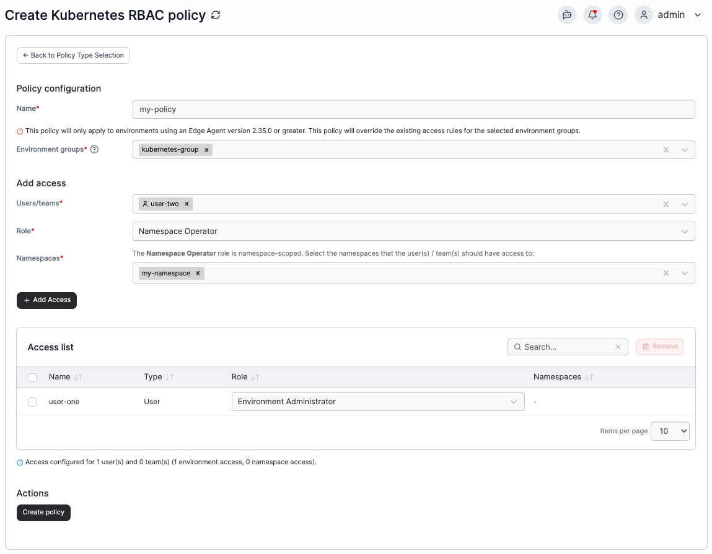

# Create a Kubernetes RBAC policy

Define a policy based on access permissions and role-based access control for Kubernetes clusters.

To create a Kubernetes RBAC policy, in the menu, expand **Environment related**, select **Policies**, and then choose **Create policy**. From the list, select **Kubernetes RBAC** and select **Continue** to begin configuring the policy.

| Field/Option       | Overview                                                                                                                                                                                                                                                                                                        |
| ------------------ | --------------------------------------------------------------------------------------------------------------------------------------------------------------------------------------------------------------------------------------------------------------------------------------------------------------- |
| Name               | Define a name for this policy.                                                                                                                                                                                                                                                                                  |
| Environment groups | Select one or more Kubernetes environment [groups](../groups.md) from the dropdown menu.                                                                                                                                                                                                                        |
| Users/teams        | Select one or more [users](../../user/users.md) or [teams](../../user/teams/) from the dropdown menu.                                                                                                                                                                                                           |
| Role               | 
Select the role you want to assign to the users or teams.  If you select a <a href="../../../user/kubernetes/namespaces/">namespace-scoped role</a>, a <strong>Namespaces</strong> field will appear, allowing you to pick one or more existing namespaces, or to type a name to add a new namespace.
 |

<figure><figcaption></figcaption></figure>

Click **Add Access** to add the user/team to the policy, multiple users or teams can be added. Each access added will show in the **Access list**. When you have finished adding access, click **Create policy**.
