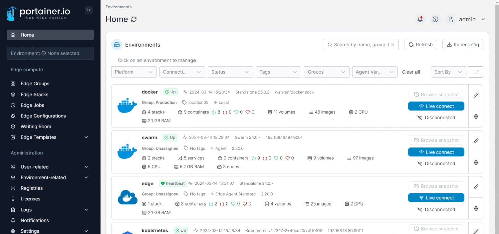

# Tags

Tags can be applied to environments and are useful for defining node or resource metadata. For example, you could use tags to define the physical location of nodes, departments or owners of resources, and much more.

## Creating a tag

From the menu expand **Environment-related** then select **Tags**.&#x20;

<figure><figcaption></figcaption></figure>

Enter a name for the tag then click **Create tag**. The tag appears in the list and can be assigned to environments.

## Tagging an environment

From the menu expand **Environment-related**, select **Environments** then select the environment you want to tag.

<figure><figcaption></figcaption></figure>

From the **Tags** lookup select the tag then click **Update environment**.


Environment tags will be visible on the Portainer home page. You can also search for environments based on their tags.

