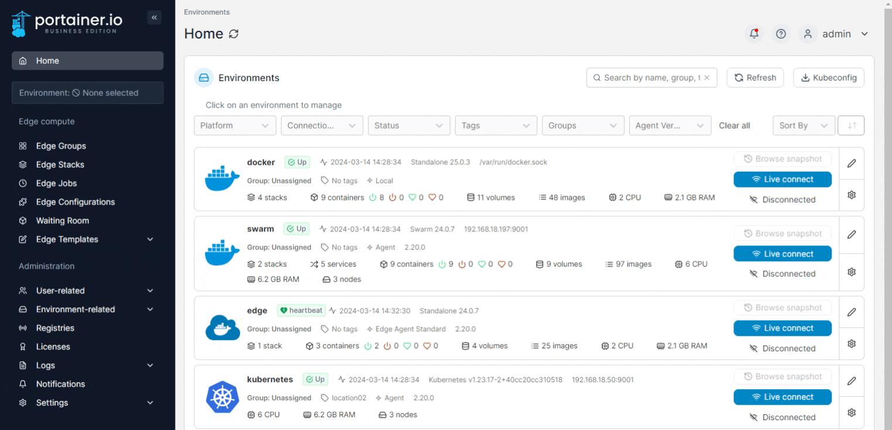
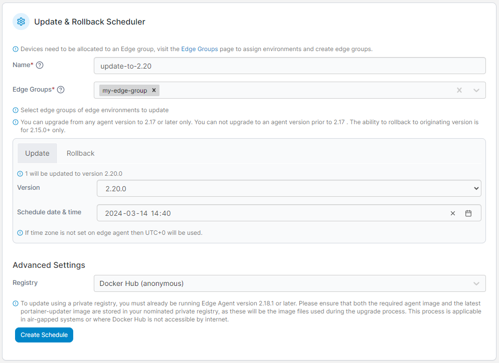
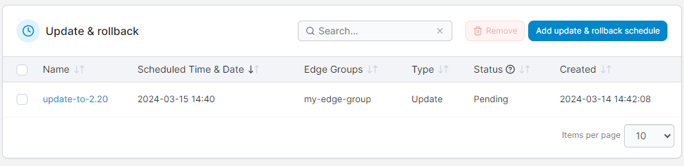
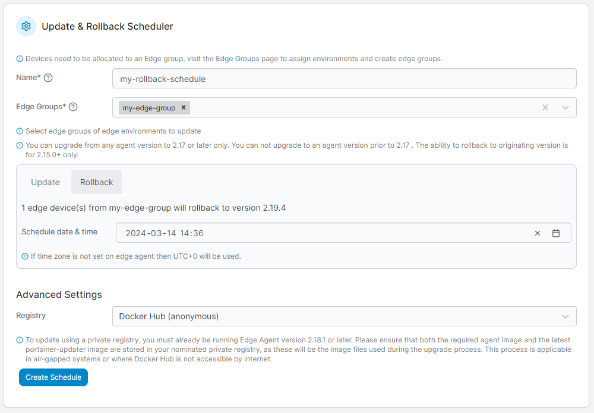

# Update & Rollback

This feature lets you upgrade your Edge Agent deployments directly from Portainer, without the need to log into the remote environments and manually update.


This feature is currently in beta, and is only currently available for Edge Agents running on Docker Standalone environments.


To view your currently scheduled updates or schedule a new update process, from the menu expand **Environment-related** then select **Update & Rollback**.

<figure><figcaption></figcaption></figure>

Here you will see a list of your pending and completed updates and rollbacks.

## Schedule an update

To add a new update schedule, click the **Add update & rollback schedule** button, then fill out the form.


To schedule an update, Portainer must have a snapshot of all the environments you wish to upgrade.


| Field/Option         | Overview                                                                                                                                                                                                                                                                                                   |
| -------------------- | ---------------------------------------------------------------------------------------------------------------------------------------------------------------------------------------------------------------------------------------------------------------------------------------------------------- |
| Name                 | Enter a name for the scheduled update.                                                                                                                                                                                                                                                                     |
| Groups               | Select the Edge Group(s) containing the Edge devices you want to update. You can configure these groups under [Edge Groups](../../user/edge/groups.md).                                                                                                                                                    |
| Version              | Ensure the **Update** tab is selected, then select the version you want to upgrade to from the dropdown.                                                                                                                                                                                                   |
| Schedule date & time | 
Select a date and time to schedule the update. When upgrading from a version prior to 2.17, this field will be unavailable and the upgrade will take place immediately on creation of the schedule.
                                                                                              |
| Registry             | If needed, you can select the registry to pull the updated Portainer Agent images from. The image you are updating to must exist in the registry with the `agent:version` name format, as must the `portainer-updater` image. This functionality is useful if you are running in an airgapped environment. |

<figure><figcaption></figcaption></figure>

When you're ready, click **Create Schedule** to schedule the update. You will be returned to the Update & Rollback page where you can check the status of your scheduled update.

<figure><figcaption></figcaption></figure>

## Schedule a rollback

To schedule the rollback of an update, click the **Add update & rollback schedule** button, then fill out the form.


To schedule a rollback, Portainer must have a snapshot of all the environments you wish to roll back.


| Field/Option         | Overview                                                                                                                                                                                                                                                                                               |
| -------------------- | ------------------------------------------------------------------------------------------------------------------------------------------------------------------------------------------------------------------------------------------------------------------------------------------------------ |
| Name                 | Enter a name for the scheduled rollback.                                                                                                                                                                                                                                                               |
| Group                | Select the Edge Group(s) containing the Edge devices you want to roll back. You can configure these groups under [Edge Groups](../../user/edge/groups.md).                                                                                                                                             |
| Version              | 
Ensure the <strong>Rollback</strong> tab is selected, then select the version you want to roll back to from the dropdown. This dropdown is only available when multiple rollback versions are available.
                                                                                     |
| Schedule date & time | Select a date and time to schedule the rollback.                                                                                                                                                                                                                                                       |
| Registry             | If needed, you can select the registry to pull the Portainer Agent images from. The image you are rolling back to must exist in the registry with the `agent:version` name format, as must the `portainer-updater` image. This functionality is useful if you are running in an airgapped environment. |

<figure><figcaption></figcaption></figure>

When you're ready, click **Create Schedule** to schedule the rollback. You will be returned to the Update & Rollback page where you can check the status of your scheduled rollback.

