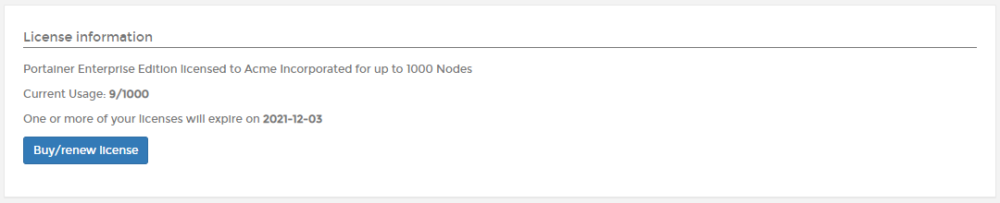
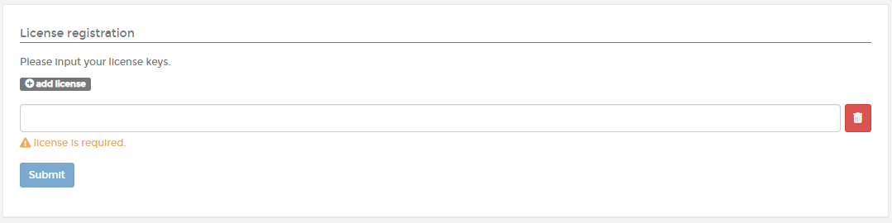
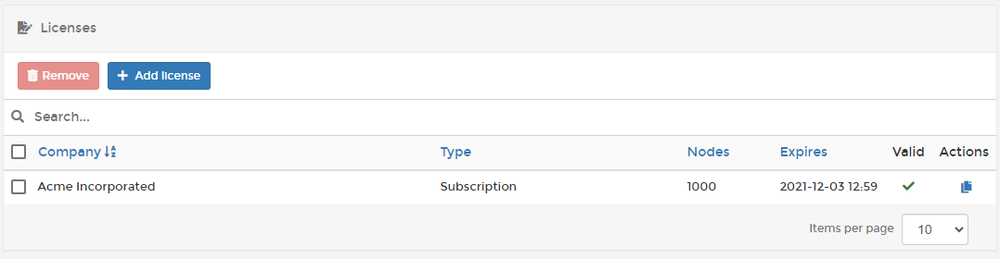

# Licenses

Licensing in Portainer Business Edition is based on the [number of nodes](../faq/concepts.md#what-is-a-node-for-licensing-purposes) you are managing.

From the menu select **Licenses**. The **License Information** section summarizes information about your license including how many nodes it covers and how many nodes are currently being used, as well as the license expiry date.

You can also view a list of each license applied to your Portainer installation.

If you want to add more nodes to your environment than your license allows, first [upgrade your license](../faq/upgrading.md#how-do-i-upgrade-my-license) then click **Add license**, enter your license key then click **Submit**.

