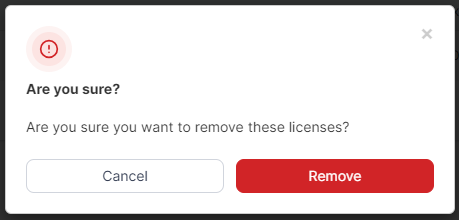

# Licenses

Licensing in Portainer Business Edition is based on the [number of nodes](https://portal.portainer.io/knowledge/what-is-a-node-for-licensing-purposes) you are managing.

From the menu select **Licenses**. The **License Information** section summarizes information about your license including how many nodes it covers and how many nodes are currently being used, as well as the license expiry date. You can click **Upgrade licenses** to purchase additional licenses.

<figure><figcaption></figcaption></figure>

You can also view a list of each license applied to your Portainer installation.

<figure><figcaption></figcaption></figure>

If you want to add more nodes to your environment than your license allows, first [upgrade your license](https://portal.portainer.io/knowledge/how-do-i-upgrade-my-license).

## Add a new license

To add a new license to Portainer, click **Add license**, enter your license key then click **Submit**.

<figure><figcaption></figcaption></figure>

## Remove a license

To remove a license (for example when you want to remove an expired license), tick the box next to the license and click **Remove**. You will be asked to confirm the removal.


Ensure you have enough licenses to cover the number of nodes you are using before committing to the removal. For more on how nodes are calculated, refer to [this knowledge base article](https://portal.portainer.io/knowledge/what-is-a-node-for-licensing-purposes).


<figure><figcaption></figcaption></figure>

To confirm, click **Remove**.
