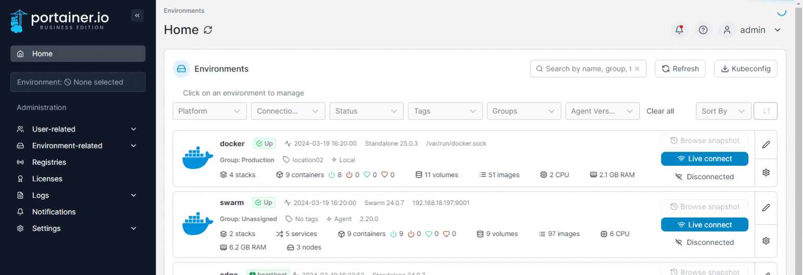
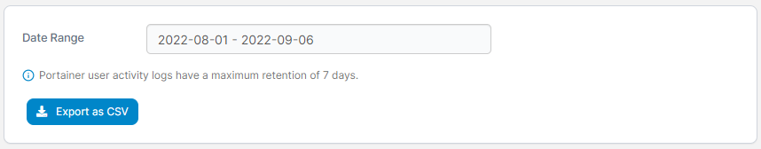
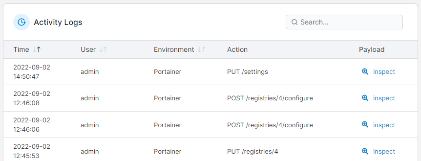
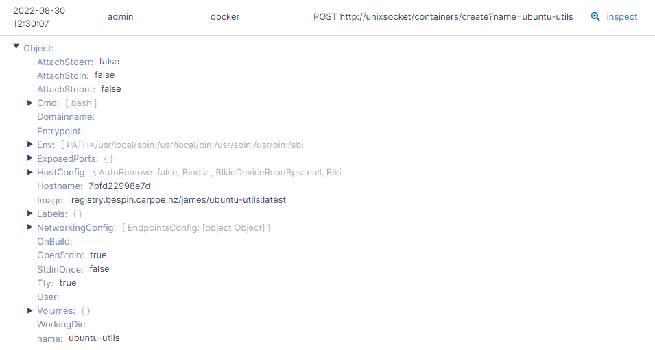

# Activity

Within the Portainer Business Edition UI you can view a log of all actions taken. The log is read-only and cannot be edited.

From the menu expand **Logs** then select **Activity**.

<figure><figcaption></figcaption></figure>

If you want to export logs, filter by date range then click **Export to CSV**.

<figure><figcaption></figcaption></figure>

Activity logs are searchable, and the date and time, user, endpoint, and action are provided for each.

<figure><figcaption></figcaption></figure>

You can also click **inspect** to inspect the activity's payload.

<figure><figcaption></figcaption></figure>
