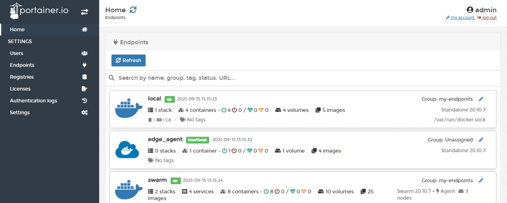
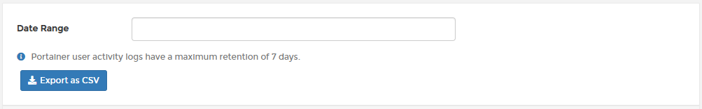
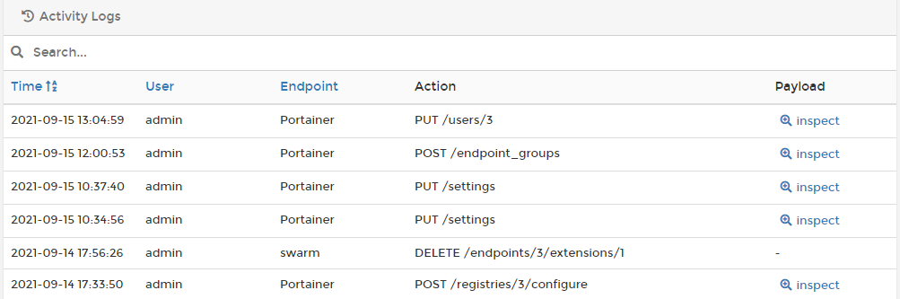
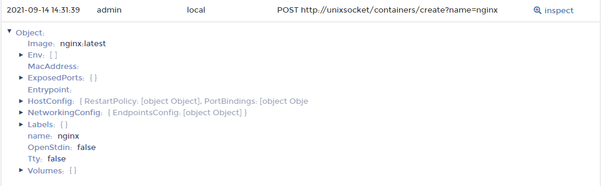

# Activity logs

Within the Portainer Business Edition UI you can view a log of all actions taken. The log is read-only and cannot be edited.

From the menu select **Authentication logs** then select **Activity Logs**.

If you want to export logs, filter by date range then click **Export to CSV**.

Activity logs are searchable, and the date and time, user, endpoint, and action are provided for each.

You can also click a link to inspect the activity's payload.

