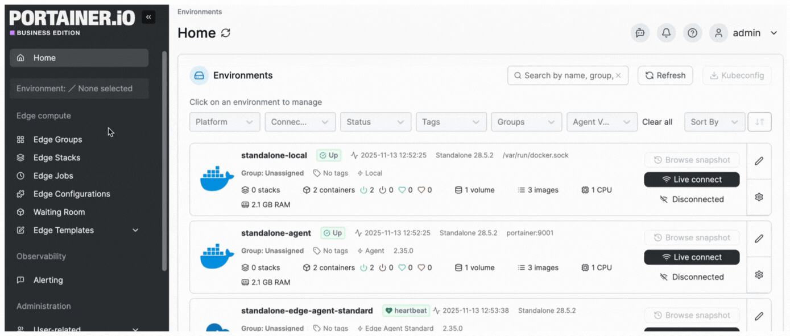
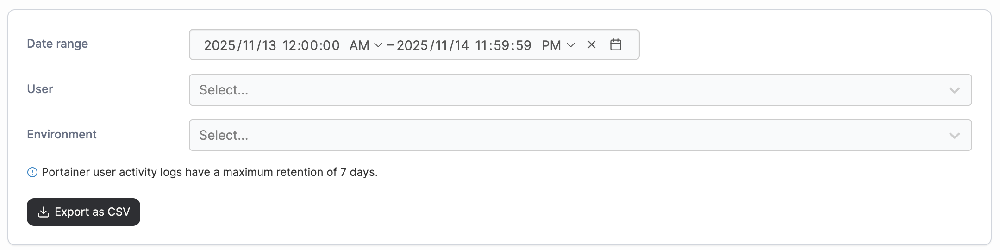
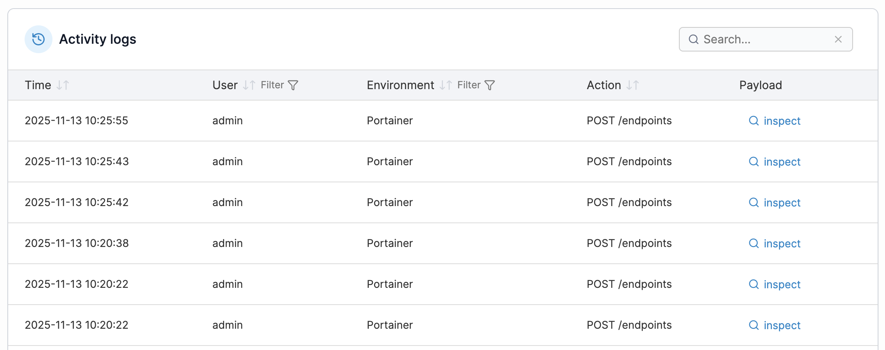
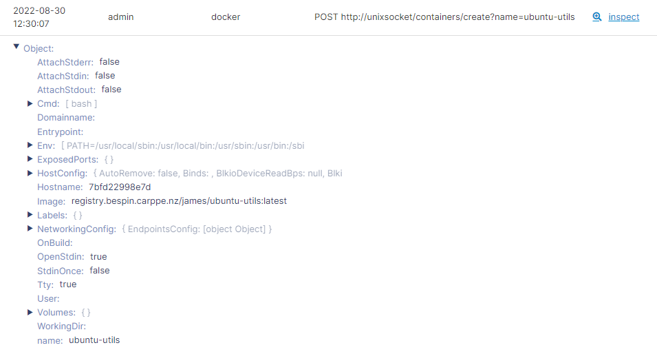

---
metaLinks:
  alternates:
    - https://app.gitbook.com/s/udjBY77rL45c6FTs07xf/admin/logs/activity
---

# Activity

Within the Portainer Business Edition UI you can view a log of all actions taken. The log is read-only and cannot be edited.

From the menu expand **Logs** then select **Activity**.

<figure><figcaption></figcaption></figure>

To filter the logs, select the date range you want to view. You can further narrow the results by adjusting the time fields within the date range, or by filtering on a specific user or environment. Once these filters are added, the activity logs will update automatically. You can download the filtered logs by clicking **Export as CSV**.

<figure><figcaption></figcaption></figure>

Activity logs are searchable, and the date and time, user, endpoint, and action are provided for each.

<figure><figcaption></figcaption></figure>

You can also click **inspect** to inspect the activity's payload.

<figure><figcaption></figcaption></figure>
