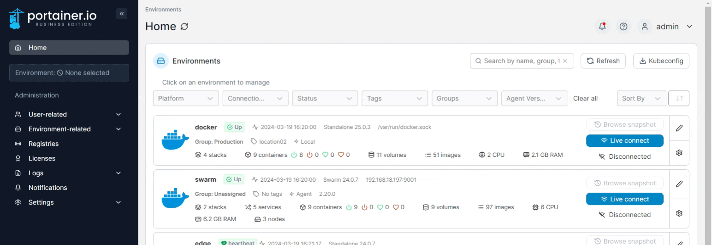
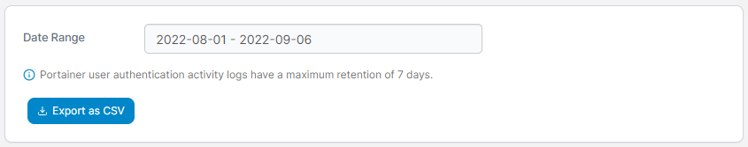
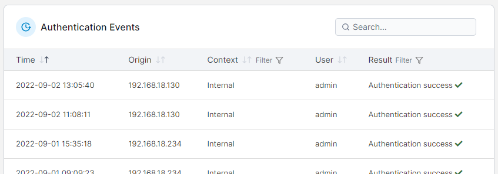

# Authentication

Within the Portainer Business Edition UI you can view a log of all authentication actions. The log is read-only and cannot be edited.


Portainer also provides the ability to view [detailed activity logs](activity.md).


From the menu expand **Logs** and select **Authentication**.

<figure><figcaption></figcaption></figure>

If you want to export logs, filter by date range then click **Export to CSV**.

<figure><figcaption></figcaption></figure>

Authentication events are searchable and filterable, and the date and time, origin IP address, context, user and result are provided for each.

<figure><figcaption></figcaption></figure>

